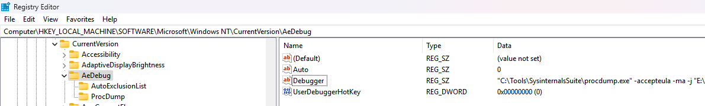

+++
title = 'Application Crash Dump Analysis'
summary= 'This post explores application dumps, a crucial tool for debugging and analyzing software errors, offering insights into memory analysis and troubleshooting techniques'
tags = ["Crash Dump", "Windows Troubleshooting", "Dump Analysis", "WinDbg", "Windows", "Application Errors", "Memory Analysis"]
date = 2025-02-07T07:38:39+05:30
draft = false
+++


### Faulty Code

```c
import std;
#include <windows.h>

bool hDoRemaining(HANDLE hdle, std::string payload) {

    if (hdle != INVALID_HANDLE_VALUE) {
        CloseHandle(hdle);
    }
    CloseHandle(hdle);
    auto cPayload = payload.c_str();
    DWORD bytesWritten;
    if (WriteFile(hdle, cPayload, strlen(cPayload), &bytesWritten, nullptr)) {
        return true;
    }
    std::cout << "Payload / bytesWritten " << strlen(cPayload) / bytesWritten << std::endl;
    return true;
}


bool hIsWriteable(HANDLE hdle, std::string payload) {
    if (hdle != INVALID_HANDLE_VALUE) {
        DWORD bytesWritten;
        auto cPayload = payload.c_str();
        if (WriteFile(hdle, cPayload, strlen(cPayload), &bytesWritten, nullptr)) {
            return hDoRemaining(hdle, payload);
        }
    }
 
    return false;   
}

bool hCreateFile(std::string payload) {
    auto hdle = CreateFileA(
        "access.log",
        GENERIC_WRITE | GENERIC_READ,
        0,
        nullptr,
        CREATE_ALWAYS,
        FILE_ATTRIBUTE_NORMAL,
        nullptr
    );
    return hIsWriteable(hdle, payload);
}

std::string doXor(char key, const std::string& payload) {
    std::string out(payload.size(), '\0'); 
    for (size_t i = 0; i < payload.size(); ++i) {
        out[i] = payload[i] ^ key;  
    }
    return out;
}

int main() {
    std::string payload= "127.0.0.1 - jane [21/Apr/2023:13:05:11 -0700] GET / index.html HTTP / 1.1 200 2326";
    auto output = doXor(0x99, payload);

    if (hCreateFile(output)) {
        std::println("Writing Successful");
    }
}

```
- **Double Closing the Handle**: The main error here is that the handle is closed before it's used. Specifically, CloseHandle(hdle) is called twice - once unconditionally before `WriteFile` is invoked, and again at the end. This causes a double closing of the handle, making it invalid for the WriteFile function. 

- **Division by Zero Risk**: The handle closing causes division by zero (i.e. bytesWritten=0).

### Procdump Setup 

```bash
>_  SysinternalsSuite ➜  .\procdump.exe -ma -i E:\Codes\DebugApplication\Dumps\

ProcDump v11.0 - Sysinternals process dump utility
Copyright (C) 2009-2022 Mark Russinovich and Andrew Richards
Sysinternals - www.sysinternals.com

Set to:
  HKLM\SOFTWARE\Microsoft\Windows NT\CurrentVersion\AeDebug
    (REG_SZ) Auto     = 1
    (REG_SZ) Debugger = "C:\Tools\SysinternalsSuite\procdump.exe" -accepteula -ma -j "E:\Codes\DebugApplication\Dumps" %ld %ld %p

Set to:
  HKLM\SOFTWARE\Wow6432Node\Microsoft\Windows NT\CurrentVersion\AeDebug
    (REG_SZ) Auto     = 1
    (REG_SZ) Debugger = "C:\Tools\SysinternalsSuite\procdump.exe" -accepteula -ma -j "E:\Codes\DebugApplication\Dumps" %ld %ld %p

ProcDump is now set as the Just-in-time (AeDebug) debugger.
```

Install and set the dump path to `E:\Codes\DebugApplication\Dumps`

or it can be changed through Registry 




Compile and Run it. Upon program termination due to an unhandled exception, a core dump  will be automatically saved to disk.

```bash
 ╰─λ ls
DebugApplication.exe_250205_084645.dmp  DebugApplication.exe_250205_084646.dmp
```

After getting dump, Set the `Computer\HKEY_LOCAL_MACHINE\SOFTWARE\Microsoft\Windows NT\CurrentVersion\AeDebug`

- `Auto` to 0.

Load the generated dump file in windbg for analysis.


```bash
0:000> !analyze -v
*******************************************************************************
*                                                                             *
*                        Exception Analysis                                   *
*                                                                             *
*******************************************************************************


KEY_VALUES_STRING: 1

    Key  : Analysis.CPU.mSec
    Value: 546

    Key  : Analysis.Elapsed.mSec
    Value: 41995

    Key  : Analysis.IO.Other.Mb
    Value: 1

    Key  : Analysis.IO.Read.Mb
    Value: 1

    Key  : Analysis.IO.Write.Mb
    Value: 6

    Key  : Analysis.Init.CPU.mSec
    Value: 625

    Key  : Analysis.Init.Elapsed.mSec
    Value: 7396

    Key  : Analysis.Memory.CommitPeak.Mb
    Value: 92

    Key  : Analysis.Version.DbgEng
    Value: 10.0.27725.1000

    Key  : Analysis.Version.Description
    Value: 10.2408.27.01 amd64fre

    Key  : Analysis.Version.Ext
    Value: 1.2408.27.1

    Key  : Failure.Bucket
    Value: INTEGER_DIVIDE_BY_ZERO_c0000094_DebugApplication.exe!hDoRemaining

    Key  : Failure.Hash
    Value: {eb875f65-3c8b-ba45-7fb3-ce4ffd1e8c9d}

    Key  : Timeline.OS.Boot.DeltaSec
    Value: 61256

    Key  : Timeline.Process.Start.DeltaSec
    Value: 1

    Key  : WER.OS.Branch
    Value: ge_release

    Key  : WER.OS.Version
    Value: 10.0.26100.1


FILE_IN_CAB:  DebugApplication.exe_250205_084645.dmp

COMMENT:  
*** "C:\Tools\SysinternalsSuite\procdump.exe" -accepteula -ma -j "E:\Codes\DebugApplication\Dumps" 2496 620 00000242E2740000
*** Just-In-Time debugger. PID: 2496 Event Handle: 620 JIT Context: .jdinfo 0x242e2740000

NTGLOBALFLAG:  0

APPLICATION_VERIFIER_FLAGS:  0

CONTEXT:  (.ecxr)
rax=0000000000000052 rbx=0000000000000000 rcx=0000000000000000
rdx=0000000000000000 rsi=0000000000000000 rdi=0000008171b2f538
rip=00007ff7c2929e47 rsp=0000008171b2f460 rbp=0000008171b2f490
 r8=7efefefefefefeff  r9=4ccccccccbffaeaa r10=00000242e2571ac0
r11=8101010101010100 r12=0000000000000000 r13=0000000000000000
r14=0000000000000000 r15=0000000000000000
iopl=0         nv up ei pl zr na po nc
cs=0033  ss=002b  ds=002b  es=002b  fs=0053  gs=002b             efl=00010246
DebugApplication!hDoRemaining+0xf7:
00007ff7`c2929e47 48f7f1          div     rax,rcx
Resetting default scope

EXCEPTION_RECORD:  (.exr -1)
ExceptionAddress: 00007ff7c2929e47 (DebugApplication!hDoRemaining+0x00000000000000f7)
   ExceptionCode: c0000094 (Integer divide-by-zero)
  ExceptionFlags: 00000000
NumberParameters: 0

PROCESS_NAME:  DebugApplication.exe

ERROR_CODE: (NTSTATUS) 0xc0000094 - {EXCEPTION}  Integer division by zero.

EXCEPTION_CODE_STR:  c0000094

STACK_TEXT:  
00000081`71b2f460 00007ff7`c292a0a6     : 00000000`000000d8 00000081`71b2f768 00000000`00000000 00000081`71b2f644 : DebugApplication!hDoRemaining+0xf7
00000081`71b2f610 00007ff7`c2929cfd     : 00000000`000000d8 00000081`71b2f958 00000081`71b2fb40 00000000`00000053 : DebugApplication!hIsWriteable+0xd6
00000081`71b2f810 00007ff7`c292aa01     : 00000081`71b2fb38 00000081`71b2fa38 00000081`71b2f9f8 00320070`00700043 : DebugApplication!hCreateFile+0x8d
00000081`71b2f9d0 00007ff7`c2939879     : 000004ca`00000001 00007ff9`700825c8 00000000`00000000 00007ff7`c293b02d : DebugApplication!main+0x91
00000081`71b2fc20 00007ff7`c2939722     : 00007ff7`c2942000 00007ff7`c2942220 00000000`00000000 00000000`00000000 : DebugApplication!invoke_main+0x39
00000081`71b2fc70 00007ff7`c29395de     : 00000000`00000000 00000000`00000000 00000000`00000000 00000000`00000000 : DebugApplication!__scrt_common_main_seh+0x132
00000081`71b2fce0 00007ff7`c293990e     : 00000000`00000000 00000000`00000000 00000000`00000000 00000000`00000000 : DebugApplication!__scrt_common_main+0xe
00000081`71b2fd10 00007ffa`49c7e8d7     : 00000081`71cb0000 00000000`00000000 00000000`00000000 00000000`00000000 : DebugApplication!mainCRTStartup+0xe
00000081`71b2fd40 00007ffa`4b9bfbcc     : 00000000`00000000 00000000`00000000 000004f0`fffffb30 000004d0`fffffb30 : kernel32!BaseThreadInitThunk+0x17
00000081`71b2fd70 00000000`00000000     : 00000000`00000000 00000000`00000000 00000000`00000000 00000000`00000000 : ntdll!RtlUserThreadStart+0x2c


STACK_COMMAND:  ~0s; .ecxr ; kb

FAULTING_SOURCE_LINE:  E:\Codes\DebugApplication\DebugApplication\DebugApplication.cpp

FAULTING_SOURCE_FILE:  E:\Codes\DebugApplication\DebugApplication\DebugApplication.cpp

FAULTING_SOURCE_LINE_NUMBER:  15

FAULTING_SOURCE_CODE:  
    11:     DWORD bytesWritten;
    12:     if (WriteFile(hdle, cPayload, strlen(cPayload), &bytesWritten, nullptr)) {
    13:         return true;
    14:     }
>   15:     std::cout << "Payload / bytesWritten " << strlen(cPayload) / bytesWritten << std::endl;
    16:     return true;
    17: }
    18: 
    19: 
    20: bool hIsWriteable(HANDLE hdle, std::string payload) {


SYMBOL_NAME:  DebugApplication!hDoRemaining+f7

MODULE_NAME: DebugApplication

IMAGE_NAME:  DebugApplication.exe

FAILURE_BUCKET_ID:  INTEGER_DIVIDE_BY_ZERO_c0000094_DebugApplication.exe!hDoRemaining

OS_VERSION:  10.0.26100.1

BUILDLAB_STR:  ge_release

OSPLATFORM_TYPE:  x64

OSNAME:  Windows 10

FAILURE_ID_HASH:  {eb875f65-3c8b-ba45-7fb3-ce4ffd1e8c9d}

Followup:     MachineOwner
---------
```

`.exr`: displays various information about exception record like ExceptionAddress, ExceptionCode, ExceptionFlags and NumberofParameters.

To display the most recent exception record. Use `.exr -1`

```bash
0:000> .exr -1
ExceptionAddress: 00007ff7c2929e47 (DebugApplication!hDoRemaining+0x00000000000000f7)
   ExceptionCode: c0000094 (Integer divide-by-zero)
  ExceptionFlags: 00000000
NumberParameters: 0
```

#### Debugger Output Line

```bash
                                          +---------------+-----------------+-----------------+-----------------+
                                          |       RCX     |        RDX      |     R8          |    R9           |
00000081`71b2f810 00007ff7`c292aa01     : 00000081`71b2fb38 00000081`71b2fa38 00000081`71b2f9f8 00320070`00700043 : DebugApplication!hCreateFile+0x8d
```
##### Register Inspections

Let's Inspect the register values while calling the function.

**Inspecting RDX**

```bash
0:000> db 00000081`71b2fa38
00000081`71b2fa38  60 c9 57 e2 42 02 00 00-c0 d9 57 e2 42 02 00 00  `.W.B.....W.B...
00000081`71b2fa48  00 00 00 00 00 00 00 00-52 00 00 00 00 00 00 00  ........R.......
00000081`71b2fa58  5f 00 00 00 00 00 00 00-cc cc cc cc cc cc cc cc  _...............
00000081`71b2fa68  cc cc cc cc cc cc cc cc-cc cc cc cc cc cc cc cc  ................
00000081`71b2fa78  cc cc cc cc cc cc cc cc-cc cc cc cc cc cc cc cc  ................
00000081`71b2fa88  cc cc cc cc cc cc cc cc-cc cc cc cc cc cc cc cc  ................
00000081`71b2fa98  cc cc cc cc cc cc cc cc-cc cc cc cc cc cc cc cc  ................
00000081`71b2faa8  cc cc cc cc cc cc cc cc-cc cc cc cc cc cc cc cc  ................
```

```bash
0:000> db poi(00000081`71b2fa38+0x8)
00000242`e257d9c0  a8 ab ae b7 a9 b7 a9 b7-a8 b9 b4 b9 f3 f8 f7 fc  ................
00000242`e257d9d0  b9 c2 ab a8 b6 d8 e9 eb-b6 ab a9 ab aa a3 a8 aa  ................
00000242`e257d9e0  a3 a9 ac a3 a8 a8 b9 b4-a9 ae a9 a9 c4 b9 de dc  ................
00000242`e257d9f0  cd b9 b6 b9 f0 f7 fd fc-e1 b7 f1 ed f4 f5 b9 d1  ................
00000242`e257da00  cd cd c9 b9 b6 b9 a8 b7-a8 b9 ab a9 a9 b9 ab aa  ................
00000242`e257da10  ab af 00 cd cd cd cd cd-cd cd cd cd cd cd cd cd  ................
00000242`e257da20  fd fd fd fd 00 00 00 00-e5 54 35 34 00 10 00 80  .........T54....
00000242`e257da30  00 00 00 00 00 00 00 00-00 00 00 00 00 00 00 00  ................
```


**Inspecting R8**
```bash
0:000> db 00000081`71b2f9f8
00000081`71b2f9f8  50 ca 57 e2 42 02 00 00-c0 d4 57 e2 42 02 00 00  P.W.B.....W.B...
00000081`71b2fa08  00 00 00 00 00 00 00 00-52 00 00 00 00 00 00 00  ........R.......
00000081`71b2fa18  5f 00 00 00 00 00 00 00-cc cc cc cc cc cc cc cc  _...............
00000081`71b2fa28  cc cc cc cc cc cc cc cc-cc cc cc cc cc cc cc cc  ................
00000081`71b2fa38  60 c9 57 e2 42 02 00 00-c0 d9 57 e2 42 02 00 00  `.W.B.....W.B...
00000081`71b2fa48  00 00 00 00 00 00 00 00-52 00 00 00 00 00 00 00  ........R.......
00000081`71b2fa58  5f 00 00 00 00 00 00 00-cc cc cc cc cc cc cc cc  _...............
00000081`71b2fa68  cc cc cc cc cc cc cc cc-cc cc cc cc cc cc cc cc  ................

0:000> db poi(00000081`71b2f9f8+0x8)
00000242`e257d4c0  31 32 37 2e 30 2e 30 2e-31 20 2d 20 6a 61 6e 65  127.0.0.1 - jane
00000242`e257d4d0  20 5b 32 31 2f 41 70 72-2f 32 30 32 33 3a 31 33   [21/Apr/2023:13
00000242`e257d4e0  3a 30 35 3a 31 31 20 2d-30 37 30 30 5d 20 47 45  :05:11 -0700] GE
00000242`e257d4f0  54 20 2f 20 69 6e 64 65-78 2e 68 74 6d 6c 20 48  T / index.html H
00000242`e257d500  54 54 50 20 2f 20 31 2e-31 20 32 30 30 20 32 33  TTP / 1.1 200 23
00000242`e257d510  32 36 00 cd cd cd cd cd-cd cd cd cd cd cd cd cd  26..............
00000242`e257d520  fd fd fd fd 00 00 00 00-15 54 c5 34 00 08 00 80  .........T.4....
00000242`e257d530  5c 00 3f 00 3f 00 5c 00-45 00 3a 00 5c 00 30 00  \.?.?.\.E.:.\.0.
```
##### Decrypt the original content 

**Inspecting RCX**
```bash
0:000> db 8171b2fb38
00000081`71b2fb38  40 cb 57 e2 42 02 00 00-e0 d7 57 e2 42 02 00 00  @.W.B.....W.B...
00000081`71b2fb48  00 00 00 00 00 00 00 00-52 00 00 00 00 00 00 00  ........R.......
00000081`71b2fb58  5f 00 00 00 00 00 00 00-fe ff ff ff ff ff ff ff  _...............
00000081`71b2fb68  00 00 00 00 00 00 00 00-00 00 00 00 00 00 00 00  ................
00000081`71b2fb78  38 fb b2 71 81 00 00 00-00 00 00 00 00 00 00 00  8..q............
00000081`71b2fb88  00 00 00 00 00 00 00 00-00 00 00 00 00 00 00 00  ................
00000081`71b2fb98  00 00 00 00 00 00 00 00-00 00 00 00 00 00 00 00  ................
00000081`71b2fba8  fb f6 00 70 f9 7f 00 00-00 b3 1e 70 f9 7f 00 00  ...p.......p....
```

- [0:8] : Unknown(stores the address) -> that points to same address **00000081`71b2fb38**
- [8:16] : PayloadAddress
- [16:24] : Unknown (NULL)
- [24:32] : PayloadSize
- [32:40] : Allocated Size (aligned with power of 2)

- **Payload Address**: 0x020242e757d0e
- **Payload Size**: 0x52


```bash
0:000> db 0242e257d7e0
00000242`e257d7e0  a8 ab ae b7 a9 b7 a9 b7-a8 b9 b4 b9 f3 f8 f7 fc  ................
00000242`e257d7f0  b9 c2 ab a8 b6 d8 e9 eb-b6 ab a9 ab aa a3 a8 aa  ................
00000242`e257d800  a3 a9 ac a3 a8 a8 b9 b4-a9 ae a9 a9 c4 b9 de dc  ................
00000242`e257d810  cd b9 b6 b9 f0 f7 fd fc-e1 b7 f1 ed f4 f5 b9 d1  ................
00000242`e257d820  cd cd c9 b9 b6 b9 a8 b7-a8 b9 ab a9 a9 b9 ab aa  ................
00000242`e257d830  ab af 00 cd cd cd cd cd-cd cd cd cd cd cd cd cd  ................
00000242`e257d840  fd fd fd fd 00 00 00 00-c3 54 17 34 00 0d 00 8c  .........T.4....
00000242`e257d850  d0 c9 57 e2 42 02 00 00-a0 aa 57 e2 42 02 00 00  ..W.B.....W.B...
```


```bash
0:000> db 0242e257d7e0 L52
00000242`e257d7e0  a8 ab ae b7 a9 b7 a9 b7-a8 b9 b4 b9 f3 f8 f7 fc  ................
00000242`e257d7f0  b9 c2 ab a8 b6 d8 e9 eb-b6 ab a9 ab aa a3 a8 aa  ................
00000242`e257d800  a3 a9 ac a3 a8 a8 b9 b4-a9 ae a9 a9 c4 b9 de dc  ................
00000242`e257d810  cd b9 b6 b9 f0 f7 fd fc-e1 b7 f1 ed f4 f5 b9 d1  ................
00000242`e257d820  cd cd c9 b9 b6 b9 a8 b7-a8 b9 ab a9 a9 b9 ab aa  ................
00000242`e257d830  ab af  
```


```py
hex_bytes = [
    0xa8, 0xab, 0xae, 0xb7, 0xa9, 0xb7, 0xa9, 0xb7,
    0xa8, 0xb9, 0xb4, 0xb9, 0xf3, 0xf8, 0xf7, 0xfc,
    0xb9, 0xc2, 0xab, 0xa8, 0xb6, 0xd8, 0xe9, 0xeb,
    0xb6, 0xab, 0xa9, 0xab, 0xaa, 0xa3, 0xa8, 0xaa,
    0xa3, 0xa9, 0xac, 0xa3, 0xa8, 0xa8, 0xb9, 0xb4,
    0xa9, 0xae, 0xa9, 0xa9, 0xc4, 0xb9, 0xde, 0xdc,
    0xcd, 0xb9, 0xb6, 0xb9, 0xf0, 0xf7, 0xfd, 0xfc,
    0xe1, 0xb7, 0xf1, 0xed, 0xf4, 0xf5, 0xb9, 0xd1,
    0xcd, 0xcd, 0xc9, 0xb9, 0xb6, 0xb9, 0xa8, 0xb7,
    0xa8, 0xb9, 0xab, 0xa9, 0xa9, 0xb9, 0xab, 0xaa,
    0xab, 0xaf
]

for byte in hex_bytes:
    xor_result = byte ^ 0x99
    print(chr(xor_result), end='')  

```

**Output**
```bash
127.0.0.1 - jane [21/Apr/2023:13:05:11 -0700] GET / index.html HTTP / 1.1 200 2326
```

#### Debugger Output Line


```bash
        00000081`71b2f610 00007ff7`c2929cfd     : 00000000`000000d8 00000081`71b2f958 00000081`71b2fb40 00000000`00000053 : DebugApplication!hIsWriteable+0xd6
```


- Handle Value : **00000000`000000d8**
- Payload: **00000081`71b2f958**


```bash
0:000> db 00000081`71b2f958
00000081`71b2f958  90 cb 57 e2 42 02 00 00-60 df 57 e2 42 02 00 00  ..W.B...`.W.B...
00000081`71b2f968  00 00 00 00 00 00 00 00-52 00 00 00 00 00 00 00  ........R.......
00000081`71b2f978  5f 00 00 00 00 00 00 00-00 00 91 c2 00 7f 00 00  _...............
00000081`71b2f988  00 e0 04 00 00 00 00 00-00 00 00 01 01 00 00 00  ................
00000081`71b2f998  58 f9 b2 71 81 00 00 00-c0 d9 57 e2 42 02 00 00  X..q......W.B...
00000081`71b2f9a8  58 f9 b2 71 81 00 00 00-9f a0 95 c2 f7 7f 00 00  X..q............
00000081`71b2f9b8  40 fb b2 71 81 00 00 00-f0 f9 b2 71 81 00 00 00  @..q.......q....
00000081`71b2f9c8  01 aa 92 c2 f7 7f 00 00-38 fb b2 71 81 00 00 00  ........8..q....


0:000> db poi(00000081`71b2f958+0x8)
00000242`e257df60  a8 ab ae b7 a9 b7 a9 b7-a8 b9 b4 b9 f3 f8 f7 fc  ................
00000242`e257df70  b9 c2 ab a8 b6 d8 e9 eb-b6 ab a9 ab aa a3 a8 aa  ................
00000242`e257df80  a3 a9 ac a3 a8 a8 b9 b4-a9 ae a9 a9 c4 b9 de dc  ................
00000242`e257df90  cd b9 b6 b9 f0 f7 fd fc-e1 b7 f1 ed f4 f5 b9 d1  ................
00000242`e257dfa0  cd cd c9 b9 b6 b9 a8 b7-a8 b9 ab a9 a9 b9 ab aa  ................
00000242`e257dfb0  ab af 00 cd cd cd cd cd-cd cd cd cd cd cd cd cd  ................
00000242`e257dfc0  fd fd fd fd 00 00 00 00-04 00 00 00 00 7a 00 00  .............z..
00000242`e257dfd0  f0 00 56 e2 42 02 00 00-f0 00 56 e2 42 02 00 00  ..V.B.....V.B...

```