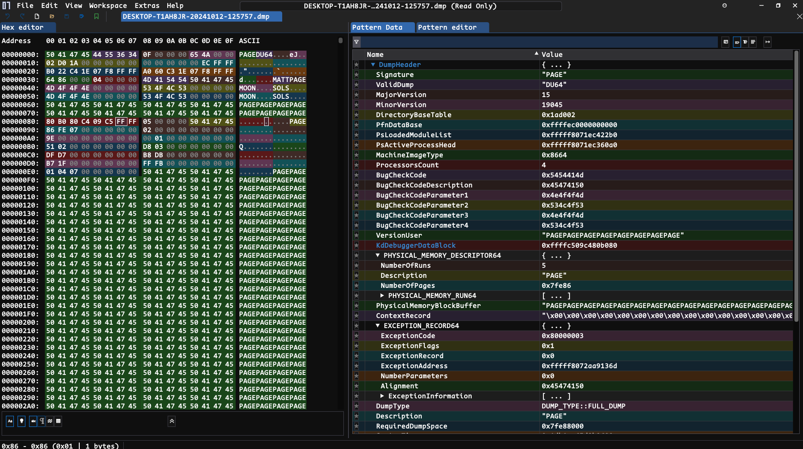

+++
title = "Kernel Memory Dump Analysis : Introduction"
date = "2025-01-30T18:28:18+05:30"
tags = ["Digital Forensics", "Kernel Dump", "Windows Troubleshooting", "Dump Analysis", "Memory Forensics", "WinDbg", "Windows"]
summary = "An introduction to analyzing kernel memory dumps using WinDbg."
draft = false
+++

#### Kernel Dump
A kernel dump is a snapshot of the system volatile memory (RAM) saved to the drive when the system crashes or the kernel (core part of the operating system) stops working.

#### Types of Kernel Memory Dumps

1. ***Complete Memory Dump***: Contains entire contents of system physical memory at the time of crash. It would be equal to your SYSTEM RAM size.

2. ***Kernel Dump***: Contains only kernel mode memory associated with operating system's kernel and its modules. It ignores memory (allocated  or unallocated) used by user mode.

3. ***Small Memory Dump***: Exactly 64KB in size. It includes BugCheck and its parametes, PRCB, EPROCESS and ETHREAD for the process that crashed and list of loaded modules.

4. ***Automatic Memory Dump***: Similar to `Kernel Dump`, the file contents would be same as Kernel Dump. The key difference between them is 
how Windows manages the system pagefile size. It automatically adjust size. Initially, Windows Page size is set smaller than RAM to save space. If computer crashes and the pagefile is too large, then Windows will increase the pagefile size almost equal to RAM size.

5. ***Active Memory Dump***: Similar to `Complete Memory Dump`. The key difference is it filters out the pages that are not useful in trobuleshooting. It ignores the irrelevant pages.

#### Requirements 
- **WinDbg**: WinDbg is a debugger that can be used to analyze crash dumps, debug live user-mode and kernel-mode code.

- ***[Mex.dll](https://www.microsoft.com/en-us/download/details.aspx?id=53304)***: Extension that simplifies debugging tasks and also provides powerful text filtering capabilites. 

**Note**: This is not a complete memory dump. Some commands may not function as intended.

#### Loading Mex.dll 

```bash
0: kd> .load C:\WinDbgExt\mex.dll
Mex External 3.0.0.7172 Loaded!
```

### Memory Dump Analysis

#### Dump Information 

`!di`: Displays dump information like **Computer Name**, **Product**, **BugCheck Code** and so on.

```
0: kd> !di
Computer Name: DESKTOP-T1AH8JR
Windows 10 Kernel Version 19045 MP (4 procs) Free x64
Product: WinNt, suite: TerminalServer SingleUserTS
Edition build lab: 19041.1.amd64fre.vb_release.191206-1406
Kernel base = 0xfffff807`1e018000 PsLoadedModuleList = 0xfffff807`1ec422b0
Debug session time: Sat Oct 12 18:27:59.711 2024 (UTC + 5:30)
System Uptime: 0 days 0:38:41.104
SystemManufacturer = VMware, Inc.
SystemProductName = VMware20,1
Processor: 11th Gen Intel(R) Core(TM) i5-1135G7 @ 2.40GHz
Bugcheck: 5454414D (4E4F4F4D, 534C4F53, 4E4F4F4D, 534C4F53)
KernelMode Full Memory Dump Path: V:\WinVM\QuackQuack\DESKTOP-T1AH8JR-20241012-125757.dmp
Share Path: \\QUACK\V$\WinVM\QuackQuack\DESKTOP-T1AH8JR-20241012-125757.dmp
```

Use `-v` for enabling verbose mode.

```
0: kd> !di -v
Computer Name: DESKTOP-T1AH8JR
Windows 10 Kernel Version 19045 MP (4 procs) Free x64
Product: WinNt, suite: TerminalServer SingleUserTS
Edition build lab: 19041.1.amd64fre.vb_release.191206-1406
Kernel base = 0xfffff807`1e018000 PsLoadedModuleList = 0xfffff807`1ec422b0
Debug session time: Sat Oct 12 18:27:59.711 2024 (UTC + 5:30)
System Uptime: 0 days 0:38:41.104
SystemManufacturer = VMware, Inc.
SystemProductName = VMware20,1
Processor: 11th Gen Intel(R) Core(TM) i5-1135G7 @ 2.40GHz
Bugcheck: 5454414D (4E4F4F4D, 534C4F53, 4E4F4F4D, 534C4F53)
KernelMode Full Memory Dump Path: V:\WinVM\QuackQuack\DESKTOP-T1AH8JR-20241012-125757.dmp
Share Path: \\QUACK\V$\WinVM\QuackQuack\DESKTOP-T1AH8JR-20241012-125757.dmp
Verbose mode

Event        Times (UTC + 5:30)
============ ==========================
System Start 10/12/2024 05:49:18.607 PM
Dump Start   10/12/2024 06:27:59.711 PM

Stat          Duration
============= ==========
System Uptime 38m:41.104


File size 2,145,943,552
File date 10/12/2024 18:28:12
ExceptionAddress: fffff8072aa9136d (DumpIt+0x000000000000136d)
   ExceptionCode: 80000003 (Break instruction exception)
  ExceptionFlags: 00000001
NumberParameters: 0

Local Machine Name QUACK (QUACK\heysa)
```

Opening the DUMP file in Hex Editor [ImHex](https://github.com/WerWolv/ImHex) to analyze its contents. ImHex has collection of various pattern files that could be useful for understanding file structures and patterns.  





#### Computer Name

- `!cn`: Displays Computer Name 


Alias: `!name`, `!computername`

```
0: kd> !cn
Computer Name: DESKTOP-T1AH8JR
```
#### Crash

- `!crash`:  Perfoms crash dump analysis and provides details

```
0: kd> !crash
Dump Info
============================================
Computer Name: DESKTOP-T1AH8JR
Windows 10 Kernel Version 19045 MP (4 procs) Free x64
Product: WinNt, suite: TerminalServer SingleUserTS
Edition build lab: 19041.1.amd64fre.vb_release.191206-1406
Kernel base = 0xfffff807`1e018000 PsLoadedModuleList = 0xfffff807`1ec422b0
Debug session time: Sat Oct 12 18:27:59.711 2024 (UTC + 5:30)
System Uptime: 0 days 0:38:41.104
SystemManufacturer = VMware, Inc.
SystemProductName = VMware20,1
Processor: 11th Gen Intel(R) Core(TM) i5-1135G7 @ 2.40GHz
Bugcheck: 5454414D (4E4F4F4D, 534C4F53, 4E4F4F4D, 534C4F53)
KernelMode Full Memory Dump Path: V:\WinVM\QuackQuack\DESKTOP-T1AH8JR-20241012-125757.dmp
Share Path: \\QUACK\V$\WinVM\QuackQuack\DESKTOP-T1AH8JR-20241012-125757.dmp


Bugcheck details
============================================
Bugcheck code 5454414D
Arguments 00000000`4e4f4f4d 00000000`534c4f53 00000000`4e4f4f4d 00000000`534c4f53

Crashing Stack
============================================
  *** Stack trace for last set context - .thread/.cxr resets it
 # Child-SP          RetAddr               Call Site
00 ffffc10f`7507ec70 ffffc509`bc08d6d0     DumpIt+0x16d7
01 ffffc10f`7507f190 00000000`00000001     0xffffc509`bc08d6d0
02 ffffc10f`7507f198 fffff807`1ed02a10     0x1
03 ffffc10f`7507f1a0 7fffc509`c25a3b80     nt!KiAbTreeArray+0xee10
04 ffffc10f`7507f1a8 00000000`ffffffff     0x7fffc509`c25a3b80
05 ffffc10f`7507f1b0 00000000`00000000     0xffffffff
```

#### Where Am I 

To check at what proccess currently in. This will display processes name along with details such as PID, TID, TEB and Session.

Alias: `!context`

```
0: kd> !w
Session: 0
Process: ffffc509b8884040 System
Thread:  fffff8071ed3fa00 Idle fffff8071ed3ca00
Pid: 4
Tid: 0
Frame: 0
Teb: 0
Dbgid: 0 (Debugger thread ID in usermode / Processor ID in kernelmode)
```

We can confirm that we are in the correct thread, as we got the same information from `!crash`

```
0: kd> !thread fffff8071ed3fa00
THREAD fffff8071ed3fa00  Cid 0000.0000  Teb: 0000000000000000 Win32Thread: 0000000000000000 RUNNING on processor 0
Not impersonating
DeviceMap                 ffff990107e38420
Owning Process            fffff8071ed3ca00       Image:         Idle
Attached Process          ffffc509b8884040       Image:         System
Wait Start TickCount      8051           Ticks: 140509 (0:00:36:35.453)
Context Switch Count      983471         IdealProcessor: 0             
UserTime                  00:00:00.000
KernelTime                00:31:12.906
Win32 Start Address nt!KiIdleLoop (0xfffff8071e418500)
Stack Init fffff80720e75650 Current fffff80720e755e0
Base fffff80720e76000 Limit fffff80720e6f000 Call 0000000000000000
Priority 0  BasePriority 0  IoPriority 0  PagePriority 5
Child-SP          RetAddr               : Args to Child                                                           : Call Site
ffffc10f`7507ec70 ffffc509`bc08d6d0     : 00000000`00000001 fffff807`1ed02a10 7fffc509`c25a3b80 00000000`ffffffff : DumpIt+0x16d7
ffffc10f`7507f190 00000000`00000001     : fffff807`1ed02a10 7fffc509`c25a3b80 00000000`ffffffff 00000000`00000000 : 0xffffc509`bc08d6d0
ffffc10f`7507f198 fffff807`1ed02a10     : 7fffc509`c25a3b80 00000000`ffffffff 00000000`00000000 ffffc509`bc08d720 : 0x1
ffffc10f`7507f1a0 7fffc509`c25a3b80     : 00000000`ffffffff 00000000`00000000 ffffc509`bc08d720 00000000`00000000 : nt!KiAbTreeArray+0xee10
ffffc10f`7507f1a8 00000000`ffffffff     : 00000000`00000000 ffffc509`bc08d720 00000000`00000000 00000000`00000000 : 0x7fffc509`c25a3b80
ffffc10f`7507f1b0 00000000`00000000     : ffffc509`bc08d720 00000000`00000000 00000000`00000000 00000000`00000000 : 0xffffffff
```

To get formatted and simplified view, use `!t <threadID>` 

```
0: kd> !t fffff8071ed3fa00
Process                 AttachedProcess           Thread                       CID       UserTime KernelTime ContextSwitches Wait Reason          Time State
Idle (fffff8071ed3ca00) System (ffffc509b8884040) fffff8071ed3fa00 (E|K|W|R|V) 0.0              0 31m:12.906          983471 WrCalloutStack 36m:35.453 Running on processor 0

Priority:
    Current Base Decrement ForegroundBoost IO Page
    0       0    0         0               0  5

# Child-SP         Return           Call Site
0 ffffc10f7507ec70 ffffc509bc08d6d0 DumpIt+0x16d7
1 ffffc10f7507f190 0000000000000001 0xffffc509bc08d6d0
2 ffffc10f7507f198 fffff8071ed02a10 0x1
3 ffffc10f7507f1a0 7fffc509c25a3b80 nt!KiAbTreeArray+0xee10
4 ffffc10f7507f1a8 00000000ffffffff 0x7fffc509c25a3b80
5 ffffc10f7507f1b0 0000000000000000 0xffffffff
```

- **E (Executive)** - Thread is executing in the Windows Executive layer.
- **K (Kernel)** - Thread is executing in kernel mode.
- **W (Wait)** - Thread is waiting for an event or resource.
- **R (Ready)** - Thread is ready to run but is not currently executing.
- **V (Wait for Event Pair Low)** - Thread is waiting on an lower part of event pair (used in synchronization). Mostly appears in ALPC, RPC and User to Kernel Communication.

#### List Threads 

- `!lt`: To get list of threads of a process.

Alias: `!listthreads`

```
0: kd> !lt
Process PID Thread           Id State         Time Reason
======= === ================ == ======= ========== ==============
Idle      0 fffff8071ed3fa00  0 Running 36m:35.453 WrCalloutStack
Idle      0 ffffb000addf2140  0 Running 38m:41.250 Executive
Idle      0 ffffb000ad9f5140  0 Running 38m:41.250 Executive
Idle      0 ffffb000adb78140  0 Standby 38m:41.250 Executive

Thread Count: 4
```

How to figure State and Reason looking at `_KTHREAD` structure ?

Examining the KTHREAD field, Identify the State and WaitReason fields, interpreting values to understand thread states and reasons for waiting.


```bash
0: kd> dt nt!_ETHREAD 
   +0x000 Tcb              : _KTHREAD
   +0x430 CreateTime       : _LARGE_INTEGER
   ...
```

- `_ETHREAD` is a gigantic structure. The very first entry is TCB(Thread Control Block) which is defined as a `_KTHREAD` structure. 

```bash

0: kd> dt nt!_KTHREAD fffff8071ed3fa00 -y WaitReason
   +0x283 WaitReason : 0x19 ''
  
0: kd> dt nt!_KTHREAD fffff8071ed3fa00  State
   +0x184 State : 0x2 ''
```

The WaitReason value `0x19` corresponds to 25 which is WrCalloutStack.

```c
typedef enum _KWAIT_REASON{
         Executive = 0,
         FreePage = 1,
         PageIn = 2,
         PoolAllocation = 3,
         DelayExecution = 4,
         Suspended = 5,
         UserRequest = 6,
         WrExecutive = 7,
         WrFreePage = 8,
         WrPageIn = 9,
         WrPoolAllocation = 10,
         WrDelayExecution = 11,
         WrSuspended = 12,
         WrUserRequest = 13,
         WrEventPair = 14,
         WrQueue = 15,
         WrLpcReceive = 16,
         WrLpcReply = 17,
         WrVirtualMemory = 18,
         WrPageOut = 19,
         WrRendezvous = 20,
         Spare2 = 21,
         Spare3 = 22,
         Spare4 = 23,
         Spare5 = 24,
         WrCalloutStack = 25,
         WrKernel = 26,
         WrResource = 27,
         WrPushLock = 28,
         WrMutex = 29,
         WrQuantumEnd = 30,
         WrDispatchInt = 31,
         WrPreempted = 32,
         WrYieldExecution = 33,
         WrFastMutex = 34,
         WrGuardedMutex = 35,
         WrRundown = 36,
         MaximumWaitReason = 37
} KWAIT_REASON;
```

By examining the State Value, we can determine the current state of the thread.

State 0x2: Running 

```c
    0x00: "Initialized",
    0x01: "Ready",
    0x02: "Running",
    0x03: "Standby",
    0x04: "Terminated",
    0x05: "Waiting",
    0x06: "Transition",
    0x07: "DeferredReady",  # Windows 5.2 and higher
    0x08: "GateWait",  # Windows 5.2 SP1 and higher
    0x09: "WaitingForProcessInSwap"  # Windows 10.0 and higher
```
#### Thread Lists

- `!lt`: Displays a list of threads.

Use `-pid <PROCESS_ID>` to see all threads of a process.

```bash
0: kd> !lt -pid 6672
Process      PID Thread             Id State        Time Reason
=========== ==== ================ ==== ======= ========= ===========
svchost.exe 1f3c ffffc509bd207080 1f38 Waiting 1m:17.609 UserRequest
svchost.exe 1f3c ffffc509bd297080 1900 Waiting 1m:17.578 UserRequest
svchost.exe 1f3c ffffc509b89ad080 1044 Waiting 1m:17.609 UserRequest
svchost.exe 1f3c ffffc509c1b40080  d08 Waiting 1m:17.578 UserRequest
svchost.exe 1f3c ffffc509bfbce040  d44 Waiting   17s.625 WrQueue
svchost.exe 1f3c ffffc509c1d65040 1dcc Waiting 1m:17.546 WrQueue
svchost.exe 1f3c ffffc509bf003080  1bc Waiting   14s.250 UserRequest
svchost.exe 1f3c ffffc509bdb0d080 1cd8 Waiting 1m:17.578 WrQueue
svchost.exe 1f3c ffffc509bdf6a040  1dc Waiting 1m:17.578 WrQueue
```

Use `-wr <Reason>` to filter out threads based on WaitReason

```bash
0: kd> !lt -pid 6672 -wr WrQueue
Process      PID Thread             Id State        Time Reason
=========== ==== ================ ==== ======= ========= =======
svchost.exe 1f3c ffffc509bfbce040  d44 Waiting   17s.625 WrQueue
svchost.exe 1f3c ffffc509c1d65040 1dcc Waiting 1m:17.546 WrQueue
svchost.exe 1f3c ffffc509bdb0d080 1cd8 Waiting 1m:17.578 WrQueue
svchost.exe 1f3c ffffc509bdf6a040  1dc Waiting 1m:17.578 WrQueue

Thread Count: 4
```

Let's inspect `cmd.exe` process.

```bash
0: kd> !process 0 0 cmd.exe
PROCESS ffffc509bf28b080
    SessionId: 1  Cid: 1164    Peb: 72ce659000  ParentCid: 1148
    DirBase: 5e2bc002  ObjectTable: ffff99011473e500  HandleCount: 245.
    Image: cmd.exe
```

#### Process 

- `!p`: It displays process details 

```bash
0: kd> !p ffffc509bf28b080
Name    Address                  Ses PID           Parent        PEB              Create Time                Mods Handle Thrd User Name
======= ======================== === ============= ============= ================ ========================== ==== ====== ==== ======================
cmd.exe ffffc509bf28b080 (E|K|O)   1 1164 (0n4452) 1148 (0n4424) 00000072ce659000 10/12/2024 06:17:51.083 PM   46      0    4 DESKTOP-T1AH8JR\w0w

Command Line: "C:\Windows\System32\cmd.exe"

Memory Details:

    VM   Peak Commit Size PP Quota  NPP Quota
    ==== ==== =========== ========= =========
    2 TB 2 TB     7.05 MB 181.53 KB  13.39 KB

Show LPC Port information for process

Show Threads: Unique Stacks    !mex.listthreads (!lt) ffffc509bf28b080    !process ffffc509bf28b080 7
```

Dump `PEB` for more insight about the process. 

```bash
0: kd> !peb 00000072ce659000
PEB at 00000072ce659000
    InheritedAddressSpace:    No
    ReadImageFileExecOptions: No
    BeingDebugged:            No
    ImageBaseAddress:         00007ff7931f0000
    NtGlobalFlag:             0
    NtGlobalFlag2:            0
    Ldr                       00007ffe5ef1c4c0
    Ldr.Initialized:          Yes
    Ldr.InInitializationOrderModuleList: 000001c7641224f0 . 000001c7641c8e90
    Ldr.InLoadOrderModuleList:           000001c764122660 . 000001c7641c7450
    Ldr.InMemoryOrderModuleList:         000001c764122670 . 000001c7641c7460
                    Base TimeStamp                     Module
            7ff7931f0000 e1cbfc53 Jan 16 14:56:43 2090 C:\Windows\System32\cmd.exe
            7ffe5edb0000 2f715b17 Mar 23 16:57:19 1995 C:\Windows\SYSTEM32\ntdll.dll
            7ffe5e530000 71a43e4a Jun 02 05:37:38 2030 C:\Windows\System32\KERNEL32.DLL
            7ffe5ca70000 a1c3e870 Jan 01 22:16:40 2056 C:\Windows\System32\KERNELBASE.dll
            7ffe5cef0000 564f9f39 Nov 21 04:01:21 2015 C:\Windows\System32\msvcrt.dll
            7ffe5d550000 03e7e147 Jan 29 15:45:35 1972 C:\Windows\System32\combase.dll
            7ffe5c5f0000 2bd748bf Apr 23 07:09:11 1993 C:\Windows\System32\ucrtbase.dll
            7ffe5cf90000 2261afdc Apr 12 11:19:16 1988 C:\Windows\System32\RPCRT4.dll
            7ffe469f0000 112f521c Feb 20 04:41:24 1979 C:\Windows\SYSTEM32\winbrand.dll
            7ffe5e430000 9370b239 May 21 06:43:29 2048 C:\Windows\System32\sechost.dll
            7ffe58140000 951bdbb4 Apr 10 06:58:20 2049 C:\Windows\SYSTEM32\cmdext.dll
            7ffe5e620000 18db2b76 Mar 20 19:28:14 1983 C:\Windows\System32\SHELL32.dll
            7ffe5cd70000 39255ccf May 19 20:55:03 2000 C:\Windows\System32\msvcp_win.dll
            7ffe5d160000 32a2a2e9 Dec 02 15:05:37 1996 C:\Windows\System32\USER32.dll
            7ffe5ca40000 0dcd0213 May 04 01:56:59 1977 C:\Windows\System32\win32u.dll
            7ffe5e5f0000 eeb3a47d Nov 26 12:11:01 2096 C:\Windows\System32\GDI32.dll
            7ffe5c920000 b89e115a Feb 25 09:11:14 2068 C:\Windows\System32\gdi32full.dll
            7ffe5e1e0000 68ff10be Oct 27 11:57:10 2025 C:\Windows\System32\IMM32.DLL
            7ffe5c7e0000 856685b0 Dec 03 00:47:04 2040 C:\Windows\System32\bcryptPrimitives.dll
            7ffe515e0000 db2b08ef Jul 09 10:53:59 2086 < Name not readable >
            7ffe5d4a0000 29534f79 Dec 21 19:58:09 1991 C:\Windows\System32\SHCORE.dll
            7ffe5e4d0000 19bb5737 Sep 06 20:22:39 1983 C:\Windows\System32\shlwapi.dll
            7ffe5a570000 8eecb4fc Dec 26 10:35:00 2045 C:\Windows\SYSTEM32\windows.storage.dll
            7ffe5be10000 db45726f Jul 29 11:43:03 2086 C:\Windows\System32\Wldp.dll
            7ffe5ddf0000 6869db26 Jul 06 07:40:46 2025 C:\Windows\System32\advapi32.dll
            7ffe5a370000 f0713fcd Oct 30 12:12:21 2097 C:\Windows\SYSTEM32\kernel.appcore.dll
            7ffe59ea0000 06bc4541 Aug 01 02:53:13 1973 C:\Windows\system32\uxtheme.dll
            7ffe5dea0000 2f888521 Apr 10 06:38:49 1995 C:\Windows\System32\ole32.dll
            7ffe58010000 3a69740d Jan 20 16:48:37 2001 C:\Windows\System32\PROPSYS.dll
            7ffe5dd20000 61567b6b Oct 01 08:37:23 2021 C:\Windows\System32\OLEAUT32.dll
            7ffe5dfe0000 a7c9263e Mar 15 23:43:18 2059 C:\Windows\System32\clbcatq.dll
            7ffe5c3d0000 793b0534 Jun 14 20:48:12 2034 C:\Windows\System32\profapi.dll
            7ffe40d70000 be357357 Feb 15 02:42:55 2071 < Name not readable >
            7ffe5c6f0000 04ed5855 Aug 14 23:35:09 1972 < Name not readable >
            7ffe51290000 e4672001 Jun 06 15:50:49 2091 C:\Windows\System32\urlmon.dll
            7ffe50fd0000 443050a9 Apr 03 04:01:05 2006 C:\Windows\System32\iertutil.dll
            7ffe5b970000 fcf57d1b Jun 26 23:36:19 2104 C:\Windows\System32\netutils.dll
            7ffe50f90000 58a8ec81 Feb 19 06:23:21 2017 C:\Windows\System32\srvcli.dll
            7ffe5c380000 1d683fd4 Aug 20 13:05:48 1985 C:\Windows\System32\SspiCli.dll
            7ffe4d960000 af44cd81 Mar 08 01:07:37 2063 C:\Windows\SYSTEM32\virtdisk.dll
            7ffe496c0000 2ea9f33d Oct 23 10:53:09 1994 C:\Windows\SYSTEM32\FLTLIB.DLL
            7ffe4f500000 0d302819 Jan 05 02:33:21 1977 C:\Windows\System32\MPR.dll
            7ffe46910000 6b7310c3 Feb 15 20:20:43 2027 < Name not readable >
            7ffe47610000 fafdac70 Jun 10 19:55:52 2103 C:\Windows\System32\sfc_os.dll
            7ffe5d8b0000 ad12c63e Jan 05 17:42:46 2062 C:\Windows\System32\SETUPAPI.dll
            7ffe5c740000 87ca24c8 Mar 11 23:00:48 2042 < Name not readable >
    SubSystemData:     0000000000000000
    ProcessHeap:       000001c764120000
    ProcessParameters: 000001c764121cb0
    CurrentDirectory:  'C:\Users\w0w\Downloads\'
    WindowTitle:  'C:\Windows\System32\cmd.exe'
    ImageFile:    'C:\Windows\System32\cmd.exe'
    CommandLine:  '"C:\Windows\System32\cmd.exe" '
    DllPath:      '< Name not readable >'
    Environment:  000001c7641ed5b0
       Unable to read Environment string.
```


To display a process along with all its threads, their stack traces, and the arguments passed to functions in each thread

```bash
!process <Address> <flags>
```

```bash
0: kd> !process ffffc509bf28b080 7
PROCESS ffffc509bf28b080
    SessionId: 1  Cid: 1164    Peb: 72ce659000  ParentCid: 1148
    DirBase: 5e2bc002  ObjectTable: ffff99011473e500  HandleCount: 245.
    Image: cmd.exe
    VadRoot ffffc509c25d2850 Vads 97 Clone 0 Private 541. Modified 1639. Locked 0.
    DeviceMap ffff99010c29f0d0
    Token                             ffff9901102cf5f0
    ElapsedTime                       00:10:08.787
    UserTime                          00:00:00.000
    KernelTime                        00:00:00.015
    QuotaPoolUsage[PagedPool]         185888
    QuotaPoolUsage[NonPagedPool]      13712
    Working Set Sizes (now,min,max)  (360, 50, 345) (1440KB, 200KB, 1380KB)
    PeakWorkingSetSize                5030
    VirtualSize                       2101370 Mb
    PeakVirtualSize                   2101386 Mb
    PageFaultCount                    8156
    MemoryPriority                    BACKGROUND
    BasePriority                      8
    CommitCharge                      1805

        THREAD ffffc509bf2e1080  Cid 1164.1a28  Teb: 00000072ce65a000 Win32Thread: ffffc509c19bad00 WAIT: (UserRequest) UserMode Non-Alertable
            ffffc509c1f6c080  ProcessObject
        Not impersonating
        DeviceMap                 ffff99010c29f0d0
        Owning Process            ffffc509bf28b080       Image:         cmd.exe
        Attached Process          N/A            Image:         N/A
        Wait Start TickCount      130470         Ticks: 18090 (0:00:04:42.656)
        Context Switch Count      674            IdealProcessor: 1             
        UserTime                  00:00:00.015
        KernelTime                00:00:00.046
        Win32 Start Address 0x00007ff793208f50
        Stack Init ffffc10f7221f650 Current ffffc10f7221f060
        Base ffffc10f72220000 Limit ffffc10f72219000 Call 0000000000000000
        Priority 9  BasePriority 8  IoPriority 2  PagePriority 5
        Kernel stack not resident.
        Child-SP          RetAddr               : Args to Child                                                           : Call Site
        ffffc10f`7221f0a0 fffff807`1e2349c0     : ffffb000`adde7180 00000000`ffffffff ffffc10f`7221f220 ffffc509`bf28b700 : nt!KiSwapContext+0x76
        ffffc10f`7221f1e0 fffff807`1e233eef     : 00000000`00000001 00000000`00000003 ffffc10f`7221f3a0 00000000`00000000 : nt!KiSwapThread+0x500
        ffffc10f`7221f290 fffff807`1e233793     : 00000000`00000000 fffff807`00000000 00000000`00000700 ffffc509`bf2e11c0 : nt!KiCommitThreadWait+0x14f
        ffffc10f`7221f330 fffff807`1e629641     : ffffc509`c1f6c080 00000000`00000006 00000000`00000001 00000000`00000000 : nt!KeWaitForSingleObject+0x233
        ffffc10f`7221f420 fffff807`1e62959a     : ffffc509`bf2e1080 00000000`00000000 00000000`00000000 00000000`00000002 : nt!ObWaitForSingleObject+0x91
        ffffc10f`7221f480 fffff807`1e4274f5     : ffffc509`bf2e1000 00000000`00001000 00000000`00000000 00000000`00000000 : nt!NtWaitForSingleObject+0x6a
        ffffc10f`7221f4c0 00007ffe`5ee4d0e4     : 00000000`00000000 00000000`00000000 00000000`00000000 00000000`00000000 : nt!KiSystemServiceCopyEnd+0x25 (TrapFrame @ ffffc10f`7221f4c0)
        00000072`ce8feda8 00000000`00000000     : 00000000`00000000 00000000`00000000 00000000`00000000 00000000`00000000 : 0x00007ffe`5ee4d0e4

        THREAD ffffc509bdfa4040  Cid 1164.19b0  Teb: 00000072ce66c000 Win32Thread: 0000000000000000 WAIT: (WrQueue) UserMode Alertable
            ffffc509bd99bbc0  QueueObject
        Not impersonating
        DeviceMap                 ffff99010c29f0d0
        Owning Process            ffffc509bf28b080       Image:         cmd.exe
        Attached Process          N/A            Image:         N/A
        Wait Start TickCount      148010         Ticks: 550 (0:00:00:08.593)
        Context Switch Count      63             IdealProcessor: 0             
        UserTime                  00:00:00.000
        KernelTime                00:00:00.000
        Win32 Start Address 0x00007ffe5ee02b20
        Stack Init ffffc10f74aef650 Current ffffc10f74aeed80
        Base ffffc10f74af0000 Limit ffffc10f74ae9000 Call 0000000000000000
        Priority 9  BasePriority 8  IoPriority 2  PagePriority 5
        Child-SP          RetAddr               : Args to Child                                                           : Call Site
        ffffc10f`74aeedc0 fffff807`1e2349c0     : ffffb000`ad9ea180 fffff807`ffffffff ffffec00`0076a970 0a000000`278dd025 : nt!KiSwapContext+0x76
        ffffc10f`74aeef00 fffff807`1e233eef     : c509bc22`00000002 ffffc10f`00000001 00000000`00000000 ffffec00`00000000 : nt!KiSwapThread+0x500
        ffffc10f`74aeefb0 fffff807`1e21fd73     : ffffc10f`00000000 00000000`00000000 ffffc509`00000000 00000000`00000001 : nt!KiCommitThreadWait+0x14f
        ffffc10f`74aef050 fffff807`1e21f7a8     : ffffc509`bd99bbc0 ffffc509`c13d3730 ffffc10f`74aef220 8a000000`00000000 : nt!KeRemoveQueueEx+0x263
        ffffc10f`74aef0f0 fffff807`1e21f258     : 00000000`00000000 ffffc509`bf28b700 ffffc10f`74aef350 ffffc509`bdfa4040 : nt!IoRemoveIoCompletion+0x98
        ffffc10f`74aef220 fffff807`1e4274f5     : 00000000`00000000 00000000`00000000 00000000`00000000 00000072`ce659000 : nt!NtWaitForWorkViaWorkerFactory+0xdc8
        ffffc10f`74aef450 00007ffe`5ee50ad4     : 00000000`00000000 00000000`00000000 00000000`00000000 00000000`00000000 : nt!KiSystemServiceCopyEnd+0x25 (TrapFrame @ ffffc10f`74aef4c0)
        00000072`ce9ff998 00000000`00000000     : 00000000`00000000 00000000`00000000 00000000`00000000 00000000`00000000 : 0x00007ffe`5ee50ad4

        THREAD ffffc509bda44080  Cid 1164.1710  Teb: 00000072ce66e000 Win32Thread: 0000000000000000 WAIT: (WrQueue) UserMode Alertable
            ffffc509bd99bbc0  QueueObject
        Not impersonating
        DeviceMap                 ffff99010c29f0d0
        Owning Process            ffffc509bf28b080       Image:         cmd.exe
        Attached Process          N/A            Image:         N/A
        Wait Start TickCount      148010         Ticks: 550 (0:00:00:08.593)
        Context Switch Count      6              IdealProcessor: 1             
        UserTime                  00:00:00.000
        KernelTime                00:00:00.000
        Win32 Start Address 0x00007ffe5ee02b20
        Stack Init ffffc10f74ae7650 Current ffffc10f74ae6d80
        Base ffffc10f74ae8000 Limit ffffc10f74ae1000 Call 0000000000000000
        Priority 9  BasePriority 8  IoPriority 2  PagePriority 5
        Child-SP          RetAddr               : Args to Child                                                           : Call Site
        ffffc10f`74ae6dc0 fffff807`1e2349c0     : ffffb000`adde7180 00007ffe`ffffffff ffffc509`00000000 ffffc509`bd5e79c0 : nt!KiSwapContext+0x76
        ffffc10f`74ae6f00 fffff807`1e233eef     : 00000000`00000001 00000000`00000002 00000000`00000000 00000000`00000000 : nt!KiSwapThread+0x500
        ffffc10f`74ae6fb0 fffff807`1e21fd73     : 00000000`00000000 ffffc509`00000000 ffffc509`c242c100 00000000`00000001 : nt!KiCommitThreadWait+0x14f
        ffffc10f`74ae7050 fffff807`1e21f7a8     : ffffc509`bd99bbc0 ffffc509`c13d3730 ffffc10f`74ae74c0 ffffc509`00000000 : nt!KeRemoveQueueEx+0x263
        ffffc10f`74ae70f0 fffff807`1e21f258     : 00000000`00000000 ffffc509`bf28b700 ffffc10f`74ae7350 ffffc509`bda44080 : nt!IoRemoveIoCompletion+0x98
        ffffc10f`74ae7220 fffff807`1e4274f5     : 00000000`00000000 00000000`00000000 00000000`00000000 ffffc509`bdcef810 : nt!NtWaitForWorkViaWorkerFactory+0xdc8
        ffffc10f`74ae7450 00007ffe`5ee50ad4     : 00000000`00000000 00000000`00000000 00000000`00000000 00000000`00000000 : nt!KiSystemServiceCopyEnd+0x25 (TrapFrame @ ffffc10f`74ae74c0)
        00000072`ceaff6f8 00000000`00000000     : 00000000`00000000 00000000`00000000 00000000`00000000 00000000`00000000 : 0x00007ffe`5ee50ad4

        THREAD ffffc509bdbf8080  Cid 1164.1e84  Teb: 00000072ce670000 Win32Thread: 0000000000000000 WAIT: (WrQueue) UserMode Alertable
            ffffc509bd99bbc0  QueueObject
        Not impersonating
        DeviceMap                 ffff99010c29f0d0
        Owning Process            ffffc509bf28b080       Image:         cmd.exe
        Attached Process          N/A            Image:         N/A
        Wait Start TickCount      148010         Ticks: 550 (0:00:00:08.593)
        Context Switch Count      4              IdealProcessor: 0             
        UserTime                  00:00:00.000
        KernelTime                00:00:00.000
        Win32 Start Address 0x00007ffe5ee02b20
        Stack Init ffffc10f74b0f650 Current ffffc10f74b0ed80
        Base ffffc10f74b10000 Limit ffffc10f74b09000 Call 0000000000000000
        Priority 9  BasePriority 8  IoPriority 2  PagePriority 5
        Child-SP          RetAddr               : Args to Child                                                           : Call Site
        ffffc10f`74b0edc0 fffff807`1e2349c0     : ffffb000`ad9ea180 00007ffe`ffffffff ffffec00`0154dfd0 0a000000`719ff025 : nt!KiSwapContext+0x76
        ffffc10f`74b0ef00 fffff807`1e233eef     : 00000000`00000002 ffffc10f`00000000 00000000`00000000 ffffb000`00000000 : nt!KiSwapThread+0x500
        ffffc10f`74b0efb0 fffff807`1e21fd73     : 00000000`00000000 ffffc509`00000000 00000000`00000000 00000000`00000001 : nt!KiCommitThreadWait+0x14f
        ffffc10f`74b0f050 fffff807`1e21f7a8     : ffffc509`bd99bbc0 ffffc509`c13d3730 ffffc10f`74b0f4c0 ffffadd6`00000000 : nt!KeRemoveQueueEx+0x263
        ffffc10f`74b0f0f0 fffff807`1e21f258     : 00000000`00000000 ffffc509`bf28b700 ffffc10f`74b0f350 00000000`00000000 : nt!IoRemoveIoCompletion+0x98
        ffffc10f`74b0f220 fffff807`1e4274f5     : 00000000`00000000 00000000`00000000 00000000`00000000 00000000`00000000 : nt!NtWaitForWorkViaWorkerFactory+0xdc8
        ffffc10f`74b0f450 00007ffe`5ee50ad4     : 00000000`00000000 00000000`00000000 00000000`00000000 00000000`00000000 : nt!KiSystemServiceCopyEnd+0x25 (TrapFrame @ ffffc10f`74b0f4c0)
        00000072`cebff848 00000000`00000000     : 00000000`00000000 00000000`00000000 00000000`00000000 00000000`00000000 : 0x00007ffe`5ee50ad4
```

```bash
0: kd> !lt ffffc509bf28b080
Process  PID Thread             Id State        Time Reason      Waiting On
======= ==== ================ ==== ======= ========= =========== ================================
cmd.exe 1164 ffffc509bf2e1080 1a28 Waiting 4m:42.656 UserRequest Process: powershell.exe (0n6672)
cmd.exe 1164 ffffc509bdfa4040 19b0 Waiting    8s.593 WrQueue     
cmd.exe 1164 ffffc509bda44080 1710 Waiting    8s.593 WrQueue     
cmd.exe 1164 ffffc509bdbf8080 1e84 Waiting    8s.593 WrQueue     

Thread Count: 4
```

#### List All the processes

`tl`: To list all the running process in the machine.


```bash
0: kd> !tl
PID           Address          Name
============= ================ =============================
0x0    0n0    fffff8071ed3ca00 Idle
0x4    0n4    ffffc509b8884040 System
0x6c   0n108  ffffc509b88cb080 Registry
0x158  0n344  ffffc509baaf4040 smss.exe
0x1c8  0n456  ffffc509ba45c140 csrss.exe
0x214  0n532  ffffc509bc17d080 wininit.exe
0x21c  0n540  ffffc509bc16f080 csrss.exe
0x270  0n624  ffffc509bc1d3080 winlogon.exe
0x2a8  0n680  ffffc509bc1e9140 services.exe
0x2b0  0n688  ffffc509bd20d140 lsass.exe
0x334  0n820  ffffc509bc1e8300 svchost.exe(-p)
0x350  0n848  ffffc509bd290200 fontdrvhost.exe
0x354  0n852  ffffc509bd28e200 fontdrvhost.exe
0x3b4  0n948  ffffc509bd21c080 svchost.exe(-p)
0x198  0n408  ffffc509bd3a8080 dwm.exe
0x2d0  0n720  ffffc509bd415300 svchost.exe(-p)
0x17c  0n380  ffffc509bd41f080 svchost.exe(-p)
0x43c  0n1084 ffffc509bd433340 svchost.exe(-p)
0x454  0n1108 ffffc509bd443080 svchost.exe(-p)
0x4bc  0n1212 ffffc509bd48e0c0 svchost.exe(-p)
0x540  0n1344 ffffc509bd57b0c0 svchost.exe(-p)
0x5b4  0n1460 ffffc509bd5e8040 MemCompression
0x6c8  0n1736 ffffc509bd6c4300 svchost.exe(-p)
0x714  0n1812 ffffc509b89b1080 svchost.exe
0x71c  0n1820 ffffc509b89b3080 svchost.exe
0x798  0n1944 ffffc509b8962340 svchost.exe(-p)
0x7f4  0n2036 ffffc509bd7ac0c0 spoolsv.exe
0x578  0n1400 ffffc509b890b080 svchost.exe(-p)
0x5e8  0n1512 ffffc509b8907080 svchost.exe
0x958  0n2392 ffffc509bd860340 dasHost.exe
0x964  0n2404 ffffc509bd863080 svchost.exe(-p)
0x974  0n2420 ffffc509bd864080 Everything.exe
0x984  0n2436 ffffc509bd89a080 IpOverUsbSvc.exe*32
0x9c0  0n2496 ffffc509bd8b4080 MpDefenderCoreService.exe
0x9f4  0n2548 ffffc509bdb04300 vm3dservice.exe
0x9fc  0n2556 ffffc509bdb020c0 VGAuthService.exe
0xa0c  0n2572 ffffc509bdb03080 vmtoolsd.exe
0xa18  0n2584 ffffc509bdb07080 MsMpEng.exe
0xaa4  0n2724 ffffc509bdbac340 vm3dservice.exe
0xbec  0n3052 ffffc509bd961080 dllhost.exe
0x920  0n2336 ffffc509bdc6a340 WmiPrvSE.exe
0xc48  0n3144 ffffc509bde27300 svchost.exe(-p)
0xd3c  0n3388 ffffc509bdfa2080 msdtc.exe
0xd94  0n3476 ffffc509bdf772c0 dllhost.exe
0xdfc  0n3580 ffffc509bdfec080 svchost.exe
0x7c0  0n1984 ffffc509bf294080 NisSrv.exe
0x524  0n1316 ffffc509bf21b080 svchost.exe(-p)
0xf14  0n3860 ffffc509bfbc70c0 MicrosoftEdgeUpdate.exe*32
0x7a4  0n1956 ffffc509bfa8f080 SgrmBroker.exe
0x5f0  0n1520 ffffc509bfce3080 uhssvc.exe
0x668  0n1640 ffffc509bfbe4080 MoUsoCoreWorker.exe
0x102c 0n4140 ffffc509bfcf3080 svchost.exe
0x1064 0n4196 ffffc509bfd57300 SearchIndexer.exe
0x7b0  0n1968 ffffc509bd51d080 svchost.exe
0x117c 0n4476 ffffc509c04f3080 sihost.exe
0x136c 0n4972 ffffc509c0490080 svchost.exe(UnistackSvcGroup)
0x47c  0n1148 ffffc509bfd4c080 taskhostw.exe
0xc7c  0n3196 ffffc509bfeec080 ctfmon.exe
0x1148 0n4424 ffffc509c16df080 explorer.exe
0xf9c  0n3996 ffffc509bfe4a080 svchost.exe(-p)
0xd2c  0n3372 ffffc509c11cc080 ApplicationFrameHost.exe
0xd88  0n3464 ffffc509c0c08080 StartMenuExperienceHost.exe
0x53c  0n1340 ffffc509c0ed0080 RuntimeBroker.exe
0xfec  0n4076 ffffc509c0fa6080 SearchApp.exe
0x1468 0n5224 ffffc509c1dc6080 RuntimeBroker.exe
0xa9c  0n2716 ffffc509c1c18080 RuntimeBroker.exe
0x7dc  0n2012 ffffc509c1e1a240 SecurityHealthSystray.exe
0x1740 0n5952 ffffc509c1c29340 SecurityHealthService.exe
0xcac  0n3244 ffffc509c1d0d080 vmtoolsd.exe
0x170  0n368  ffffc509bc059080 Everything.exe
0x6dc  0n1756 ffffc509c04d60c0 OneDrive.exe
0x14e8 0n5352 ffffc509c0ca9080 SystemSettings.exe
0xe9c  0n3740 ffffc509c0c0a080 UserOOBEBroker.exe
0x1a80 0n6784 ffffc509c1de5080 smartscreen.exe
0x1164 0n4452 ffffc509bf28b080 cmd.exe
0xb90  0n2960 ffffc509c0ed2080 conhost.exe
0x1548 0n5448 ffffc509bfd5f080 audiodg.exe
0x1ba8 0n7080 ffffc509c1168080 TextInputHost.exe
0x460  0n1120 ffffc509c1d37080 taskhostw.exe
0x175c 0n5980 ffffc509c1d60080 dllhost.exe
0x14ac 0n5292 ffffc509c0492080 SearchApp.exe
0x1a30 0n6704 ffffc509c1dd3080 msedgewebview2.exe
0x12a0 0n4768 ffffc509bfdaf080 msedgewebview2.exe
0x1574 0n5492 ffffc509c1b09080 msedgewebview2.exe
0x1d4  0n468  ffffc509bfdd1080 msedgewebview2.exe
0xd68  0n3432 ffffc509c0dbd080 msedgewebview2.exe
0x14cc 0n5324 ffffc509c226b080 msedgewebview2.exe
0x1a08 0n6664 ffffc509c1b130c0 msedge.exe
0x6e0  0n1760 ffffc509c238a0c0 msedge.exe
0x156c 0n5484 ffffc509c1e0a080 msedge.exe
0x1cbc 0n7356 ffffc509c2030080 msedge.exe
0x1c84 0n7300 ffffc509c1e09080 msedge.exe
0x1a10 0n6672 ffffc509c1f6c080 powershell.exe
0x18fc 0n6396 ffffc509c1b0a080 Microsoft.Photos.exe
0x1b6c 0n7020 ffffc509c1ee9080 RuntimeBroker.exe
0x177c 0n6012 ffffc509c0f88080 010Editor.exe
0x5a8  0n1448 ffffc509c222c340 notepad.exe
0x1ec4 0n7876 ffffc509c2397080 powershell.exe
0x1754 0n5972 ffffc509c43ab080 powershell.exe
0x860  0n2144 ffffc509bfeee080 mspaint.exe
0x1f3c 0n7996 ffffc509c2ddd080 svchost.exe
0xcbc  0n3260 ffffc509c226d080 DumpIt.exe
0x55c  0n1372 ffffc509c42ec0c0 conhost.exe
============= ================ =============================
PID           Address          Name

Warning! Zombie process(es) detected (not displayed). Count: 2 [zombie report]
```

To list the zombie process.

```bash
0: kd> !tl -z
PID           Address          Name         Ses Thd Obj Handles Obj Pointers
============= ================ ============ === === =========== ============
0x1174 0n4468 ffffc509c16e0080 userinit.exe   1   0           1            1
0x1894 0n6292 ffffc509c1a020c0 msedge.exe     1   0           0            1
============= ================ ============ === === =========== ============
PID           Address          Name         Ses Thd Obj Handles Obj Pointers
```

For more detailed view, use  `!tl -stat`. It provides information like

- **PID:** Unique Process Identifier assigned by the system.  
- **Address:** Memory address where the process structure resides.  
- **Name:** Executable name of the process.  
- **UserTime:** Total time the process has spent executing in user mode.  
- **KernelTime:** Total time the process has spent executing in kernel mode.  
- **TotalTime:** Sum of UserTime and KernelTime, representing total CPU usage.  
- **Virtual Memory Size:** Total virtual memory allocated to the process.  
- **Peak Memory Size:** Highest amount of memory the process has used.  
- **Shared Memory Size:** Amount of memory shared with other processes.  
- **Commit Size:** Amount of memory committed to the process (reserved for use).  
- **Address Windowing Extension (AWE):** Indicates whether AWE is enabled for large memory management.  
- **Thread and Handles Count:** Number of active threads and open handles in the process.  
- **Creation Time:** Timestamp when the process was started.  
- **Command Line:** Full command-line arguments used to launch the process.

```bash
0: kd> !tl -stat
PID           Address          Name                               User       Kernel        Total Ses       VM      Peak   Shared Awe Size Commit Size  PP Quota NPP Quota Thd Hnd Create Time         Command Line
============= ================ ============================= ========= ============ ============ === ======== ========= ======== ======== =========== ========= ========= === === =================== ====================================================================================================================================================================================================================================================================================================================================================================================================================================================================================================================================================================================================================================================================================================================================================================================================================================================================================================================================
0x9f4  0n2548 ffffc509bdb04300 vm3dservice.exe                    16ms            0         16ms   0     2 TB      2 TB  1.97 MB        0     1.53 MB  81.55 KB   7.76 KB   3   0 10/12/2024 05:49 PM 
0x354  0n852  ffffc509bd28e200 fontdrvhost.exe                       0         16ms         16ms   0     2 TB      2 TB   368 KB        0     1.25 MB  36.09 KB   5.44 KB   5   0 10/12/2024 05:49 PM 
0x12a0 0n4768 ffffc509bfdaf080 msedgewebview2.exe                 16ms            0         16ms   1  2.07 TB   2.07 TB  3.31 MB        0     2.04 MB 114.23 KB   8.76 KB  10   0 10/12/2024 06:21 PM "C:\Program Files (x86)\Microsoft\EdgeWebView\Application\129.0.2792.89\msedgewebview2.exe" --type=crashpad-handler --user-data-dir=C:\Users\w0w\AppData\Local\Packages\Microsoft.Windows.Search_E_KEY> >::BTreeIteratorFromSearchResult(struct B_TREE<union _SM_PAGE_KEY,struct SMKM_STORE_MGR<struct SM_TRAITS>::SMKM_FRONTEND_ENTRY,4096,struct B_TREE_DUMMY_NODE_POOL,struct B_TREE_KEY_COMPARATOR<union _SM_PAGE_KEY> > * __ptr64,struct B_TREE<union _SM_PAGE_KEY,struct SMKM_STORE_MGR<struct SM_TRAITS>::SMKM_FRONTEND_ENTRY,4096,struct B_TREE_DUMMY_NODE_POOL,struct B_TREE_KEY_COMPARATOR<union _SM_PAGE_KEY> >::ITERATOR * __ptr64,struct B_TREE<union _SM_PAGE_KEY,struct SMKM_STORE_MGR<struct SM_TRAITS>::SMKM_FRONTEND_ENTRY,4096,struct B_TREE_DUMMY_NODE_POOL,struct B_TREE_KEY_COMPARATOR<union _SM_PAGE_KEY>
0xd94  0n3476 ffffc509bdf772c0 dllhost.exe                           0         31ms         31ms   0     2 TB      2 TB  2.11 MB        0     2.97 MB 108.66 KB   16.2 KB   4   0 10/12/2024 05:49 PM 
0x460  0n1120 ffffc509c1d37080 taskhostw.exe                         0         32ms         32ms   1     2 TB      2 TB  3.34 MB        0     3.36 MB 139.55 KB  11.68 KB   3   0 10/12/2024 06:19 PM taskhostw.exe
0x6e0  0n1760 ffffc509c238a0c0 msedge.exe                         16ms         16ms         32ms   1  2.07 TB   2.07 TB  3.33 MB        0     2.04 MB 121.66 KB   8.89 KB   8   0 10/12/2024 06:22 PM 
0xe9c  0n3740 ffffc509c0c0a080 UserOOBEBroker.exe                 15ms         32ms         47ms   1     2 TB      2 TB  2.44 MB        0     1.89 MB 122.89 KB  10.22 KB   1   0 10/12/2024 06:02 PM 
0x5f0  0n1520 ffffc509bfce3080 uhssvc.exe                         16ms         31ms         47ms   0     2 TB      2 TB   368 KB        0     1.32 MB  59.96 KB   6.83 KB   3   0 10/12/2024 05:51 PM 
0xd3c  0n3388 ffffc509bdfa2080 msdtc.exe                             0         47ms         47ms   0     2 TB      2 TB  1.91 MB        0     2.62 MB  89.72 KB  13.05 KB   9   0 10/12/2024 05:49 PM 
0x9fc  0n2556 ffffc509bdb020c0 VGAuthService.exe                  47ms         16ms         63ms   0     2 TB      2 TB  1.98 MB        0     2.43 MB 126.69 KB  10.66 KB   2   0 10/12/2024 05:49 PM 
0x214  0n532  ffffc509bc17d080 wininit.exe                        31ms         32ms         63ms   0     2 TB      2 TB  1.89 MB        0     1.47 MB  75.52 KB  11.11 KB   2   0 10/12/2024 05:49 PM 
0xcbc  0n3260 ffffc509c226d080 DumpIt.exe                            0         78ms         78ms   1     2 TB      2 TB  2.48 MB        0      1.9 MB 113.23 KB   12.7 KB   7   0 10/12/2024 06:27 PM "C:\Users\w0w\Downloads\Comae-Toolkit-v20230117\x64\DumpIt.exe"
0x1164 0n4452 ffffc509bf28b080 cmd.exe                            16ms         63ms         79ms   1     2 TB      2 TB  2.45 MB        0     7.05 MB 181.53 KB  13.39 KB   4   0 10/12/2024 06:17 PM "C:\Windows\System32\cmd.exe"
0xdfc  0n3580 ffffc509bdfec080 svchost.exe                        16ms         63ms         79ms   0     2 TB      2 TB  1.91 MB        0     1.87 MB  74.73 KB  10.82 KB   5   0 10/12/2024 05:49 PM 
0x1f3c 0n7996 ffffc509c2ddd080 svchost.exe                        16ms         64ms         80ms   0     2 TB      2 TB  1.93 MB        0     2.31 MB  94.66 KB  11.77 KB   9   0 10/12/2024 06:26 PM 
0x7c0  0n1984 ffffc509bf294080 NisSrv.exe                         47ms         47ms         94ms   0     2 TB      2 TB  1.91 MB        0     3.66 MB 115.17 KB  31.34 KB   3   0 10/12/2024 05:49 PM 
0x1c84 0n7300 ffffc509c1e09080 msedge.exe                         32ms         79ms        111ms   1   2.1 TB    2.1 TB  1.43 MB        0     7.34 MB 717.33 KB  10.75 KB   9   0 10/12/2024 06:22 PM 
0x158  0n344  ffffc509baaf4040 smss.exe                              0        125ms        125ms   0     2 TB      2 TB   264 KB        0     1.03 MB  12.92 KB   3.15 KB   2   0 10/12/2024 05:49 PM 
0x7f4  0n2036 ffffc509bd7ac0c0 spoolsv.exe                        31ms         94ms        125ms   0     2 TB      2 TB  1.98 MB        0     4.93 MB  134.9 KB   20.2 KB   7   0 10/12/2024 05:49 PM 
0xf14  0n3860 ffffc509bfbc70c0 MicrosoftEdgeUpdate.exe*32         31ms         94ms        125ms   0 54.38 MB  59.42 MB  1.99 MB        0     1.98 MB  107.8 KB  12.85 KB   4   0 10/12/2024 05:51 PM 
0x984  0n2436 ffffc509bd89a080 IpOverUsbSvc.exe*32                63ms         78ms        141ms   0 97.59 MB 106.29 MB  2.04 MB        0     3.96 MB 130.07 KB  18.95 KB   6   0 10/12/2024 05:49 PM 
0x175c 0n5980 ffffc509c1d60080 dllhost.exe                        78ms         63ms        141ms   1     2 TB      2 TB  2.55 MB        0     5.79 MB 155.85 KB  25.23 KB  10   0 10/12/2024 06:20 PM 
0x7a4  0n1956 ffffc509bfa8f080 SgrmBroker.exe                     78ms         64ms        142ms   0     2 TB      2 TB   352 KB        0     3.64 MB   34.7 KB   7.42 KB   7   0 10/12/2024 05:51 PM C:\Windows\system32\SgrmBroker.exe
0x714  0n1812 ffffc509b89b1080 svchost.exe                        46ms        110ms        156ms   0     2 TB      2 TB  1.91 MB        0     1.52 MB  61.85 KB   9.97 KB   3   0 10/12/2024 05:49 PM 
0x5e8  0n1512 ffffc509b8907080 svchost.exe                        94ms         63ms        157ms   0     2 TB      2 TB  1.91 MB        0     3.43 MB  98.66 KB  21.09 KB  11   0 10/12/2024 05:49 PM 
0xd68  0n3432 ffffc509c0dbd080 msedgewebview2.exe                 16ms        156ms        172ms   1   2.1 TB    2.1 TB  1.53 MB        0     7.98 MB 716.57 KB  10.35 KB   8   0 10/12/2024 06:21 PM 
0x55c  0n1372 ffffc509c42ec0c0 conhost.exe                        32ms        141ms        173ms   1     2 TB      2 TB 10.43 MB        0     6.77 MB 206.11 KB  12.34 KB   7   0 10/12/2024 06:27 PM \??\C:\Windows\system32\conhost.exe 0x4
0x7dc  0n2012 ffffc509c1e1a240 SecurityHealthSystray.exe          78ms        125ms        203ms   1     2 TB      2 TB  2.43 MB        0     1.86 MB 144.34 KB   9.95 KB   4   0 10/12/2024 06:01 PM 
0xf9c  0n3996 ffffc509bfe4a080 svchost.exe(-p)                    94ms        109ms        203ms   1     2 TB      2 TB   2.7 MB        0     3.88 MB 239.97 KB  15.53 KB   7   0 10/12/2024 06:01 PM C:\Windows\system32\svchost.exe -k ClipboardSvcGroup -p
0x958  0n2392 ffffc509bd860340 dasHost.exe                        62ms        141ms        203ms   0     2 TB      2 TB  1.92 MB        0     3.21 MB 102.38 KB  17.22 KB   4   0 10/12/2024 05:49 PM 
0x270  0n624  ffffc509bc1d3080 winlogon.exe                       16ms        204ms        220ms   1     2 TB      2 TB  5.43 MB        0      2.8 MB 146.18 KB  13.38 KB   5   0 10/12/2024 05:49 PM winlogon.exe
0x1cbc 0n7356 ffffc509c2030080 msedge.exe                         79ms        220ms        299ms   1   2.1 TB    2.1 TB  3.32 MB        0    10.76 MB 787.59 KB  17.26 KB  17   0 10/12/2024 06:22 PM "C:\Program Files (x86)\Microsoft\Edge\Application\msedge.exe" --type=utility --utility-sub-type=network.mojom.NetworkService --lang=en-US --service-sandbox-type=none --string-annotations=is-enterprise-managed=no --field-trial-handle=1960,i,4181584267198314694,12054113679502471114,262144 --variations-seed-version --mojo-platform-channel-handle=2352 /prefetch:3
0xbec  0n3052 ffffc509bd961080 dllhost.exe                       156ms        157ms        313ms   0     2 TB      2 TB  1.97 MB        0     4.05 MB 102.77 KB  14.42 KB  12   0 10/12/2024 05:49 PM C:\Windows\system32\dllhost.exe /Processid:{02D4B3F1-FD88-11D1-960D-00805FC79235}
0x102c 0n4140 ffffc509bfcf3080 svchost.exe                        78ms        250ms        328ms   0     2 TB      2 TB  1.91 MB        0      2.9 MB  81.77 KB   12.7 KB   8   0 10/12/2024 05:51 PM 
0x156c 0n5484 ffffc509c1e0a080 msedge.exe                        141ms        189ms        330ms   1   2.1 TB    2.1 TB  3.51 MB        0    86.07 MB  739.8 KB  16.39 KB  18   0 10/12/2024 06:22 PM "C:\Program Files (x86)\Microsoft\Edge\Application\msedge.exe" --type=gpu-process --string-annotations=is-enterprise-managed=no --gpu-preferences=UAAAAAAAAADgAAAMAAAAAAAAAAAAAAAAAABgAAEAAAAAAAAABAAAAAAAAAAAAAAAAAAAAAAAAAAAAAAAAAAAABAAAAAAAAAAEAAAAAAAAAAIAAAAAAAAAAgAAAAAAAAA --field-trial-handle=2108,i,4181584267198314694,12054113679502471114,262144 --variations-seed-version --mojo-platform-channel-handle=2064 /prefetch:2
0x1a80 0n6784 ffffc509c1de5080 smartscreen.exe                    93ms        250ms        343ms   1  2.04 TB   2.04 TB  2.71 MB        0     9.84 MB 252.12 KB  25.39 KB  10   0 10/12/2024 06:17 PM C:\Windows\System32\smartscreen.exe -Embedding
0x71c  0n1820 ffffc509b89b3080 svchost.exe                       203ms        157ms        360ms   0     2 TB      2 TB  1.91 MB        0      2.2 MB  98.02 KB  14.23 KB   4   0 10/12/2024 05:49 PM 
0x9c0  0n2496 ffffc509bd8b4080 MpDefenderCoreService.exe         125ms        250ms        375ms   0     2 TB      2 TB     2 MB        0     6.95 MB 144.56 KB   15.7 KB   7   0 10/12/2024 05:49 PM 
0x47c  0n1148 ffffc509bfd4c080 taskhostw.exe                     157ms        329ms        486ms   1     2 TB      2 TB  3.66 MB        0     7.18 MB 182.02 KB  35.31 KB   8   0 10/12/2024 06:01 PM 
0x1548 0n5448 ffffc509bfd5f080 audiodg.exe                       172ms        328ms        500ms   0     2 TB      2 TB  1.91 MB        0     6.48 MB   92.3 KB  11.02 KB   5   0 10/12/2024 06:17 PM C:\Windows\system32\AUDIODG.EXE 0x484\00x480
0x1b6c 0n7020 ffffc509c1ee9080 RuntimeBroker.exe                 188ms        344ms        532ms   1     2 TB      2 TB  3.72 MB        0     8.29 MB 307.35 KB  23.02 KB   9   0 10/12/2024 06:23 PM C:\Windows\System32\RuntimeBroker.exe -Embedding
0x1c8  0n456  ffffc509ba45c140 csrss.exe                          94ms        486ms        580ms   0     2 TB      2 TB  5.41 MB        0     1.74 MB 170.76 KB  15.06 KB  10   0 10/12/2024 05:49 PM 
0x6c   0n108  ffffc509b88cb080 Registry                              0        594ms        594ms   0  90.7 MB  125.2 MB                 0     5.74 MB 185.53 KB   8.23 KB   4   0 10/12/2024 05:49 PM 
0xaa4  0n2724 ffffc509bdbac340 vm3dservice.exe                    62ms        579ms        641ms   1     2 TB      2 TB  3.34 MB        0     1.67 MB  126.5 KB   9.09 KB   4   0 10/12/2024 05:49 PM 
0xb90  0n2960 ffffc509c0ed2080 conhost.exe                       157ms        485ms        642ms   1     2 TB      2 TB  3.34 MB        0     6.82 MB 195.53 KB  11.94 KB   5   0 10/12/2024 06:17 PM 
0x454  0n1108 ffffc509bd443080 svchost.exe(-p)                   390ms        298ms        688ms   0     2 TB      2 TB  1.93 MB        0    13.75 MB 179.49 KB  23.58 KB  17   0 10/12/2024 05:49 PM C:\Windows\system32\svchost.exe -k LocalServiceNoNetwork -p
0x1ba8 0n7080 ffffc509c1168080 TextInputHost.exe                 312ms        422ms        734ms   1     2 TB      2 TB  3.01 MB        0    12.44 MB 428.82 KB  22.55 KB  12   0 10/12/2024 06:19 PM "C:\Windows\SystemApps\MicrosoftWindows.Client.CBS_cw5n1h2txyewy\TextInputHost.exe" -ServerName:InputApp.AppXjd5de1g66v206tj52m9d0dtpppx4cgpn.mca
0x14e8 0n5352 ffffc509c0ca9080 SystemSettings.exe                422ms        344ms        766ms   1     2 TB      2 TB 11.54 MB        0    26.31 MB 692.87 KB  35.63 KB  17   0 10/12/2024 06:02 PM 
0x14ac 0n5292 ffffc509c0492080 SearchApp.exe                     375ms        407ms        782ms   1  2.04 TB   2.04 TB  7.42 MB        0    16.49 MB 602.71 KB   37.8 KB  16   0 10/12/2024 06:21 PM 
0x1d4  0n468  ffffc509bfdd1080 msedgewebview2.exe                344ms        469ms        813ms   1   2.1 TB    2.1 TB  3.82 MB        0    11.48 MB 790.38 KB  17.39 KB  20   0 10/12/2024 06:21 PM "C:\Program Files (x86)\Microsoft\EdgeWebView\Application\129.0.2792.89\msedgewebview2.exe" --type=utility --utility-sub-type=network.mojom.NetworkService --lang=en-US --service-sandbox-type=none --string-annotations=is-enterprise-managed=no --noerrdialogs --user-data-dir="C:\Users\w0w\AppData\Local\Packages\Microsoft.Windows.Search_cw5n1h2txyewy\LocalState\EBWebView" --webview-exe-name=SearchApp.exe --webview-exe-version=10.0.19041.2913 --embedded-browser-webview=1 --field-trial-handle=2204,i,18045552061194189501,7473414819730365478,262144 --enable-features=msEmbeddedBrowserVisualHosting --variations-seed-version --mojo-platform-channel-handle=2220 /prefetch:3
0x1740 0n5952 ffffc509c1c29340 SecurityHealthService.exe         312ms        579ms        891ms   0     2 TB      2 TB  2.27 MB        0      4.2 MB 144.04 KB  16.13 KB   7   0 10/12/2024 06:01 PM 
0x6c8  0n1736 ffffc509bd6c4300 svchost.exe(-p)                   298ms        594ms        892ms   0     2 TB      2 TB  1.91 MB        0     3.11 MB 110.15 KB  12.99 KB  11   0 10/12/2024 05:49 PM C:\Windows\System32\svchost.exe -k LocalServiceNetworkRestricted -p
0x177c 0n6012 ffffc509c0f88080 010Editor.exe                     437ms        547ms        984ms   1  4.23 GB   4.26 GB  3.56 MB        0    25.75 MB 342.03 KB  23.59 KB   3   0 10/12/2024 06:23 PM "C:\Program Files\010 Editor\010Editor.EXE" "C:\Users\w0w\Downloads\libgcc_s_dw2-1.zip"
0x1574 0n5492 ffffc509c1b09080 msedgewebview2.exe                189ms        796ms        985ms   1   2.1 TB    2.1 TB 16.79 MB        0    13.43 MB 796.34 KB  23.36 KB  21   0 10/12/2024 06:21 PM "C:\Program Files (x86)\Microsoft\EdgeWebView\Application\129.0.2792.89\msedgewebview2.exe" --type=gpu-process --string-annotations=is-enterprise-managed=no --noerrdialogs --user-data-dir="C:\Users\w0w\AppData\Local\Packages\Microsoft.Windows.Search_cw5n1h2txyewy\LocalState\EBWebView" --webview-exe-name=SearchApp.exe --webview-exe-version=10.0.19041.2913 --embedded-browser-webview=1 --gpu-preferences=UAAAAAAAAADgAAAMAAAAAAAAAAAAAAAAAABgAAEAAAAAAAAABAAAAAAAAAAAAAAAAAAAAAAAAAAAAAAAAAAAABAAAAAAAAAAEAAAAAAAAAAIAAAAAAAAAAgAAAAAAAAA --field-trial-handle=1968,i,18045552061194189501,7473414819730365478,262144 --enable-features=msEmbeddedBrowserVisualHosting --variations-seed-version --mojo-platform-channel-handle=1912 /prefetch:2
0x5a8  0n1448 ffffc509c222c340 notepad.exe                       422ms        609ms       1s.031   1     2 TB      2 TB  3.84 MB        0    10.53 MB 348.34 KB   27.2 KB   4   0 10/12/2024 06:23 PM 
0x350  0n848  ffffc509bd290200 fontdrvhost.exe                   609ms        516ms       1s.125   1     2 TB      2 TB   524 KB        0     8.25 MB 482.34 KB  12.74 KB   5   0 10/12/2024 05:49 PM 
0xa0c  0n2572 ffffc509bdb03080 vmtoolsd.exe                      422ms        735ms       1s.157   0     2 TB      2 TB     2 MB        0     6.05 MB 164.85 KB  20.45 KB  12   0 10/12/2024 05:49 PM "C:\Program Files\VMware\VMware Tools\vmtoolsd.exe"
0xd2c  0n3372 ffffc509c11cc080 ApplicationFrameHost.exe          688ms        767ms       1s.455   1     2 TB      2 TB   7.5 MB        0     19.9 MB  414.7 KB   30.8 KB  19   0 10/12/2024 06:01 PM C:\Windows\system32\ApplicationFrameHost.exe -Embedding
0x136c 0n4972 ffffc509c0490080 svchost.exe(UnistackSvcGroup)    1s.125        688ms       1s.813   1     2 TB      2 TB  2.83 MB        0    13.75 MB 384.05 KB  39.16 KB  14   0 10/12/2024 06:01 PM C:\Windows\system32\svchost.exe -k UnistackSvcGroup
0x21c  0n540  ffffc509bc16f080 csrss.exe                         125ms       1s.736       1s.861   1     2 TB      2 TB 25.03 MB        0     4.87 MB 226.68 KB  23.73 KB  13   0 10/12/2024 05:49 PM 
0x578  0n1400 ffffc509b890b080 svchost.exe(-p)                   625ms       1s.328       1s.953   0     2 TB      2 TB  1.91 MB        0    11.14 MB 112.81 KB  31.85 KB  12   0 10/12/2024 05:49 PM C:\Windows\system32\svchost.exe -k LocalServiceNoNetworkFirewall -p
0x1754 0n5972 ffffc509c43ab080 powershell.exe                   1s.703        313ms       2s.016   1     2 TB      2 TB  2.97 MB        0    55.16 MB  390.7 KB  38.74 KB  12   0 10/12/2024 06:26 PM "C:\Windows\System32\WindowsPowerShell\v1.0\powershell.exe"
0x17c  0n380  ffffc509bd41f080 svchost.exe(-p)                   579ms       1s.485       2s.064   0     2 TB      2 TB  1.92 MB        0    16.94 MB 148.73 KB  19.62 KB  12   0 10/12/2024 05:49 PM C:\Windows\System32\svchost.exe -k LocalServiceNetworkRestricted -p
0x1a10 0n6672 ffffc509c1f6c080 powershell.exe                   1s.422        657ms       2s.079   1     2 TB      2 TB  2.97 MB        0    51.63 MB 390.69 KB  37.67 KB   9   0 10/12/2024 06:23 PM 
0x1a30 0n6704 ffffc509c1dd3080 msedgewebview2.exe                611ms       1s.472       2s.083   1  2.13 TB   2.13 TB 15.05 MB        0    31.22 MB   1.04 MB  45.85 KB  54   0 10/12/2024 06:21 PM 
0x668  0n1640 ffffc509bfbe4080 MoUsoCoreWorker.exe               922ms       1s.173       2s.095   0     2 TB      2 TB  2.26 MB        0     7.34 MB 154.54 KB  17.98 KB   8   0 10/12/2024 05:51 PM 
0x1064 0n4196 ffffc509bfd57300 SearchIndexer.exe                1s.126       1s.048       2s.174   0     2 TB      2 TB  2.79 MB        0    28.38 MB 230.09 KB  70.62 KB  20   0 10/12/2024 05:51 PM C:\Windows\system32\SearchIndexer.exe /Embedding
0x1ec4 0n7876 ffffc509c2397080 powershell.exe                   1s.672        516ms       2s.188   1     2 TB      2 TB  2.97 MB        0    51.84 MB 390.69 KB  37.67 KB   9   0 10/12/2024 06:24 PM 
0x6dc  0n1756 ffffc509c04d60c0 OneDrive.exe                      704ms       1s.610       2s.314   1  2.01 TB   2.01 TB  4.07 MB        0    47.62 MB 765.69 KB  49.55 KB  23   0 10/12/2024 06:01 PM "C:\Users\w0w\AppData\Local\Microsoft\OneDrive\OneDrive.exe" /background
0x1468 0n5224 ffffc509c1dc6080 RuntimeBroker.exe                1s.219       1s.610       2s.829   1     2 TB      2 TB  3.66 MB        0     12.5 MB  378.7 KB  29.91 KB  14   0 10/12/2024 06:01 PM 
0x2a8  0n680  ffffc509bc1e9140 services.exe                     1s.421       1s.594       3s.015   0     2 TB      2 TB   372 KB        0     3.68 MB 142.03 KB  10.46 KB   5   0 10/12/2024 05:49 PM C:\Windows\system32\services.exe
0xc7c  0n3196 ffffc509bfeec080 ctfmon.exe                        923ms       2s.235       3s.158   1     2 TB      2 TB  3.33 MB        0     4.16 MB 196.61 KB  16.64 KB  13   0 10/12/2024 06:01 PM "ctfmon.exe"
0x1a08 0n6664 ffffc509c1b130c0 msedge.exe                       1s.471       1s.690       3s.161   1  2.13 TB   2.13 TB  6.66 MB        0    79.63 MB   1.04 MB  39.27 KB  47   0 10/12/2024 06:22 PM "C:\Program Files (x86)\Microsoft\Edge\Application\msedge.exe" --no-startup-window
0x964  0n2404 ffffc509bd863080 svchost.exe(-p)                  1s.938       1s.251       3s.189   0     2 TB      2 TB  2.27 MB        0     15.6 MB 166.09 KB  23.11 KB   9   0 10/12/2024 05:49 PM C:\Windows\System32\svchost.exe -k utcsvc -p
0x53c  0n1340 ffffc509c0ed0080 RuntimeBroker.exe                1s.860       1s.422       3s.282   1     2 TB      2 TB  2.73 MB        0     4.11 MB 215.16 KB   15.4 KB   4   0 10/12/2024 06:01 PM 
0xa9c  0n2716 ffffc509c1c18080 RuntimeBroker.exe                1s.266       2s.110       3s.376   1     2 TB      2 TB  2.83 MB        0     8.61 MB 237.13 KB  18.85 KB   5   0 10/12/2024 06:01 PM C:\Windows\System32\RuntimeBroker.exe -Embedding
0x117c 0n4476 ffffc509c04f3080 sihost.exe                       1s.608       1s.846       3s.454   1     2 TB      2 TB  2.71 MB        0     9.41 MB  293.8 KB  22.35 KB  15   0 10/12/2024 06:01 PM sihost.exe
0x18fc 0n6396 ffffc509c1b0a080 Microsoft.Photos.exe             1s.922       1s.611       3s.533   1  4.92 GB   4.96 GB  49.5 MB        0   143.08 MB 945.65 KB  63.44 KB  22   0 10/12/2024 06:23 PM "C:\Program Files\WindowsApps\Microsoft.Windows.Photos_2019.19071.12548.0_x64__8wekyb3d8bbwe\Microsoft.Photos.exe" -ServerName:App.AppXzst44mncqdg84v7sv6p7yznqwssy6f7f.mca
0xd88  0n3464 ffffc509c0c08080 StartMenuExperienceHost.exe      2s.250       1s.532       3s.782   1     2 TB      2 TB  5.37 MB        0    22.82 MB 534.33 KB  30.59 KB  12   0 10/12/2024 06:01 PM "C:\Windows\SystemApps\Microsoft.Windows.StartMenuExperienceHost_cw5n1h2txyewy\StartMenuExperienceHost.exe" -ServerName:App.AppXywbrabmsek0gm3tkwpr5kwzbs55tkqay.mca
0x4bc  0n1212 ffffc509bd48e0c0 svchost.exe(-p)                  1s.563       2s.267       3s.830   0     2 TB      2 TB  2.28 MB        0    12.66 MB 332.11 KB  49.93 KB  24   0 10/12/2024 05:49 PM C:\Windows\system32\svchost.exe -k LocalService -p
0x7b0  0n1968 ffffc509bd51d080 svchost.exe                      2s.578       2s.375       4s.953   0     2 TB      2 TB  2.27 MB        0    10.26 MB 199.87 KB  20.14 KB   5   0 10/12/2024 05:53 PM 
0x974  0n2420 ffffc509bd864080 Everything.exe                    547ms       5s.298       5s.845   0  4.08 GB   4.08 GB  1.99 MB        0     1.56 MB  99.93 KB   8.83 KB   2   0 10/12/2024 05:49 PM 
0x540  0n1344 ffffc509bd57b0c0 svchost.exe(-p)                  3s.390       3s.298       6s.688   0     2 TB      2 TB  2.05 MB        0     7.59 MB 169.38 KB   38.6 KB  17   0 10/12/2024 05:49 PM C:\Windows\System32\svchost.exe -k NetworkService -p
0x860  0n2144 ffffc509bfeee080 mspaint.exe                      3s.422       4s.032       7s.454   1     2 TB      2 TB  3.43 MB        0    22.06 MB 292.65 KB 101.05 KB  10   0 10/12/2024 06:26 PM "C:\Windows\system32\mspaint.exe"
0x334  0n820  ffffc509bc1e8300 svchost.exe(-p)                  1s.814       5s.876       7s.690   0     2 TB      2 TB  2.36 MB        0     8.91 MB 518.46 KB   24.7 KB  17   0 10/12/2024 05:49 PM C:\Windows\system32\svchost.exe -k DcomLaunch -p
0x14cc 0n5324 ffffc509c226b080 msedgewebview2.exe               7s.938        986ms       8s.924   1   3.2 TB    3.2 TB 12.21 MB        0   108.61 MB 748.66 KB  26.24 KB  17   0 10/12/2024 06:21 PM "C:\Program Files (x86)\Microsoft\EdgeWebView\Application\129.0.2792.89\msedgewebview2.exe" --type=renderer --string-annotations=is-enterprise-managed=no --noerrdialogs --user-data-dir="C:\Users\w0w\AppData\Local\Packages\Microsoft.Windows.Search_cw5n1h2txyewy\LocalState\EBWebView" --webview-exe-name=SearchApp.exe --webview-exe-version=10.0.19041.2913 --embedded-browser-webview=1 --video-capture-use-gpu-memory-buffer --lang=en-US --device-scale-factor=1 --num-raster-threads=2 --enable-main-frame-before-activation --renderer-client-id=5 --js-flags="--harmony-weak-refs-with-cleanup-some --expose-gc --ms-user-locale=" --time-ticks-at-unix-epoch=-1728735557172340 --launch-time-ticks=1945901679 --field-trial-handle=3448,i,18045552061194189501,7473414819730365478,262144 --enable-features=msEmbeddedBrowserVisualHosting --variations-seed-version --mojo-platform-channel-handle=3428 /prefetch:1
0x170  0n368  ffffc509bc059080 Everything.exe                   5s.546       4s.376       9s.922   1  4.18 GB   4.19 GB  2.46 MB        0    24.91 MB 175.49 KB  13.73 KB   5   0 10/12/2024 06:01 PM 
0x43c  0n1084 ffffc509bd433340 svchost.exe(-p)                  2s.985       7s.062      10s.047   0  2.01 TB   2.01 TB  2.27 MB        0    11.05 MB 202.27 KB  25.66 KB  15   0 10/12/2024 05:49 PM C:\Windows\System32\svchost.exe -k LocalSystemNetworkRestricted -p
0x198  0n408  ffffc509bd3a8080 dwm.exe                          5s.734       4s.892      10s.626   1     2 TB      2 TB 92.25 MB        0     74.8 MB 791.27 KB  50.58 KB  14   0 10/12/2024 05:49 PM "dwm.exe"
0x2b0  0n688  ffffc509bd20d140 lsass.exe                        6s.344       6s.782      13s.126   0     2 TB      2 TB  2.26 MB        0     7.12 MB 155.84 KB   25.2 KB   9   0 10/12/2024 05:49 PM C:\Windows\system32\lsass.exe
0x3b4  0n948  ffffc509bd21c080 svchost.exe(-p)                  7s.656       6s.501      14s.157   0     2 TB      2 TB   764 KB        0     6.81 MB 150.31 KB  18.77 KB  12   0 10/12/2024 05:49 PM C:\Windows\system32\svchost.exe -k RPCSS -p
0x920  0n2336 ffffc509bdc6a340 WmiPrvSE.exe                     7s.672       9s.126      16s.798   0     2 TB      2 TB  1.92 MB        0     9.35 MB 104.77 KB  16.51 KB  12   0 10/12/2024 05:49 PM C:\Windows\system32\wbem\wmiprvse.exe\0-secured\0-Embedding
0x798  0n1944 ffffc509b8962340 svchost.exe(-p)                 12s.796       5s.172      17s.968   0     2 TB      2 TB  1.98 MB        0    14.85 MB 100.72 KB  13.67 KB   7   0 10/12/2024 05:49 PM C:\Windows\system32\svchost.exe -k appmodel -p
0xfec  0n4076 ffffc509c0fa6080 SearchApp.exe                   12s.115       6s.097      18s.212   1  2.04 TB   2.04 TB 18.75 MB        0   179.11 MB  916.8 KB  123.6 KB  60   0 10/12/2024 06:01 PM 
0x524  0n1316 ffffc509bf21b080 svchost.exe(-p)                 11s.203      11s.330      22s.533   0     2 TB      2 TB  1.91 MB        0     6.91 MB 143.27 KB  19.85 KB  10   0 10/12/2024 05:51 PM C:\Windows\System32\svchost.exe -k NetworkService -p
0x1148 0n4424 ffffc509c16df080 explorer.exe                    12s.334      19s.004      31s.338   1     2 TB   2.01 TB 21.73 MB        0    80.51 MB   1.13 MB 112.95 KB  82   0 10/12/2024 06:01 PM C:\Windows\Explorer.EXE
0xcac  0n3244 ffffc509c1d0d080 vmtoolsd.exe                    46s.578      16s.688    1m:03.266   1     2 TB      2 TB  3.98 MB        0     30.5 MB 393.95 KB  34.48 KB   9   0 10/12/2024 06:01 PM "C:\Program Files\VMware\VMware Tools\vmtoolsd.exe" -n vmusr
0x5b4  0n1460 ffffc509bd5e8040 MemCompression                        0    1m:14.237    1m:14.237   0   353 MB 406.62 MB                 0      820 KB   4.12 KB            54   0 10/12/2024 05:49 PM 
0xc48  0n3144 ffffc509bde27300 svchost.exe(-p)                 44s.328      31s.594    1m:15.922   0  2.04 TB   2.04 TB  2.27 MB        0    54.43 MB 390.52 KB  35.51 KB  28   0 10/12/2024 05:49 PM C:\Windows\system32\svchost.exe -k wsappx -p
0x4    0n4    ffffc509b8884040 System                                0    2m:10.132    2m:10.132   0  3.82 MB  14.18 MB   292 KB        0      196 KB               272 B 164   0 10/12/2024 05:49 PM 
0xa18  0n2584 ffffc509bdb07080 MsMpEng.exe                   2m:24.124    1m:57.111    4m:21.235   0     2 TB      2 TB  2.35 MB        0   322.74 MB 618.59 KB  198.9 KB  29   0 10/12/2024 05:49 PM "C:\ProgramData\Microsoft\Windows Defender\platform\4.18.24080.9-0\MsMpEng.exe"
0x2d0  0n720  ffffc509bd415300 svchost.exe(-p)               4m:35.690    1m:05.799    5m:41.489   0     2 TB      2 TB  5.86 MB        0   118.43 MB 666.31 KB 128.26 KB  70   0 10/12/2024 05:49 PM C:\Windows\system32\svchost.exe -k netsvcs -p
0x0    0n0    fffff8071ed3ca00 Idle                                  0 2h:03:46.734 2h:03:46.734   0     8 KB      8 KB                 0       60 KB               272 B   4                         
============= ================ ============================= ========= ============ ============ === ======== ========= ======== ======== =========== ========= ========= === === =================== ====================================================================================================================================================================================================================================================================================================================================================================================================================================================================================================================================================================================================================================================================================================================================================================================================================================================================================================================================
PID           Address          Name                               User       Kernel        Total Ses       VM      Peak   Shared Awe Size Commit Size  PP Quota NPP Quota Thd Hnd Create Time         Command Line

Warning! Zombie process(es) detected (not displayed). Count: 2 [zombie report]
```

To list process in tree view,

```bash
0: kd> !tl -tree
  System Processes
     4    ffffc509b8884040 System 
        108  ffffc509b88cb080 Registry 
        344  ffffc509baaf4040 smss.exe 
        1460 ffffc509bd5e8040 MemCompression 
     456  ffffc509ba45c140 csrss.exe 
     532  ffffc509bc17d080 wininit.exe 
        680  ffffc509bc1e9140 services.exe 
           820  ffffc509bc1e8300 svchost.exe (-p) 
              2336 ffffc509bdc6a340 WmiPrvSE.exe 
              3476 ffffc509bdf772c0 dllhost.exe 
              1640 ffffc509bfbe4080 MoUsoCoreWorker.exe 
              3372 ffffc509c11cc080 ApplicationFrameHost.exe 
              3464 ffffc509c0c08080 StartMenuExperienceHost.exe 
              1340 ffffc509c0ed0080 RuntimeBroker.exe 
              4076 ffffc509c0fa6080 SearchApp.exe 
              5224 ffffc509c1dc6080 RuntimeBroker.exe 
              2716 ffffc509c1c18080 RuntimeBroker.exe 
              5352 ffffc509c0ca9080 SystemSettings.exe 
              3740 ffffc509c0c0a080 UserOOBEBroker.exe 
              6784 ffffc509c1de5080 smartscreen.exe 
              7080 ffffc509c1168080 TextInputHost.exe 
              5980 ffffc509c1d60080 dllhost.exe 
              5292 ffffc509c0492080 SearchApp.exe 
                 6704 ffffc509c1dd3080 msedgewebview2.exe 
                    4768 ffffc509bfdaf080 msedgewebview2.exe 
                    5492 ffffc509c1b09080 msedgewebview2.exe 
                    468  ffffc509bfdd1080 msedgewebview2.exe 
                    3432 ffffc509c0dbd080 msedgewebview2.exe 
                    5324 ffffc509c226b080 msedgewebview2.exe 
              6396 ffffc509c1b0a080 Microsoft.Photos.exe 
              7020 ffffc509c1ee9080 RuntimeBroker.exe 
           948  ffffc509bd21c080 svchost.exe (-p) 
           720  ffffc509bd415300 svchost.exe (-p) 
              4476 ffffc509c04f3080 sihost.exe 
              1148 ffffc509bfd4c080 taskhostw.exe 
              1120 ffffc509c1d37080 taskhostw.exe 
           380  ffffc509bd41f080 svchost.exe (-p) 
           1084 ffffc509bd433340 svchost.exe (-p) 
              2392 ffffc509bd860340 dasHost.exe 
              3196 ffffc509bfeec080 ctfmon.exe 
           1108 ffffc509bd443080 svchost.exe (-p) 
           1212 ffffc509bd48e0c0 svchost.exe (-p) 
           1344 ffffc509bd57b0c0 svchost.exe (-p) 
           1736 ffffc509bd6c4300 svchost.exe (-p) 
              5448 ffffc509bfd5f080 audiodg.exe 
           1812 ffffc509b89b1080 svchost.exe 
           1820 ffffc509b89b3080 svchost.exe 
           1944 ffffc509b8962340 svchost.exe (-p) 
           2036 ffffc509bd7ac0c0 spoolsv.exe 
           1400 ffffc509b890b080 svchost.exe (-p) 
           1512 ffffc509b8907080 svchost.exe 
           2404 ffffc509bd863080 svchost.exe (-p) 
           2420 ffffc509bd864080 Everything.exe 
           2436 ffffc509bd89a080 IpOverUsbSvc.exe 
           2496 ffffc509bd8b4080 MpDefenderCoreService.exe 
           2548 ffffc509bdb04300 vm3dservice.exe 
              2724 ffffc509bdbac340 vm3dservice.exe 
           2556 ffffc509bdb020c0 VGAuthService.exe 
           2572 ffffc509bdb03080 vmtoolsd.exe 
           2584 ffffc509bdb07080 MsMpEng.exe 
           3052 ffffc509bd961080 dllhost.exe 
           3144 ffffc509bde27300 svchost.exe (-p) 
           3388 ffffc509bdfa2080 msdtc.exe 
           3580 ffffc509bdfec080 svchost.exe 
           1984 ffffc509bf294080 NisSrv.exe 
           1316 ffffc509bf21b080 svchost.exe (-p) 
           1956 ffffc509bfa8f080 SgrmBroker.exe 
           1520 ffffc509bfce3080 uhssvc.exe 
           4140 ffffc509bfcf3080 svchost.exe 
           4196 ffffc509bfd57300 SearchIndexer.exe 
           1968 ffffc509bd51d080 svchost.exe 
           4972 ffffc509c0490080 svchost.exe (UnistackSvcGroup) 
           3996 ffffc509bfe4a080 svchost.exe (-p) 
           5952 ffffc509c1c29340 SecurityHealthService.exe 
           7996 ffffc509c2ddd080 svchost.exe 
        688  ffffc509bd20d140 lsass.exe 
        852  ffffc509bd28e200 fontdrvhost.exe 
     540  ffffc509bc16f080 csrss.exe 
     624  ffffc509bc1d3080 winlogon.exe 
        848  ffffc509bd290200 fontdrvhost.exe 
        408  ffffc509bd3a8080 dwm.exe 
        4468 ffffc509c16e0080 userinit.exe 
           4424 ffffc509c16df080 explorer.exe 
              2012 ffffc509c1e1a240 SecurityHealthSystray.exe 
              3244 ffffc509c1d0d080 vmtoolsd.exe 
              368  ffffc509bc059080 Everything.exe 
              1756 ffffc509c04d60c0 OneDrive.exe 
              6292 ffffc509c1a020c0 msedge.exe 
                 6664 ffffc509c1b130c0 msedge.exe 
                    1760 ffffc509c238a0c0 msedge.exe 
                    5484 ffffc509c1e0a080 msedge.exe 
                    7356 ffffc509c2030080 msedge.exe 
                    7300 ffffc509c1e09080 msedge.exe 
              4452 ffffc509bf28b080 cmd.exe 
                 2960 ffffc509c0ed2080 conhost.exe 
                 6672 ffffc509c1f6c080 powershell.exe 
                    7876 ffffc509c2397080 powershell.exe 
                       5972 ffffc509c43ab080 powershell.exe 
              6012 ffffc509c0f88080 010Editor.exe 
              1448 ffffc509c222c340 notepad.exe 
              2144 ffffc509bfeee080 mspaint.exe 
              3260 ffffc509c226d080 DumpIt.exe 
                 1372 ffffc509c42ec0c0 conhost.exe 
     3860 ffffc509bfbc70c0 MicrosoftEdgeUpdate.exe 
```

To get details of all active processes, including the full command line used to launch each one.

```bash
0: kd> !tl -cl
PID           Address          Name                          Command Line
============= ================ ============================= ====================================================================================================================================================================================================================================================================================================================================================================================================================================================================================================================================================================================================================================================================================================================================================================================================================================================================================================================================
0x0    0n0    fffff8071ed3ca00 Idle                          
0x4    0n4    ffffc509b8884040 System                        
0x6c   0n108  ffffc509b88cb080 Registry                      
0x158  0n344  ffffc509baaf4040 smss.exe                      
0x1c8  0n456  ffffc509ba45c140 csrss.exe                     
0x214  0n532  ffffc509bc17d080 wininit.exe                   
0x21c  0n540  ffffc509bc16f080 csrss.exe                     
0x270  0n624  ffffc509bc1d3080 winlogon.exe                  winlogon.exe
0x2a8  0n680  ffffc509bc1e9140 services.exe                  C:\Windows\system32\services.exe
0x2b0  0n688  ffffc509bd20d140 lsass.exe                     C:\Windows\system32\lsass.exe
0x334  0n820  ffffc509bc1e8300 svchost.exe(-p)               C:\Windows\system32\svchost.exe -k DcomLaunch -p
0x350  0n848  ffffc509bd290200 fontdrvhost.exe               
0x354  0n852  ffffc509bd28e200 fontdrvhost.exe               
0x3b4  0n948  ffffc509bd21c080 svchost.exe(-p)               C:\Windows\system32\svchost.exe -k RPCSS -p
0x198  0n408  ffffc509bd3a8080 dwm.exe                       "dwm.exe"
0x2d0  0n720  ffffc509bd415300 svchost.exe(-p)               C:\Windows\system32\svchost.exe -k netsvcs -p
0x17c  0n380  ffffc509bd41f080 svchost.exe(-p)               C:\Windows\System32\svchost.exe -k LocalServiceNetworkRestricted -p
0x43c  0n1084 ffffc509bd433340 svchost.exe(-p)               C:\Windows\System32\svchost.exe -k LocalSystemNetworkRestricted -p
0x454  0n1108 ffffc509bd443080 svchost.exe(-p)               C:\Windows\system32\svchost.exe -k LocalServiceNoNetwork -p
0x4bc  0n1212 ffffc509bd48e0c0 svchost.exe(-p)               C:\Windows\system32\svchost.exe -k LocalService -p
0x540  0n1344 ffffc509bd57b0c0 svchost.exe(-p)               C:\Windows\System32\svchost.exe -k NetworkService -p
0x5b4  0n1460 ffffc509bd5e8040 MemCompression                
0x6c8  0n1736 ffffc509bd6c4300 svchost.exe(-p)               C:\Windows\System32\svchost.exe -k LocalServiceNetworkRestricted -p
0x714  0n1812 ffffc509b89b1080 svchost.exe                   
0x71c  0n1820 ffffc509b89b3080 svchost.exe                   
0x798  0n1944 ffffc509b8962340 svchost.exe(-p)               C:\Windows\system32\svchost.exe -k appmodel -p
0x7f4  0n2036 ffffc509bd7ac0c0 spoolsv.exe                   
0x578  0n1400 ffffc509b890b080 svchost.exe(-p)               C:\Windows\system32\svchost.exe -k LocalServiceNoNetworkFirewall -p
0x5e8  0n1512 ffffc509b8907080 svchost.exe                   
0x958  0n2392 ffffc509bd860340 dasHost.exe                   
0x964  0n2404 ffffc509bd863080 svchost.exe(-p)               C:\Windows\System32\svchost.exe -k utcsvc -p
0x974  0n2420 ffffc509bd864080 Everything.exe                
0x984  0n2436 ffffc509bd89a080 IpOverUsbSvc.exe*32           
0x9c0  0n2496 ffffc509bd8b4080 MpDefenderCoreService.exe     
0x9f4  0n2548 ffffc509bdb04300 vm3dservice.exe               
0x9fc  0n2556 ffffc509bdb020c0 VGAuthService.exe             
0xa0c  0n2572 ffffc509bdb03080 vmtoolsd.exe                  "C:\Program Files\VMware\VMware Tools\vmtoolsd.exe"
0xa18  0n2584 ffffc509bdb07080 MsMpEng.exe                   "C:\ProgramData\Microsoft\Windows Defender\platform\4.18.24080.9-0\MsMpEng.exe"
0xaa4  0n2724 ffffc509bdbac340 vm3dservice.exe               
0xbec  0n3052 ffffc509bd961080 dllhost.exe                   C:\Windows\system32\dllhost.exe /Processid:{02D4B3F1-FD88-11D1-960D-00805FC79235}
0x920  0n2336 ffffc509bdc6a340 WmiPrvSE.exe                  C:\Windows\system32\wbem\wmiprvse.exe\0-secured\0-Embedding
0xc48  0n3144 ffffc509bde27300 svchost.exe(-p)               C:\Windows\system32\svchost.exe -k wsappx -p
0xd3c  0n3388 ffffc509bdfa2080 msdtc.exe                     
0xd94  0n3476 ffffc509bdf772c0 dllhost.exe                   
0xdfc  0n3580 ffffc509bdfec080 svchost.exe                   
0x7c0  0n1984 ffffc509bf294080 NisSrv.exe                    
0x524  0n1316 ffffc509bf21b080 svchost.exe(-p)               C:\Windows\System32\svchost.exe -k NetworkService -p
0xf14  0n3860 ffffc509bfbc70c0 MicrosoftEdgeUpdate.exe*32    
0x7a4  0n1956 ffffc509bfa8f080 SgrmBroker.exe                C:\Windows\system32\SgrmBroker.exe
0x5f0  0n1520 ffffc509bfce3080 uhssvc.exe                    
0x668  0n1640 ffffc509bfbe4080 MoUsoCoreWorker.exe           
0x102c 0n4140 ffffc509bfcf3080 svchost.exe                   
0x1064 0n4196 ffffc509bfd57300 SearchIndexer.exe             C:\Windows\system32\SearchIndexer.exe /Embedding
0x7b0  0n1968 ffffc509bd51d080 svchost.exe                   
0x117c 0n4476 ffffc509c04f3080 sihost.exe                    sihost.exe
0x136c 0n4972 ffffc509c0490080 svchost.exe(UnistackSvcGroup) C:\Windows\system32\svchost.exe -k UnistackSvcGroup
0x47c  0n1148 ffffc509bfd4c080 taskhostw.exe                 
0xc7c  0n3196 ffffc509bfeec080 ctfmon.exe                    "ctfmon.exe"
0x1148 0n4424 ffffc509c16df080 explorer.exe                  C:\Windows\Explorer.EXE
0xf9c  0n3996 ffffc509bfe4a080 svchost.exe(-p)               C:\Windows\system32\svchost.exe -k ClipboardSvcGroup -p
0xd2c  0n3372 ffffc509c11cc080 ApplicationFrameHost.exe      C:\Windows\system32\ApplicationFrameHost.exe -Embedding
0xd88  0n3464 ffffc509c0c08080 StartMenuExperienceHost.exe   "C:\Windows\SystemApps\Microsoft.Windows.StartMenuExperienceHost_cw5n1h2txyewy\StartMenuExperienceHost.exe" -ServerName:App.AppXywbrabmsek0gm3tkwpr5kwzbs55tkqay.mca
0x53c  0n1340 ffffc509c0ed0080 RuntimeBroker.exe             
0xfec  0n4076 ffffc509c0fa6080 SearchApp.exe                 
0x1468 0n5224 ffffc509c1dc6080 RuntimeBroker.exe             
0xa9c  0n2716 ffffc509c1c18080 RuntimeBroker.exe             C:\Windows\System32\RuntimeBroker.exe -Embedding
0x7dc  0n2012 ffffc509c1e1a240 SecurityHealthSystray.exe     
0x1740 0n5952 ffffc509c1c29340 SecurityHealthService.exe     
0xcac  0n3244 ffffc509c1d0d080 vmtoolsd.exe                  "C:\Program Files\VMware\VMware Tools\vmtoolsd.exe" -n vmusr
0x170  0n368  ffffc509bc059080 Everything.exe                
0x6dc  0n1756 ffffc509c04d60c0 OneDrive.exe                  "C:\Users\w0w\AppData\Local\Microsoft\OneDrive\OneDrive.exe" /background
0x14e8 0n5352 ffffc509c0ca9080 SystemSettings.exe            
0xe9c  0n3740 ffffc509c0c0a080 UserOOBEBroker.exe            
0x1a80 0n6784 ffffc509c1de5080 smartscreen.exe               C:\Windows\System32\smartscreen.exe -Embedding
0x1164 0n4452 ffffc509bf28b080 cmd.exe                       "C:\Windows\System32\cmd.exe"
0xb90  0n2960 ffffc509c0ed2080 conhost.exe                   
0x1548 0n5448 ffffc509bfd5f080 audiodg.exe                   C:\Windows\system32\AUDIODG.EXE 0x484\00x480
0x1ba8 0n7080 ffffc509c1168080 TextInputHost.exe             "C:\Windows\SystemApps\MicrosoftWindows.Client.CBS_cw5n1h2txyewy\TextInputHost.exe" -ServerName:InputApp.AppXjd5de1g66v206tj52m9d0dtpppx4cgpn.mca
0x460  0n1120 ffffc509c1d37080 taskhostw.exe                 taskhostw.exe
0x175c 0n5980 ffffc509c1d60080 dllhost.exe                   
0x14ac 0n5292 ffffc509c0492080 SearchApp.exe                 
0x1a30 0n6704 ffffc509c1dd3080 msedgewebview2.exe            
0x12a0 0n4768 ffffc509bfdaf080 msedgewebview2.exe            "C:\Program Files (x86)\Microsoft\EdgeWebView\Application\129.0.2792.89\msedgewebview2.exe" --type=crashpad-handler --user-data-dir=C:\Users\w0w\AppData\Local\Packages\Microsoft.Windows.Search_E_KEY> >::BTreeIteratorFromSearchResult(struct B_TREE<union _SM_PAGE_KEY,struct SMKM_STORE_MGR<struct SM_TRAITS>::SMKM_FRONTEND_ENTRY,4096,struct B_TREE_DUMMY_NODE_POOL,struct B_TREE_KEY_COMPARATOR<union _SM_PAGE_KEY> > * __ptr64,struct B_TREE<union _SM_PAGE_KEY,struct SMKM_STORE_MGR<struct SM_TRAITS>::SMKM_FRONTEND_ENTRY,4096,struct B_TREE_DUMMY_NODE_POOL,struct B_TREE_KEY_COMPARATOR<union _SM_PAGE_KEY> >::ITERATOR * __ptr64,struct B_TREE<union _SM_PAGE_KEY,struct SMKM_STORE_MGR<struct SM_TRAITS>::SMKM_FRONTEND_ENTRY,4096,struct B_TREE_DUMMY_NODE_POOL,struct B_TREE_KEY_COMPARATOR<union _SM_PAGE_KEY>
0x1574 0n5492 ffffc509c1b09080 msedgewebview2.exe            "C:\Program Files (x86)\Microsoft\EdgeWebView\Application\129.0.2792.89\msedgewebview2.exe" --type=gpu-process --string-annotations=is-enterprise-managed=no --noerrdialogs --user-data-dir="C:\Users\w0w\AppData\Local\Packages\Microsoft.Windows.Search_cw5n1h2txyewy\LocalState\EBWebView" --webview-exe-name=SearchApp.exe --webview-exe-version=10.0.19041.2913 --embedded-browser-webview=1 --gpu-preferences=UAAAAAAAAADgAAAMAAAAAAAAAAAAAAAAAABgAAEAAAAAAAAABAAAAAAAAAAAAAAAAAAAAAAAAAAAAAAAAAAAABAAAAAAAAAAEAAAAAAAAAAIAAAAAAAAAAgAAAAAAAAA --field-trial-handle=1968,i,18045552061194189501,7473414819730365478,262144 --enable-features=msEmbeddedBrowserVisualHosting --variations-seed-version --mojo-platform-channel-handle=1912 /prefetch:2
0x1d4  0n468  ffffc509bfdd1080 msedgewebview2.exe            "C:\Program Files (x86)\Microsoft\EdgeWebView\Application\129.0.2792.89\msedgewebview2.exe" --type=utility --utility-sub-type=network.mojom.NetworkService --lang=en-US --service-sandbox-type=none --string-annotations=is-enterprise-managed=no --noerrdialogs --user-data-dir="C:\Users\w0w\AppData\Local\Packages\Microsoft.Windows.Search_cw5n1h2txyewy\LocalState\EBWebView" --webview-exe-name=SearchApp.exe --webview-exe-version=10.0.19041.2913 --embedded-browser-webview=1 --field-trial-handle=2204,i,18045552061194189501,7473414819730365478,262144 --enable-features=msEmbeddedBrowserVisualHosting --variations-seed-version --mojo-platform-channel-handle=2220 /prefetch:3
0xd68  0n3432 ffffc509c0dbd080 msedgewebview2.exe            
0x14cc 0n5324 ffffc509c226b080 msedgewebview2.exe            "C:\Program Files (x86)\Microsoft\EdgeWebView\Application\129.0.2792.89\msedgewebview2.exe" --type=renderer --string-annotations=is-enterprise-managed=no --noerrdialogs --user-data-dir="C:\Users\w0w\AppData\Local\Packages\Microsoft.Windows.Search_cw5n1h2txyewy\LocalState\EBWebView" --webview-exe-name=SearchApp.exe --webview-exe-version=10.0.19041.2913 --embedded-browser-webview=1 --video-capture-use-gpu-memory-buffer --lang=en-US --device-scale-factor=1 --num-raster-threads=2 --enable-main-frame-before-activation --renderer-client-id=5 --js-flags="--harmony-weak-refs-with-cleanup-some --expose-gc --ms-user-locale=" --time-ticks-at-unix-epoch=-1728735557172340 --launch-time-ticks=1945901679 --field-trial-handle=3448,i,18045552061194189501,7473414819730365478,262144 --enable-features=msEmbeddedBrowserVisualHosting --variations-seed-version --mojo-platform-channel-handle=3428 /prefetch:1
0x1a08 0n6664 ffffc509c1b130c0 msedge.exe                    "C:\Program Files (x86)\Microsoft\Edge\Application\msedge.exe" --no-startup-window
0x6e0  0n1760 ffffc509c238a0c0 msedge.exe                    
0x156c 0n5484 ffffc509c1e0a080 msedge.exe                    "C:\Program Files (x86)\Microsoft\Edge\Application\msedge.exe" --type=gpu-process --string-annotations=is-enterprise-managed=no --gpu-preferences=UAAAAAAAAADgAAAMAAAAAAAAAAAAAAAAAABgAAEAAAAAAAAABAAAAAAAAAAAAAAAAAAAAAAAAAAAAAAAAAAAABAAAAAAAAAAEAAAAAAAAAAIAAAAAAAAAAgAAAAAAAAA --field-trial-handle=2108,i,4181584267198314694,12054113679502471114,262144 --variations-seed-version --mojo-platform-channel-handle=2064 /prefetch:2
0x1cbc 0n7356 ffffc509c2030080 msedge.exe                    "C:\Program Files (x86)\Microsoft\Edge\Application\msedge.exe" --type=utility --utility-sub-type=network.mojom.NetworkService --lang=en-US --service-sandbox-type=none --string-annotations=is-enterprise-managed=no --field-trial-handle=1960,i,4181584267198314694,12054113679502471114,262144 --variations-seed-version --mojo-platform-channel-handle=2352 /prefetch:3
0x1c84 0n7300 ffffc509c1e09080 msedge.exe                    
0x1a10 0n6672 ffffc509c1f6c080 powershell.exe                
0x18fc 0n6396 ffffc509c1b0a080 Microsoft.Photos.exe          "C:\Program Files\WindowsApps\Microsoft.Windows.Photos_2019.19071.12548.0_x64__8wekyb3d8bbwe\Microsoft.Photos.exe" -ServerName:App.AppXzst44mncqdg84v7sv6p7yznqwssy6f7f.mca
0x1b6c 0n7020 ffffc509c1ee9080 RuntimeBroker.exe             C:\Windows\System32\RuntimeBroker.exe -Embedding
0x177c 0n6012 ffffc509c0f88080 010Editor.exe                 "C:\Program Files\010 Editor\010Editor.EXE" "C:\Users\w0w\Downloads\libgcc_s_dw2-1.zip"
0x5a8  0n1448 ffffc509c222c340 notepad.exe                   
0x1ec4 0n7876 ffffc509c2397080 powershell.exe                
0x1754 0n5972 ffffc509c43ab080 powershell.exe                "C:\Windows\System32\WindowsPowerShell\v1.0\powershell.exe"
0x860  0n2144 ffffc509bfeee080 mspaint.exe                   "C:\Windows\system32\mspaint.exe"
0x1f3c 0n7996 ffffc509c2ddd080 svchost.exe                   
0xcbc  0n3260 ffffc509c226d080 DumpIt.exe                    "C:\Users\w0w\Downloads\Comae-Toolkit-v20230117\x64\DumpIt.exe"
0x55c  0n1372 ffffc509c42ec0c0 conhost.exe                   \??\C:\Windows\system32\conhost.exe 0x4
============= ================ ============================= ====================================================================================================================================================================================================================================================================================================================================================================================================================================================================================================================================================================================================================================================================================================================================================================================================================================================================================================================================
PID           Address          Name                          Command Line

Warning! Zombie process(es) detected (not displayed). Count: 2 [zombie report]
```

Filter out process by name 

```bash
0: kd> !tl -n cmd.exe
PID           Address          Name
============= ================ =======
0x1164 0n4452 ffffc509bf28b080 cmd.exe
============= ================ =======
PID           Address          Name

Warning! Zombie process(es) detected (not displayed). Count: 2 [zombie report]
```
Sort the processes by pid | own | address | name | user | kernel | total | vm | peak | ws | thread | handle | session | username | createtime.

- **PID**: Unique identifier for the process.  
- **Owner**: Owner or user associated with the process.  
- **Address**: Memory address of the process.  
- **Name**: Name of the process executable.  
- **User Time**: CPU time spent in user mode.  
- **Kernel Time**: CPU time spent in kernel mode.  
- **Total Time**: Total CPU time used by the process.  
- **Virtual Memory (VM)**: Amount of virtual memory allocated.  
- **Peak Memory**: Maximum memory usage by the process.  
- **Working Set (WS)**: Physical memory currently in use.  
- **Thread Count**: Number of threads in the process.  
- **Handle Count**: Number of handles opened by the process.  
- **Session ID**: Session associated with the process.  
- **Username**: User account running the process.  
- **Creation Time**: Timestamp when the process was created.

Sorting by name

```bash
0: kd> !tl -sort name
PID           Address          Name
============= ================ =============================
0x177c 0n6012 ffffc509c0f88080 010Editor.exe
0xd2c  0n3372 ffffc509c11cc080 ApplicationFrameHost.exe
0x1548 0n5448 ffffc509bfd5f080 audiodg.exe
0x1164 0n4452 ffffc509bf28b080 cmd.exe
0x55c  0n1372 ffffc509c42ec0c0 conhost.exe
0xb90  0n2960 ffffc509c0ed2080 conhost.exe
0x1c8  0n456  ffffc509ba45c140 csrss.exe
0x21c  0n540  ffffc509bc16f080 csrss.exe
0xc7c  0n3196 ffffc509bfeec080 ctfmon.exe
0x958  0n2392 ffffc509bd860340 dasHost.exe
0xd94  0n3476 ffffc509bdf772c0 dllhost.exe
0xbec  0n3052 ffffc509bd961080 dllhost.exe
0x175c 0n5980 ffffc509c1d60080 dllhost.exe
0xcbc  0n3260 ffffc509c226d080 DumpIt.exe
0x198  0n408  ffffc509bd3a8080 dwm.exe
0x974  0n2420 ffffc509bd864080 Everything.exe
0x170  0n368  ffffc509bc059080 Everything.exe
0x1148 0n4424 ffffc509c16df080 explorer.exe
0x354  0n852  ffffc509bd28e200 fontdrvhost.exe
0x350  0n848  ffffc509bd290200 fontdrvhost.exe
0x0    0n0    fffff8071ed3ca00 Idle
0x984  0n2436 ffffc509bd89a080 IpOverUsbSvc.exe*32
0x2b0  0n688  ffffc509bd20d140 lsass.exe
0x5b4  0n1460 ffffc509bd5e8040 MemCompression
0x18fc 0n6396 ffffc509c1b0a080 Microsoft.Photos.exe
0xf14  0n3860 ffffc509bfbc70c0 MicrosoftEdgeUpdate.exe*32
0x668  0n1640 ffffc509bfbe4080 MoUsoCoreWorker.exe
0x9c0  0n2496 ffffc509bd8b4080 MpDefenderCoreService.exe
0xd3c  0n3388 ffffc509bdfa2080 msdtc.exe
0x1a08 0n6664 ffffc509c1b130c0 msedge.exe
0x156c 0n5484 ffffc509c1e0a080 msedge.exe
0x6e0  0n1760 ffffc509c238a0c0 msedge.exe
0x1c84 0n7300 ffffc509c1e09080 msedge.exe
0x1cbc 0n7356 ffffc509c2030080 msedge.exe
0x1d4  0n468  ffffc509bfdd1080 msedgewebview2.exe
0x1574 0n5492 ffffc509c1b09080 msedgewebview2.exe
0x1a30 0n6704 ffffc509c1dd3080 msedgewebview2.exe
0x12a0 0n4768 ffffc509bfdaf080 msedgewebview2.exe
0xd68  0n3432 ffffc509c0dbd080 msedgewebview2.exe
0x14cc 0n5324 ffffc509c226b080 msedgewebview2.exe
0xa18  0n2584 ffffc509bdb07080 MsMpEng.exe
0x860  0n2144 ffffc509bfeee080 mspaint.exe
0x7c0  0n1984 ffffc509bf294080 NisSrv.exe
0x5a8  0n1448 ffffc509c222c340 notepad.exe
0x6dc  0n1756 ffffc509c04d60c0 OneDrive.exe
0x1754 0n5972 ffffc509c43ab080 powershell.exe
0x1ec4 0n7876 ffffc509c2397080 powershell.exe
0x1a10 0n6672 ffffc509c1f6c080 powershell.exe
0x6c   0n108  ffffc509b88cb080 Registry
0x1468 0n5224 ffffc509c1dc6080 RuntimeBroker.exe
0x53c  0n1340 ffffc509c0ed0080 RuntimeBroker.exe
0xa9c  0n2716 ffffc509c1c18080 RuntimeBroker.exe
0x1b6c 0n7020 ffffc509c1ee9080 RuntimeBroker.exe
0xfec  0n4076 ffffc509c0fa6080 SearchApp.exe
0x14ac 0n5292 ffffc509c0492080 SearchApp.exe
0x1064 0n4196 ffffc509bfd57300 SearchIndexer.exe
0x1740 0n5952 ffffc509c1c29340 SecurityHealthService.exe
0x7dc  0n2012 ffffc509c1e1a240 SecurityHealthSystray.exe
0x2a8  0n680  ffffc509bc1e9140 services.exe
0x7a4  0n1956 ffffc509bfa8f080 SgrmBroker.exe
0x117c 0n4476 ffffc509c04f3080 sihost.exe
0x1a80 0n6784 ffffc509c1de5080 smartscreen.exe
0x158  0n344  ffffc509baaf4040 smss.exe
0x7f4  0n2036 ffffc509bd7ac0c0 spoolsv.exe
0xd88  0n3464 ffffc509c0c08080 StartMenuExperienceHost.exe
0x1f3c 0n7996 ffffc509c2ddd080 svchost.exe
0x6c8  0n1736 ffffc509bd6c4300 svchost.exe(-p)
0xc48  0n3144 ffffc509bde27300 svchost.exe(-p)
0x43c  0n1084 ffffc509bd433340 svchost.exe(-p)
0x714  0n1812 ffffc509b89b1080 svchost.exe
0x524  0n1316 ffffc509bf21b080 svchost.exe(-p)
0xdfc  0n3580 ffffc509bdfec080 svchost.exe
0x454  0n1108 ffffc509bd443080 svchost.exe(-p)
0x71c  0n1820 ffffc509b89b3080 svchost.exe
0x798  0n1944 ffffc509b8962340 svchost.exe(-p)
0x5e8  0n1512 ffffc509b8907080 svchost.exe
0x540  0n1344 ffffc509bd57b0c0 svchost.exe(-p)
0x578  0n1400 ffffc509b890b080 svchost.exe(-p)
0x4bc  0n1212 ffffc509bd48e0c0 svchost.exe(-p)
0x964  0n2404 ffffc509bd863080 svchost.exe(-p)
0x136c 0n4972 ffffc509c0490080 svchost.exe(UnistackSvcGroup)
0x102c 0n4140 ffffc509bfcf3080 svchost.exe
0x17c  0n380  ffffc509bd41f080 svchost.exe(-p)
0x7b0  0n1968 ffffc509bd51d080 svchost.exe
0x334  0n820  ffffc509bc1e8300 svchost.exe(-p)
0x3b4  0n948  ffffc509bd21c080 svchost.exe(-p)
0x2d0  0n720  ffffc509bd415300 svchost.exe(-p)
0xf9c  0n3996 ffffc509bfe4a080 svchost.exe(-p)
0x4    0n4    ffffc509b8884040 System
0x14e8 0n5352 ffffc509c0ca9080 SystemSettings.exe
0x47c  0n1148 ffffc509bfd4c080 taskhostw.exe
0x460  0n1120 ffffc509c1d37080 taskhostw.exe
0x1ba8 0n7080 ffffc509c1168080 TextInputHost.exe
0x5f0  0n1520 ffffc509bfce3080 uhssvc.exe
0xe9c  0n3740 ffffc509c0c0a080 UserOOBEBroker.exe
0x9fc  0n2556 ffffc509bdb020c0 VGAuthService.exe
0x9f4  0n2548 ffffc509bdb04300 vm3dservice.exe
0xaa4  0n2724 ffffc509bdbac340 vm3dservice.exe
0xa0c  0n2572 ffffc509bdb03080 vmtoolsd.exe
0xcac  0n3244 ffffc509c1d0d080 vmtoolsd.exe
0x214  0n532  ffffc509bc17d080 wininit.exe
0x270  0n624  ffffc509bc1d3080 winlogon.exe
0x920  0n2336 ffffc509bdc6a340 WmiPrvSE.exe
============= ================ =============================
PID           Address          Name
```

To list all process running in machine along with thread details. It displays

- **ProcessName**: Name of the process to which the thread belongs.  
- **PID**: Process ID of the process owning the thread.  
- **ETHREAD Address**: Memory address of the executive thread (ETHREAD) structure in the kernel.  
- **Thread ID**: Unique identifier for the thread within the process.  
- **Thread State**: Current execution state of the thread (e.g., Running, Waiting, Ready).  
- **Time**: Time associated with the thread's execution or wait state.  
- **WaitReason**: Reason the thread is in a waiting state (e.g., waiting for I/O, synchronization).  
- **Waiting On**: Resource or object the thread is waiting for, if applicable.

```bash
0: kd> !lt -a
Process                         PID Thread             Id State         Time Reason            Waiting On
============================== ==== ================ ==== ======= ========== ================= =============================================================================
vm3dservice.exe                 9f4 ffffc509bd8f1080  9f8 Waiting 38m:27.140 UserRequest       
vm3dservice.exe                 9f4 ffffc509bdb25080  a3c Waiting  6m:57.328 WrUserRequest     
vm3dservice.exe                 9f4 ffffc509bdb570c0  a88 Waiting          0 UserRequest       
fontdrvhost.exe                 354 ffffc509bd292080  35c Waiting 38m:28.265 UserRequest       
fontdrvhost.exe                 354 ffffc509bd293080  368 Waiting 17m:18.687 UserRequest       
fontdrvhost.exe                 354 ffffc509bd294080  36c Waiting 38m:28.281 UserRequest       
fontdrvhost.exe                 354 ffffc509bd295080  370 Waiting 38m:28.281 UserRequest       
fontdrvhost.exe                 354 ffffc509bd296080  374 Waiting 38m:28.390 UserRequest      
......
......
```

<details>
  <summary>Click to View Full Log</summary>

```bash
0: kd> !lt -a
Process                         PID Thread             Id State         Time Reason            Waiting On
============================== ==== ================ ==== ======= ========== ================= =============================================================================
vm3dservice.exe                 9f4 ffffc509bd8f1080  9f8 Waiting 38m:27.140 UserRequest       
vm3dservice.exe                 9f4 ffffc509bdb25080  a3c Waiting  6m:57.328 WrUserRequest     
vm3dservice.exe                 9f4 ffffc509bdb570c0  a88 Waiting          0 UserRequest       
fontdrvhost.exe                 354 ffffc509bd292080  35c Waiting 38m:28.265 UserRequest       
fontdrvhost.exe                 354 ffffc509bd293080  368 Waiting 17m:18.687 UserRequest       
fontdrvhost.exe                 354 ffffc509bd294080  36c Waiting 38m:28.281 UserRequest       
fontdrvhost.exe                 354 ffffc509bd295080  370 Waiting 38m:28.281 UserRequest       
fontdrvhost.exe                 354 ffffc509bd296080  374 Waiting 38m:28.390 UserRequest       
msedgewebview2.exe             12a0 ffffc509c1b0b440  33c Waiting    47s.093 Suspended         
msedgewebview2.exe             12a0 ffffc509c213d080 13f0 Waiting    47s.093 Suspended         
msedgewebview2.exe             12a0 ffffc509c1d322c0  ba8 Waiting  6m:17.531 UserRequest       
msedgewebview2.exe             12a0 ffffc509bcbce540 15cc Waiting    53s.218 WrUserRequest     
msedgewebview2.exe             12a0 ffffc509c226e080  8d4 Waiting  6m:17.531 UserRequest       
msedgewebview2.exe             12a0 ffffc509c1f54080  1d0 Waiting  6m:17.531 UserRequest       
msedgewebview2.exe             12a0 ffffc509bdc71080 12d4 Waiting    47s.093 Suspended         
msedgewebview2.exe             12a0 ffffc509c1cf6080 1a4c Waiting  6m:16.765 Executive         
msedgewebview2.exe             12a0 ffffc509c1d2b080  bc0 Waiting    53s.125 Executive         
msedgewebview2.exe             12a0 ffffc509c17db040 1a40 Waiting    47s.093 Suspended         
dllhost.exe                     d94 ffffc509bdfa0080  d98 Waiting 38m:25.406 UserRequest       
dllhost.exe                     d94 ffffc509bdfe20c0  dd0 Waiting  3m:25.390 WrUserRequest     
dllhost.exe                     d94 ffffc509bf009080  e0c Waiting 28m:16.281 UserRequest       
dllhost.exe                     d94 ffffc509bdfef080  e34 Waiting 28m:16.281 WrQueue           
taskhostw.exe                   460 ffffc509c1efa080  468 Waiting  7m:59.906 UserRequest       
taskhostw.exe                   460 ffffc509c1d0f080 1b00 Waiting     3s.656 UserRequest       
taskhostw.exe                   460 ffffc509bc22d080  91c Waiting  7m:59.890 UserRequest       
msedge.exe                      6e0 ffffc509bda89080 1008 Waiting  1m:42.671 WrQueue           
msedge.exe                      6e0 ffffc509c0f7d080 13ac Waiting  5m:13.328 UserRequest       
msedge.exe                      6e0 ffffc509c13ce080 1124 Waiting     3s.656 WrUserRequest     
msedge.exe                      6e0 ffffc509bd587080  940 Waiting  5m:13.296 UserRequest       
msedge.exe                      6e0 ffffc509c1b95080 1508 Waiting  5m:13.296 UserRequest       
msedge.exe                      6e0 ffffc509bfcef080 1200 Waiting  2m:13.015 Executive         
msedge.exe                      6e0 ffffc509bf086080 11d8 Waiting  3m:13.171 Executive         
msedge.exe                      6e0 ffffc509c1b4e040 1578 Waiting    13s.265 WrQueue           
UserOOBEBroker.exe              e9c ffffc509c1d93080  9a0 Waiting 25m:17.531 WrUserRequest     
uhssvc.exe                      5f0 ffffc509bfbcc080  510 Waiting 36m:26.031 UserRequest       
uhssvc.exe                      5f0 ffffc509bfce6080  300 Waiting          0 DelayExecution    
uhssvc.exe                      5f0 ffffc509bfce7080  3e4 Waiting 36m:26.015 WrQueue           
msdtc.exe                       d3c ffffc509bdf860c0  d40 Waiting 38m:25.750 UserRequest       
msdtc.exe                       d3c ffffc509bdfad080  d5c Waiting 38m:25.218 UserRequest       Thread: ffffc509bdfac080 msdtc.exe (0n3388)
msdtc.exe                       d3c ffffc509bdfac080  d60 Waiting 38m:25.218 WrUserRequest     
msdtc.exe                       d3c ffffc509bdfa3080  d8c Waiting 38m:25.453 UserRequest       
msdtc.exe                       d3c ffffc509bdfe6080  da4 Waiting 27m:58.312 UserRequest       
msdtc.exe                       d3c ffffc509bd635080  db0 Waiting 38m:25.421 UserRequest       
msdtc.exe                       d3c ffffc509bd5eb080  db8 Waiting 38m:20.421 UserRequest       
msdtc.exe                       d3c ffffc509bdfe5080  dc4 Waiting 38m:25.421 UserRequest       
msdtc.exe                       d3c ffffc509bdf79080  dd8 Waiting 38m:21.312 UserRequest       
VGAuthService.exe               9fc ffffc509bd8f0080  a00 Waiting 38m:27.156 UserRequest       
VGAuthService.exe               9fc ffffc509bdbc2080  acc Waiting 38m:27.015 UserRequest       
wininit.exe                     214 ffffc509bc17e080  218 Waiting 38m:28.593 UserRequest       
wininit.exe                     214 ffffc509bdfed080  b58 Waiting    28s.703 WrQueue           
DumpIt.exe                      cbc ffffc509bc08d080 1a70 Running      156ms Executive         
DumpIt.exe                      cbc ffffc509c0d06080 1e04 Waiting      234ms WrQueue           
DumpIt.exe                      cbc ffffc509bd5c0080 1fb0 Waiting      234ms WrQueue           
DumpIt.exe                      cbc ffffc509c1d6b080 1cf8 Waiting      203ms WrQueue           
DumpIt.exe                      cbc ffffc509c102c080 173c Waiting      234ms UserRequest       
DumpIt.exe                      cbc ffffc509c2256080 1154 Waiting      234ms WrQueue           
DumpIt.exe                      cbc ffffc509c1b6e440 15d4 Waiting      234ms WrQueue           
cmd.exe                        1164 ffffc509bf2e1080 1a28 Waiting  4m:42.656 UserRequest       Process: powershell.exe (0n6672)
cmd.exe                        1164 ffffc509bdfa4040 19b0 Waiting     8s.593 WrQueue           
cmd.exe                        1164 ffffc509bda44080 1710 Waiting     8s.593 WrQueue           
cmd.exe                        1164 ffffc509bdbf8080 1e84 Waiting     8s.593 WrQueue           
svchost.exe                     dfc ffffc509bde24080  e00 Waiting 38m:25.296 UserRequest       
svchost.exe                     dfc ffffc509bdfea080  e44 Waiting 38m:25.203 UserRequest       
svchost.exe                     dfc ffffc509bf010080  e88 Waiting 38m:25.171 UserRequest       
svchost.exe                     dfc ffffc509bf041080  e94 Waiting 38m:22.640 UserRequest       
svchost.exe                     dfc ffffc509bf03c080  ea8 Waiting 38m:25.125 UserRequest       
svchost.exe                    1f3c ffffc509bd207080 1f38 Waiting  1m:17.609 UserRequest       
svchost.exe                    1f3c ffffc509bd297080 1900 Waiting  1m:17.578 UserRequest       
svchost.exe                    1f3c ffffc509b89ad080 1044 Waiting  1m:17.609 UserRequest       
svchost.exe                    1f3c ffffc509c1b40080  d08 Waiting  1m:17.578 UserRequest       
svchost.exe                    1f3c ffffc509bfbce040  d44 Waiting    17s.625 WrQueue           
svchost.exe                    1f3c ffffc509c1d65040 1dcc Waiting  1m:17.546 WrQueue           
svchost.exe                    1f3c ffffc509bf003080  1bc Waiting    14s.250 UserRequest       
svchost.exe                    1f3c ffffc509bdb0d080 1cd8 Waiting  1m:17.578 WrQueue           
svchost.exe                    1f3c ffffc509bdf6a040  1dc Waiting  1m:17.578 WrQueue           
NisSrv.exe                      7c0 ffffc509bd8102c0  6c4 Waiting 38m:19.515 UserRequest       
NisSrv.exe                      7c0 ffffc509bf296080  7a8 Waiting 38m:19.500 UserRequest       
NisSrv.exe                      7c0 ffffc509bf35e080  f28 Waiting    21s.812 WrQueue           
msedge.exe                     1c84 ffffc509c1161080 1c80 Waiting     4s.546 UserRequest       
msedge.exe                     1c84 ffffc509c21ed080  830 Waiting  5m:12.562 UserRequest       
msedge.exe                     1c84 ffffc509c1e11080 1504 Waiting     2s.515 UserRequest       
msedge.exe                     1c84 ffffc509bf082080  b68 Waiting  5m:12.562 UserRequest       
msedge.exe                     1c84 ffffc509bfcf0080  7d0 Waiting  4m:11.687 UserRequest       
msedge.exe                     1c84 ffffc509c0e78080  ff0 Waiting  4m:11.687 UserRequest       
msedge.exe                     1c84 ffffc509bfce1080  a74 Waiting  4m:13.062 WrQueue           
msedge.exe                     1c84 ffffc509c0d0f540 16b0 Waiting  4m:11.687 UserRequest       
msedge.exe                     1c84 ffffc509c1b48040 192c Waiting    12s.609 WrQueue           
smss.exe                        158 ffffc509bac02080  15c Waiting 38m:28.734 UserRequest       Process: csrss.exe (0n456)
smss.exe                        158 ffffc509bac17080  164 Waiting 38m:28.265 WrQueue           
spoolsv.exe                     7f4 ffffc509b8918080  7f8 Waiting 26m:24.531 UserRequest       
spoolsv.exe                     7f4 ffffc509b892d080  4e4 Waiting 38m:27.562 UserRequest       
spoolsv.exe                     7f4 ffffc509bda28080  84c Waiting 38m:01.812 UserRequest       
spoolsv.exe                     7f4 ffffc509bdbf3080  f70 Waiting 37m:58.843 UserRequest       
spoolsv.exe                     7f4 ffffc509bdbf4080  f74 Waiting 38m:01.843 UserRequest       
spoolsv.exe                     7f4 ffffc509bdbf7080  eec Waiting 38m:01.796 WrQueue           
spoolsv.exe                     7f4 ffffc509bf47e080  760 Waiting 37m:01.828 WrQueue           
MicrosoftEdgeUpdate.exe *32     f14 ffffc509bdbe8080  d30 Waiting  6m:57.328 WrUserRequest     
MicrosoftEdgeUpdate.exe *32     f14 ffffc509bd579080  490 Waiting 36m:26.421 WrQueue           
MicrosoftEdgeUpdate.exe *32     f14 ffffc509b89af080  a04 Waiting 17m:54.828 UserRequest       
MicrosoftEdgeUpdate.exe *32     f14 ffffc509bfbde080  888 Waiting 36m:26.375 UserRequest       
IpOverUsbSvc.exe *32            984 ffffc509bd80d080  988 Waiting 38m:26.921 UserRequest       
IpOverUsbSvc.exe *32            984 ffffc509bdb3a080  abc Waiting 38m:27.140 UserRequest       
IpOverUsbSvc.exe *32            984 ffffc509bdbc4080  ac4 Waiting 38m:24.453 UserRequest       
IpOverUsbSvc.exe *32            984 ffffc509bc225080  bb4 Waiting  6m:57.328 WrUserRequest     
IpOverUsbSvc.exe *32            984 ffffc509bc21f080  bcc Waiting 38m:26.781 UserRequest       
IpOverUsbSvc.exe *32            984 ffffc509bdc620c0  bd8 Waiting  6m:57.312 UserRequest       
dllhost.exe                    175c ffffc509c22b7080  ca0 Waiting  7m:34.765 UserRequest       
dllhost.exe                    175c ffffc509c1dc8080  e84 Waiting    11s.265 UserRequest       
dllhost.exe                    175c ffffc509c1657080  9bc Waiting  1m:33.984 WrUserRequest     
dllhost.exe                    175c ffffc509bde7c080 12d8 Waiting  1m:18.906 UserRequest       
dllhost.exe                    175c ffffc509c1cee080  e04 Waiting  1m:18.953 WrQueue           
dllhost.exe                    175c ffffc509c1eb9300  180 Waiting    49s.109 WrQueue           
dllhost.exe                    175c ffffc509c4304080 1088 Waiting  4m:19.718 UserRequest       
dllhost.exe                    175c ffffc509c1ba1040 1e24 Waiting  1m:19.109 WrQueue           
dllhost.exe                    175c ffffc509bc1df080 1270 Waiting  1m:18.906 WrQueue           
dllhost.exe                    175c ffffc509bf0eb080  fb0 Waiting  1m:19.109 WrQueue           
SgrmBroker.exe                  7a4 ffffc509bdb10080  810 Waiting 36m:26.171 UserRequest       
SgrmBroker.exe                  7a4 ffffc509bfbd6080  fb8 Waiting          0 UserRequest       
SgrmBroker.exe                  7a4 ffffc509bfbd2080  364 Waiting 36m:26.140 UserRequest       
SgrmBroker.exe                  7a4 ffffc509bfbd0080  6bc Waiting          0 UserRequest       
SgrmBroker.exe                  7a4 ffffc509bfbcf080  560 Waiting 36m:26.140 UserRequest       
SgrmBroker.exe                  7a4 ffffc509c2116080 16b8 Waiting      984ms WrQueue           
SgrmBroker.exe                  7a4 ffffc509bab0b080 1734 Waiting    58s.921 WrQueue           
svchost.exe                     714 ffffc509b8993080  718 Waiting 38m:27.718 UserRequest       
svchost.exe                     714 ffffc509b8903080  8ec Waiting 38m:22.718 WrQueue           
svchost.exe                     714 ffffc509bda79040  8e8 Waiting    29s.703 WrQueue           
svchost.exe                     5e8 ffffc509b88d5080   48 Waiting 38m:26.703 UserRequest       
svchost.exe                     5e8 ffffc509b8911080  88c Waiting 38m:26.312 UserRequest       
svchost.exe                     5e8 ffffc509bdac2080  89c Waiting  7m:33.437 WrQueue           
svchost.exe                     5e8 ffffc509bdabd0c0  8b0 Waiting 38m:27.453 UserRequest       
svchost.exe                     5e8 ffffc509bda91080  8b4 Waiting 38m:27.453 UserRequest       
svchost.exe                     5e8 ffffc509bdc81080  a94 Waiting    51s.593 UserRequest       
svchost.exe                     5e8 ffffc509bc231080  b3c Waiting    45s.593 UserRequest       
svchost.exe                     5e8 ffffc509bdd38080  c08 Waiting 38m:26.296 UserRequest       
svchost.exe                     5e8 ffffc509c1b9a300 1844 Waiting    42s.593 UserRequest       
svchost.exe                     5e8 ffffc509c16cc080 12c8 Waiting    42s.593 WrQueue           
svchost.exe                     5e8 ffffc509b89a4040 1ecc Waiting    45s.593 WrQueue           
msedgewebview2.exe              d68 ffffc509c1dc4080 17f0 Waiting    47s.218 UserRequest       
msedgewebview2.exe              d68 ffffc509c13d6080 1458 Waiting  6m:16.906 UserRequest       
msedgewebview2.exe              d68 ffffc509c1f29080 178c Waiting  6m:16.906 UserRequest       
msedgewebview2.exe              d68 ffffc509c22bb080 1b44 Waiting  6m:09.671 UserRequest       
msedgewebview2.exe              d68 ffffc509c22ba080  2c0 Waiting  6m:16.812 UserRequest       
msedgewebview2.exe              d68 ffffc509bc1c0080 16c4 Waiting    47s.093 Suspended         
msedgewebview2.exe              d68 ffffc509c1c22080  2fc Waiting  6m:16.828 UserRequest       
msedgewebview2.exe              d68 ffffc509c0dbf040 11f4 Waiting    47s.093 Suspended         
conhost.exe                     55c ffffc509c1f2b080 1d10 Waiting      156ms UserRequest       
conhost.exe                     55c ffffc509bd3d5080 1f98 Waiting     2s.281 WrQueue           
conhost.exe                     55c ffffc509bde32080 1f40 Waiting     2s.281 WrQueue           
conhost.exe                     55c ffffc509bc1e3080 1fa8 Waiting          0 UserRequest       
conhost.exe                     55c ffffc509b891c080  92c Waiting          0 WrUserRequest     
conhost.exe                     55c ffffc509c1dd6080  b6c Waiting     2s.281 WrQueue           
conhost.exe                     55c ffffc509c1bb3040 168c Waiting          0 WrQueue           
SecurityHealthSystray.exe       7dc ffffc509c1c3a080  930 Waiting     3s.656 WrUserRequest     
SecurityHealthSystray.exe       7dc ffffc509c0d72040  228 Waiting  1m:07.656 WrQueue           
SecurityHealthSystray.exe       7dc ffffc509c0c9d080 1e00 Waiting    12s.562 WrQueue           
SecurityHealthSystray.exe       7dc ffffc509c2359080 18ec Waiting  1m:07.656 WrQueue           
svchost.exe (-p)                f9c ffffc509c16cf080  b88 Waiting 26m:22.671 UserRequest       
svchost.exe (-p)                f9c ffffc509c13d1080  61c Waiting  2m:03.531 UserRequest       
svchost.exe (-p)                f9c ffffc509c13cb080 10d4 Waiting          0 UserRequest       
svchost.exe (-p)                f9c ffffc509c1b1d080 16e8 Waiting     2s.406 UserRequest       
svchost.exe (-p)                f9c ffffc509bd45b080 1a64 Waiting  1m:00.062 UserRequest       
svchost.exe (-p)                f9c ffffc509c0ef5080  d58 Waiting  1m:19.281 WrQueue           
svchost.exe (-p)                f9c ffffc509c1b36080 170c Waiting    49s.281 WrQueue           
dasHost.exe                     958 ffffc509bd84c080  95c Waiting 38m:27.296 UserRequest       
dasHost.exe                     958 ffffc509bdd34080  c10 Waiting 38m:26.296 WrLpcReply        Message queued
dasHost.exe                     958 ffffc509bdee7080  c24 Waiting  7m:33.437 WrQueue           
dasHost.exe                     958 ffffc509c04d9040 1b58 Waiting    52s.265 WrQueue           
winlogon.exe                    270 ffffc509bc1d4080  274 Waiting     2s.453 UserRequest       
winlogon.exe                    270 ffffc509bd3a3080  130 Waiting     2s.453 WrQueue           
winlogon.exe                    270 ffffc509bdfa5080  d84 Waiting 38m:25.453 WrQueue           
winlogon.exe                    270 ffffc509bf207040 18b0 Waiting     3s.734 WrQueue           
winlogon.exe                    270 ffffc509bd92b080  80c Waiting     2s.500 WrQueue           
msedge.exe                     1cbc ffffc509c1163080 1cc0 Waiting     4s.750 UserRequest       
msedge.exe                     1cbc ffffc509c1669080  194 Waiting  5m:12.812 UserRequest       
msedge.exe                     1cbc ffffc509c1ef6080 1cd4 Waiting     2s.703 UserRequest       
msedge.exe                     1cbc ffffc509bc077080 1160 Waiting  2m:27.812 UserRequest       
msedge.exe                     1cbc ffffc509bd431080 1108 Waiting  4m:10.687 UserRequest       
msedge.exe                     1cbc ffffc509bdca2080 1794 Waiting  2m:26.687 UserRequest       
msedge.exe                     1cbc ffffc509c04f5080  ef8 Waiting          0 WrQueue           
msedge.exe                     1cbc ffffc509c1f6b080 1ce4 Waiting  4m:01.687 UserRequest       
msedge.exe                     1cbc ffffc509c0f89080 1cec Waiting  3m:12.343 WrQueue           
msedge.exe                     1cbc ffffc509bfe69080 1cf0 Waiting  5m:12.718 UserRequest       
msedge.exe                     1cbc ffffc509bdf69080 1790 Waiting  5m:12.718 WrQueue           
msedge.exe                     1cbc ffffc509bd521080 12e0 Waiting  4m:01.687 UserRequest       
msedge.exe                     1cbc ffffc509c224a080 1d00 Waiting  5m:12.421 UserRequest       
msedge.exe                     1cbc ffffc509c04db080 15a0 Waiting  4m:11.687 UserRequest       
msedge.exe                     1cbc ffffc509c227a4c0 19e4 Waiting    12s.593 WrQueue           
msedge.exe                     1cbc ffffc509c1d64240 1eb0 Waiting  3m:12.671 WrQueue           
msedge.exe                     1cbc ffffc509bd430040 1b20 Waiting    12s.437 WrQueue           
dllhost.exe                     bec ffffc509bd5e0080  bf0 Waiting 38m:26.437 UserRequest       
dllhost.exe                     bec ffffc509bd4130c0  818 Waiting 38m:26.546 UserRequest       
dllhost.exe                     bec ffffc509bdd1f080  2a4 Waiting  3m:26.453 WrUserRequest     
dllhost.exe                     bec ffffc509bdbe70c0  584 Waiting 38m:26.375 UserRequest       
dllhost.exe                     bec ffffc509bdd170c0  4f0 Waiting  2m:25.875 WrQueue           
dllhost.exe                     bec ffffc509bdd3e080  9b4 Waiting          0 UserRequest       
dllhost.exe                     bec ffffc509bdf640c0  cc0 Waiting 31m:44.609 WrQueue           
dllhost.exe                     bec ffffc509bde53080  cc8 Waiting 38m:25.937 UserRequest       
dllhost.exe                     bec ffffc509bdf87080  d38 Waiting 27m:58.343 UserRequest       
dllhost.exe                     bec ffffc509bf00a080  fd8 Waiting    24s.031 UserRequest       
dllhost.exe                     bec ffffc509bc082040 1e8c Waiting    47s.359 WrQueue           
dllhost.exe                     bec ffffc509bda29080 1b0c Waiting    47s.390 WrQueue           
svchost.exe                    102c ffffc509bd4e8080 1030 Waiting 26m:24.546 UserRequest       
svchost.exe                    102c ffffc509bfbe7080 1050 Waiting 36m:25.640 UserRequest       
svchost.exe                    102c ffffc509bfd4f080 1060 Waiting 35m:25.640 UserRequest       
svchost.exe                    102c ffffc509bfd48080 1080 Waiting  7m:33.437 UserRequest       
svchost.exe                    102c ffffc509bfd47080 1084 Waiting  7m:33.453 WrQueue           
svchost.exe                    102c ffffc509bfd30080 1098 Waiting 26m:24.531 UserRequest       
svchost.exe                    102c ffffc509c1a14040 1a20 Waiting    27s.375 WrQueue           
svchost.exe                    102c ffffc509bf295080 11e0 Waiting  1m:25.750 WrQueue           
msedge.exe                     156c ffffc509bc09c080  df4 Waiting     8s.078 UserRequest       
msedge.exe                     156c ffffc509c13d5080 13cc Waiting  5m:12.953 UserRequest       
msedge.exe                     156c ffffc509c2016080 1c58 Waiting    53s.187 UserRequest       
msedge.exe                     156c ffffc509c1e07080 1d70 Waiting  5m:11.015 WrAlertByThreadId 
msedge.exe                     156c ffffc509c224d080 1d78 Waiting  5m:11.015 WrAlertByThreadId 
msedge.exe                     156c ffffc509c2120080 1d74 Waiting  5m:11.015 WrAlertByThreadId 
msedge.exe                     156c ffffc509bde52080 1d5c Waiting  5m:11.015 WrAlertByThreadId 
msedge.exe                     156c ffffc509c213b080 1d18 Waiting  5m:11.015 WrAlertByThreadId 
msedge.exe                     156c ffffc509c2041080 149c Waiting  5m:11.015 WrAlertByThreadId 
msedge.exe                     156c ffffc509c16cb080 1d38 Waiting  2m:27.812 UserRequest       
msedge.exe                     156c ffffc509c1d8d080 1d58 Waiting  4m:10.687 UserRequest       
msedge.exe                     156c ffffc509c1f1d080 1d48 Waiting  2m:26.687 UserRequest       
msedge.exe                     156c ffffc509bc22a080 1d40 Waiting  4m:11.687 UserRequest       
msedge.exe                     156c ffffc509bd518080 1d30 Waiting     8s.078 WrQueue           
msedge.exe                     156c ffffc509bda88080 1d44 Waiting  5m:12.656 WrQueue           
msedge.exe                     156c ffffc509c1d5d080 1d4c Waiting  5m:12.656 UserRequest       
msedge.exe                     156c ffffc509c0e84080  d00 Waiting  2m:26.687 UserRequest       
msedge.exe                     156c ffffc509c0f4c040 196c Waiting    12s.671 WrQueue           
smartscreen.exe                1a80 ffffc509b894b080 112c Waiting 10m:08.828 UserRequest       
smartscreen.exe                1a80 ffffc509c16dd080 1404 Waiting  3m:36.187 UserRequest       
smartscreen.exe                1a80 ffffc509bd4ec080 1b60 Waiting  3m:38.812 UserRequest       
smartscreen.exe                1a80 ffffc509bf255080  950 Waiting  3m:40.187 UserRequest       
smartscreen.exe                1a80 ffffc509b88ef080  f04 Waiting  3m:40.187 UserRequest       
smartscreen.exe                1a80 ffffc509c16d4080  c58 Waiting  3m:14.234 WrQueue           
smartscreen.exe                1a80 ffffc509c18a9080 1f48 Waiting    32s.375 UserRequest       
smartscreen.exe                1a80 ffffc509c21e8240 1f8c Waiting     8s.828 WrQueue           
smartscreen.exe                1a80 ffffc509bdf80080 1ccc Waiting     8s.828 WrQueue           
smartscreen.exe                1a80 ffffc509c1e14080  d24 Waiting          0 WrQueue           
svchost.exe                     71c ffffc509b8995080  720 Waiting 26m:24.390 UserRequest       
svchost.exe                     71c ffffc509b895a040  7ec Waiting    29s.703 WrQueue           
svchost.exe                     71c ffffc509b88e9080  70c Waiting 38m:27.578 UserRequest       
svchost.exe                     71c ffffc509b88eb080  784 Waiting 38m:27.562 UserRequest       
MpDefenderCoreService.exe       9c0 ffffc509bd89e080  9c4 Waiting 38m:27.156 UserRequest       
MpDefenderCoreService.exe       9c0 ffffc509bdbf0080  b08 Waiting 38m:27.078 WrAlertByThreadId 
MpDefenderCoreService.exe       9c0 ffffc509bd20c080  328 Waiting 33m:17.953 WrAlertByThreadId 
MpDefenderCoreService.exe       9c0 ffffc509bd963080  420 Waiting  8m:12.328 WrAlertByThreadId 
MpDefenderCoreService.exe       9c0 ffffc509bdd1b080  9d4 Waiting 20m:20.406 UserRequest       
MpDefenderCoreService.exe       9c0 ffffc509bdf81080  dec Waiting 38m:25.375 UserRequest       
MpDefenderCoreService.exe       9c0 ffffc509bf04f080  e54 Waiting 38m:25.265 WrQueue           
taskhostw.exe                   47c ffffc509bfcde080  1e0 Waiting 26m:24.250 UserRequest       
taskhostw.exe                   47c ffffc509bfeda080  4e0 Waiting     3s.656 UserRequest       
taskhostw.exe                   47c ffffc509c0d5c080  e60 Waiting 26m:24.234 UserRequest       
taskhostw.exe                   47c ffffc509c0d1d080 1118 Waiting          0 WrUserRequest     
taskhostw.exe                   47c ffffc509c1b3a080  b30 Waiting    47s.828 UserRequest       
taskhostw.exe                   47c ffffc509c1b37080 111c Waiting    48s.843 WrQueue           
taskhostw.exe                   47c ffffc509c1f5b080 17e8 Waiting    47s.843 WrQueue           
taskhostw.exe                   47c ffffc509c17d7080  b80 Waiting          0 WrQueue           
audiodg.exe                    1548 ffffc509bffb8080  704 Waiting 10m:05.921 UserRequest       
audiodg.exe                    1548 ffffc509c0d66080  c50 Waiting    35s.703 UserRequest       
audiodg.exe                    1548 ffffc509bd4ee040 18e0 Waiting     2s.031 WrQueue           
audiodg.exe                    1548 ffffc509c16ce080 1efc Waiting     5s.937 WrQueue           
audiodg.exe                    1548 ffffc509c0489080 1418 Waiting     3s.531 WrQueue           
RuntimeBroker.exe              1b6c ffffc509c1e1b080 19bc Waiting    37s.312 UserRequest       
RuntimeBroker.exe              1b6c ffffc509c16e2080 17ec Waiting    23s.906 UserRequest       
RuntimeBroker.exe              1b6c ffffc509c1bb2040  f08 Waiting  1m:11.859 WrQueue           
RuntimeBroker.exe              1b6c ffffc509bf0e8080 1df0 Waiting     3s.656 UserRequest       
RuntimeBroker.exe              1b6c ffffc509c1d06080 1828 Waiting     3s.671 UserRequest       
RuntimeBroker.exe              1b6c ffffc509c1b4b080 193c Waiting          0 WrUserRequest     
RuntimeBroker.exe              1b6c ffffc509bf0e7080  674 Waiting     3s.656 UserRequest       
RuntimeBroker.exe              1b6c ffffc509c1b5d080 1aa4 Waiting  1m:11.859 WrQueue           
RuntimeBroker.exe              1b6c ffffc509c4265080  520 Waiting    41s.859 WrQueue           
csrss.exe                       1c8 ffffc509ba9610c0  1d8 Waiting     2s.359 WrLpcReceive      
csrss.exe                       1c8 ffffc509bc134500  1f8 Waiting 38m:01.812 WrLpcReply        Thread: ffffc509bd2a1040 WARNING! Invalid thread. Thread may have terminated.
csrss.exe                       1c8 ffffc509bcbc4080  200 Waiting 38m:28.734 UserRequest       
csrss.exe                       1c8 ffffc509bcbe6080  204 Waiting 38m:28.734 UserRequest       
csrss.exe                       1c8 ffffc509bc16e080  208 Waiting 38m:28.734 WrLpcReceive      
csrss.exe                       1c8 ffffc509bc1cd080  264 Waiting     2s.421 WrLpcReceive      
csrss.exe                       1c8 ffffc509bc1d5080  278 Waiting     7s.640 WrUserRequest     
csrss.exe                       1c8 ffffc509bc1d6080  27c Waiting 14m:08.953 WrUserRequest     
csrss.exe                       1c8 ffffc509bd29c080  380 Waiting  2m:38.156 WrUserRequest     
csrss.exe                       1c8 ffffc509bd849080  96c Waiting          0 WrLpcReceive      
Registry                         6c ffffc509b88d0080   70 Waiting 38m:39.578 Executive         
Registry                         6c ffffc509bc0eb080  19c Waiting    41s.500 Executive         
Registry                         6c ffffc509bc0ec080  1a0 Waiting    39s.125 Executive         
Registry                         6c ffffc509bc0ed080  1a4 Waiting  1m:38.046 Executive         
vm3dservice.exe                 aa4 ffffc509bdb3e080  aa8 Waiting     2s.468 WrUserRequest     
vm3dservice.exe                 aa4 ffffc509bdbc3080  ac8 Waiting          0 UserRequest       
vm3dservice.exe                 aa4 ffffc509bdbee080  b18 Waiting          0 UserRequest       
vm3dservice.exe                 aa4 ffffc509c1f61080 16ac Waiting     3s.671 WrUserRequest     
conhost.exe                     b90 ffffc509bf35b080  3a8 Waiting     8s.593 UserRequest       
conhost.exe                     b90 ffffc509c1b4f080  f34 Waiting  1m:45.875 UserRequest       
conhost.exe                     b90 ffffc509c1d6a080 1714 Waiting     3s.671 WrUserRequest     
conhost.exe                     b90 ffffc509c1ebe040  f1c Waiting     8s.718 WrQueue           
conhost.exe                     b90 ffffc509bdf8a080 133c Waiting     8s.718 WrQueue           
svchost.exe (-p)                454 ffffc509bd442380  458 Waiting 38m:27.296 UserRequest       
svchost.exe (-p)                454 ffffc509bd461080  494 Waiting          0 UserRequest       
svchost.exe (-p)                454 ffffc509b8925080  52c Waiting          0 WrQueue           
svchost.exe (-p)                454 ffffc509bda24080  890 Waiting 38m:27.312 WrQueue           
svchost.exe (-p)                454 ffffc509bd848080  970 Waiting       15ms UserRequest       
svchost.exe (-p)                454 ffffc509bd8f3080  9e8 Waiting 13m:27.234 UserRequest       
svchost.exe (-p)                454 ffffc509bdb240c0  a40 Waiting 38m:27.187 UserRequest       
svchost.exe (-p)                454 ffffc509bdbb90c0  af0 Waiting          0 WrQueue           
svchost.exe (-p)                454 ffffc509bc298080  c38 Waiting 38m:26.140 UserRequest       
svchost.exe (-p)                454 ffffc509bc299080  c3c Waiting  8m:00.093 UserRequest       
svchost.exe (-p)                454 ffffc509bdedf040  c54 Waiting          0 WrQueue           
svchost.exe (-p)                454 ffffc509bde2e080  c8c Waiting 38m:26.015 UserRequest       
svchost.exe (-p)                454 ffffc509bc0ae080  7ac Waiting  3m:26.859 UserRequest       
svchost.exe (-p)                454 ffffc509bc072080  6a0 Waiting  8m:01.000 UserRequest       
svchost.exe (-p)                454 ffffc509c04e0080 1180 Waiting          0 WrQueue           
svchost.exe (-p)                454 ffffc509c201e080  fc0 Waiting          0 WrQueue           
svchost.exe (-p)                454 ffffc509c11cd080 15bc Waiting    59s.859 WrQueue           
TextInputHost.exe              1ba8 ffffc509bd3a6080  740 Waiting    49s.515 UserRequest       
TextInputHost.exe              1ba8 ffffc509bdf66080 1560 Waiting          0 UserRequest       
TextInputHost.exe              1ba8 ffffc509c1b4c080 1350 Waiting  6m:57.078 UserRequest       
TextInputHost.exe              1ba8 ffffc509c1c20080  97c Waiting  8m:16.328 UserRequest       
TextInputHost.exe              1ba8 ffffc509c0d62080 1674 Waiting     3s.656 UserRequest       
TextInputHost.exe              1ba8 ffffc509c1b70080 13a4 Waiting  6m:57.093 UserRequest       
TextInputHost.exe              1ba8 ffffc509c18b0080 17c0 Waiting  8m:16.203 UserRequest       
TextInputHost.exe              1ba8 ffffc509bd509080 1bc0 Waiting  8m:16.187 UserRequest       
TextInputHost.exe              1ba8 ffffc509c1c26040 1ffc Waiting  1m:11.859 WrQueue           
TextInputHost.exe              1ba8 ffffc509bc07d080  b1c Waiting  1m:11.859 WrQueue           
TextInputHost.exe              1ba8 ffffc509bdfe3080 1e58 Waiting  1m:11.859 WrQueue           
TextInputHost.exe              1ba8 ffffc509c4572080 17c4 Waiting  1m:11.859 WrQueue           
SystemSettings.exe             14e8 ffffc509c1b89080 1540 Waiting 25m:17.953 UserRequest       
SystemSettings.exe             14e8 ffffc509bd506080 1620 Waiting 25m:17.421 UserRequest       
SystemSettings.exe             14e8 ffffc509c1e9c080 1b14 Waiting 25m:18.046 UserRequest       
SystemSettings.exe             14e8 ffffc509c1e9a080 1b04 Waiting 25m:01.890 WrAlertByThreadId 
SystemSettings.exe             14e8 ffffc509c0e79300 1bec Waiting 25m:16.234 UserRequest       
SystemSettings.exe             14e8 ffffc509c04f6080 1be4 Waiting 25m:17.171 UserRequest       
SystemSettings.exe             14e8 ffffc509bc05c080  c94 Waiting 25m:17.906 UserRequest       
SystemSettings.exe             14e8 ffffc509bdc7d080 1494 Waiting 25m:17.906 UserRequest       
SystemSettings.exe             14e8 ffffc509bf35f040 1bd0 Waiting 25m:01.890 UserRequest       
SystemSettings.exe             14e8 ffffc509bd8a6080 1bcc Waiting 25m:17.843 UserRequest       
SystemSettings.exe             14e8 ffffc509c0d20080 1624 Waiting 25m:17.843 WrUserRequest     
SystemSettings.exe             14e8 ffffc509bfdd9080 126c Waiting 25m:17.843 UserRequest       
SystemSettings.exe             14e8 ffffc509c04f0340 1358 Waiting 25m:01.890 Suspended         
SystemSettings.exe             14e8 ffffc509bfdee080  b9c Waiting 25m:17.640 WrUserRequest     
SystemSettings.exe             14e8 ffffc509c1ba7080 1ae0 Waiting 25m:17.546 UserRequest       
SystemSettings.exe             14e8 ffffc509bd30b080 1128 Waiting 25m:01.921 DelayExecution    
SystemSettings.exe             14e8 ffffc509c1b9f040 1840 Waiting 24m:53.671 Suspended         
SearchApp.exe                  14ac ffffc509bd49a080 128c Waiting  6m:17.968 UserRequest       
SearchApp.exe                  14ac ffffc509c0ef4080  c40 Waiting  6m:14.484 UserRequest       
SearchApp.exe                  14ac ffffc509c16d7080  c68 Waiting  6m:18.000 UserRequest       
SearchApp.exe                  14ac ffffc509bdf88080 1874 Waiting    47s.109 WrAlertByThreadId 
SearchApp.exe                  14ac ffffc509bc228080 1484 Waiting    47s.296 UserRequest       
SearchApp.exe                  14ac ffffc509c0d63080 1b78 Waiting    53s.218 UserRequest       
SearchApp.exe                  14ac ffffc509c2269080  378 Waiting    47s.343 UserRequest       
SearchApp.exe                  14ac ffffc509c1dbd0c0  54c Waiting    47s.109 Suspended         
SearchApp.exe                  14ac ffffc509c22a8340  8dc Waiting  6m:17.718 UserRequest       
SearchApp.exe                  14ac ffffc509bc07f2c0  ebc Waiting    47s.109 Suspended         
SearchApp.exe                  14ac ffffc509c11dc080 1704 Waiting  6m:17.593 UserRequest       
SearchApp.exe                  14ac ffffc509c06fa080 1150 Waiting  6m:14.484 UserRequest       
SearchApp.exe                  14ac ffffc509c1f11080 12b0 Waiting  6m:16.921 UserRequest       
SearchApp.exe                  14ac ffffc509c04df080  c9c Waiting    47s.109 UserRequest       
SearchApp.exe                  14ac ffffc509bd50c080 16f8 Waiting    47s.140 DelayExecution    
SearchApp.exe                  14ac ffffc509b88c4040 1b28 Waiting    32s.515 Suspended         
msedgewebview2.exe              1d4 ffffc509c1d2c080 1bb8 Waiting    48s.562 UserRequest       
msedgewebview2.exe              1d4 ffffc509c1f10080  28c Waiting  6m:16.906 UserRequest       
msedgewebview2.exe              1d4 ffffc509bc1bf080  c5c Waiting    52s.000 UserRequest       
msedgewebview2.exe              1d4 ffffc509c18e7080 1af8 Waiting    47s.140 UserRequest       
msedgewebview2.exe              1d4 ffffc509c1b77080 1770 Waiting    50s.671 UserRequest       
msedgewebview2.exe              1d4 ffffc509c1e22080  fd0 Waiting    47s.093 Suspended         
msedgewebview2.exe              1d4 ffffc509c17c6080  4f4 Waiting    50s.687 UserRequest       
msedgewebview2.exe              1d4 ffffc509c18ab080  8c4 Waiting  6m:16.859 UserRequest       
msedgewebview2.exe              1d4 ffffc509c1dc5080  d20 Waiting    50s.687 UserRequest       
msedgewebview2.exe              1d4 ffffc509c18e6080 1074 Waiting    47s.093 Suspended         
msedgewebview2.exe              1d4 ffffc509c1f09080  ea0 Waiting    47s.093 Suspended         
msedgewebview2.exe              1d4 ffffc509c4336080 1824 Waiting  6m:16.859 UserRequest       
msedgewebview2.exe              1d4 ffffc509c11d5080 1a0c Waiting    52s.578 UserRequest       
msedgewebview2.exe              1d4 ffffc509c11d3080 1668 Waiting    50s.671 UserRequest       
msedgewebview2.exe              1d4 ffffc509c2232080 1768 Waiting    50s.687 UserRequest       
msedgewebview2.exe              1d4 ffffc509c44c8080  bbc Waiting  6m:16.812 UserRequest       
msedgewebview2.exe              1d4 ffffc509c2119080 1368 Waiting    47s.093 Suspended         
msedgewebview2.exe              1d4 ffffc509c1dd8080 1c38 Waiting    47s.093 Suspended         
msedgewebview2.exe              1d4 ffffc509c1169040 1cb8 Waiting    47s.234 UserRequest       
msedgewebview2.exe              1d4 ffffc509bde89040 1be0 Waiting    46s.328 Suspended         
SecurityHealthService.exe      1740 ffffc509c1f67080 1748 Waiting 26m:07.609 UserRequest       
SecurityHealthService.exe      1740 ffffc509c1b73080 1348 Waiting 26m:07.531 UserRequest       
SecurityHealthService.exe      1740 ffffc509c1cec080  7c8 Waiting  5m:00.921 WrQueue           
SecurityHealthService.exe      1740 ffffc509bc17a080  eb8 Waiting  1m:07.468 WrUserRequest     
SecurityHealthService.exe      1740 ffffc509c1de9080  a34 Waiting 26m:07.468 UserRequest       
SecurityHealthService.exe      1740 ffffc509c1c32080  534 Waiting 26m:07.468 UserRequest       
SecurityHealthService.exe      1740 ffffc509bfbdd500  e38 Waiting    13s.031 WrQueue           
svchost.exe (-p)                6c8 ffffc509bd5590c0  6cc Waiting 26m:24.562 UserRequest       
svchost.exe (-p)                6c8 ffffc509b88c0080  700 Waiting  5m:27.750 WrQueue           
svchost.exe (-p)                6c8 ffffc509b88c6080  710 Waiting 26m:24.546 WrQueue           
svchost.exe (-p)                6c8 ffffc509b8997080  724 Waiting 38m:27.734 UserRequest       
svchost.exe (-p)                6c8 ffffc509b8999080  728 Waiting     2s.453 WrQueue           
svchost.exe (-p)                6c8 ffffc509bfdf8080 116c Waiting 26m:18.312 WrQueue           
svchost.exe (-p)                6c8 ffffc509bfff4040 1bc4 Waiting     3s.640 WrQueue           
svchost.exe (-p)                6c8 ffffc509c1cd4480 138c Waiting     7s.656 UserRequest       
svchost.exe (-p)                6c8 ffffc509bc0a4080  7e8 Waiting     2s.453 WrQueue           
svchost.exe (-p)                6c8 ffffc509c426b080 1fe4 Waiting     2s.421 WrQueue           
svchost.exe (-p)                6c8 ffffc509bf288040 10c8 Waiting     2s.015 WrQueue           
010Editor.exe                  177c ffffc509bfdf9080 1c40 Waiting     3s.656 UserRequest       
010Editor.exe                  177c ffffc509c1a1a080 1de0 Waiting  4m:19.062 WrUserRequest     
010Editor.exe                  177c ffffc509bdf6b080  990 Waiting  4m:04.406 UserRequest       
msedgewebview2.exe             1574 ffffc509c2354080  e7c Waiting    48s.218 UserRequest       
msedgewebview2.exe             1574 ffffc509c0dc4080 1428 Waiting  6m:17.109 UserRequest       
msedgewebview2.exe             1574 ffffc509c0dc3080 16a0 Waiting    47s.093 Suspended         
msedgewebview2.exe             1574 ffffc509c17d8080  99c Waiting    52s.640 UserRequest       
msedgewebview2.exe             1574 ffffc509c1b10080  6c0 Waiting  6m:16.843 WrAlertByThreadId 
msedgewebview2.exe             1574 ffffc509c1a1d080  a98 Waiting  6m:16.843 WrAlertByThreadId 
msedgewebview2.exe             1574 ffffc509bde2f080  3c4 Waiting  6m:16.843 WrAlertByThreadId 
msedgewebview2.exe             1574 ffffc509c0dc7080 130c Waiting  6m:16.843 WrAlertByThreadId 
msedgewebview2.exe             1574 ffffc509c1031080 1478 Waiting  6m:16.843 WrAlertByThreadId 
msedgewebview2.exe             1574 ffffc509bc1b2080  37c Waiting  6m:16.843 WrAlertByThreadId 
msedgewebview2.exe             1574 ffffc509c048c080 1a24 Waiting  6m:16.828 UserRequest       
msedgewebview2.exe             1574 ffffc509c1d49080 1760 Waiting  6m:16.812 UserRequest       
msedgewebview2.exe             1574 ffffc509c1ee0080  570 Waiting  6m:16.796 UserRequest       
msedgewebview2.exe             1574 ffffc509c4321080  4dc Waiting  6m:16.812 UserRequest       
msedgewebview2.exe             1574 ffffc509c1033080 18dc Waiting    47s.093 Suspended         
msedgewebview2.exe             1574 ffffc509c1e33080 1360 Waiting    47s.093 Suspended         
msedgewebview2.exe             1574 ffffc509c2275080  b8c Waiting    47s.218 UserRequest       
msedgewebview2.exe             1574 ffffc509c1f20080 1bf4 Waiting    53s.218 UserRequest       
msedgewebview2.exe             1574 ffffc509c11c7080 1c24 Waiting    47s.093 Suspended         
msedgewebview2.exe             1574 ffffc509c11c6080 1c28 Waiting    47s.093 Suspended         
msedgewebview2.exe             1574 ffffc509c0e7f080 1c6c Waiting    47s.093 Suspended         
notepad.exe                     5a8 ffffc509c456b080 18d4 Waiting     3s.656 WrUserRequest     
notepad.exe                     5a8 ffffc509c42f3080 13d4 Waiting     3s.796 UserRequest       
notepad.exe                     5a8 ffffc509c1ea4040 15f8 Waiting    37s.156 WrQueue           
notepad.exe                     5a8 ffffc509bf07c080 15c8 Waiting    37s.156 WrQueue           
fontdrvhost.exe                 350 ffffc509bd291080  358 Waiting 38m:28.265 UserRequest       
fontdrvhost.exe                 350 ffffc509bd29d080  384 Waiting          0 UserRequest       
fontdrvhost.exe                 350 ffffc509bd29e080  388 Waiting    22s.750 UserRequest       
fontdrvhost.exe                 350 ffffc509bd29f080  38c Waiting    24s.828 UserRequest       
fontdrvhost.exe                 350 ffffc509bd2a0080  390 Waiting 38m:28.375 UserRequest       
vmtoolsd.exe                    a0c ffffc509bd8ed080  a10 Waiting 26m:24.546 UserRequest       
vmtoolsd.exe                    a0c ffffc509bdbef080  b0c Waiting          0 UserRequest       
vmtoolsd.exe                    a0c ffffc509bd8a5080  b10 Waiting 38m:26.937 WrAlertByThreadId 
vmtoolsd.exe                    a0c ffffc509bdbea080  b24 Waiting 38m:27.015 UserRequest       
vmtoolsd.exe                    a0c ffffc509bdbe40c0  b40 Waiting 38m:26.937 WrAlertByThreadId 
vmtoolsd.exe                    a0c ffffc509bdbe10c0  b44 Waiting 38m:25.906 WrAlertByThreadId 
vmtoolsd.exe                    a0c ffffc509bd95d080  b4c Waiting          0 WrAlertByThreadId 
vmtoolsd.exe                    a0c ffffc509bd95c080  b50 Waiting 38m:26.937 WrAlertByThreadId 
vmtoolsd.exe                    a0c ffffc509bd95b080  b54 Waiting    46s.734 UserRequest       
vmtoolsd.exe                    a0c ffffc509bd5c3080  f20 Waiting     6s.687 UserRequest       
vmtoolsd.exe                    a0c ffffc509bf20f080   20 Waiting  1m:27.125 WrQueue           
vmtoolsd.exe                    a0c ffffc509c1b49080 1e34 Waiting          0 WrQueue           
ApplicationFrameHost.exe        d2c ffffc509c1b4d080  c2c Waiting 26m:21.234 UserRequest       
ApplicationFrameHost.exe        d2c ffffc509c1b1b080 16e4 Waiting     3s.640 WrUserRequest     
ApplicationFrameHost.exe        d2c ffffc509c0ca3080 1750 Waiting     2s.234 WrUserRequest     
ApplicationFrameHost.exe        d2c ffffc509b89c4080 191c Waiting    24s.515 UserRequest       
ApplicationFrameHost.exe        d2c ffffc509c1b0c080 195c Waiting     2s.359 UserRequest       
ApplicationFrameHost.exe        d2c ffffc509c1b55080 1f50 Waiting     2s.234 WrUserRequest     
ApplicationFrameHost.exe        d2c ffffc509c1c53080 187c Waiting     2s.390 UserRequest       
ApplicationFrameHost.exe        d2c ffffc509c226c080 1798 Waiting     2s.234 WrQueue           
ApplicationFrameHost.exe        d2c ffffc509c0f46080 1fb4 Waiting     2s.406 WrQueue           
ApplicationFrameHost.exe        d2c ffffc509bdfb1080 1fac Waiting     2s.234 UserRequest       
ApplicationFrameHost.exe        d2c ffffc509c16c9080 1ddc Waiting     2s.234 UserRequest       
ApplicationFrameHost.exe        d2c ffffc509bf083080 137c Waiting     2s.390 UserRequest       
ApplicationFrameHost.exe        d2c ffffc509c0f4a080 14f0 Waiting     2s.359 UserRequest       
ApplicationFrameHost.exe        d2c ffffc509c16d1080 1568 Waiting     2s.390 UserRequest       
ApplicationFrameHost.exe        d2c ffffc509bc075080 1de4 Waiting     2s.406 UserRequest       
ApplicationFrameHost.exe        d2c ffffc509c1b62080 1940 Waiting     2s.390 UserRequest       
ApplicationFrameHost.exe        d2c ffffc509c102b2c0 14bc Waiting     2s.375 WrQueue           
ApplicationFrameHost.exe        d2c ffffc509c48585c0 1fcc Waiting     2s.406 WrQueue           
ApplicationFrameHost.exe        d2c ffffc509c1b63080 1334 Waiting     2s.234 WrQueue           
svchost.exe (UnistackSvcGroup) 136c ffffc509bfee2080  660 Waiting  7m:34.171 UserRequest       
svchost.exe (UnistackSvcGroup) 136c ffffc509bc087080  844 Waiting     3s.656 UserRequest       
svchost.exe (UnistackSvcGroup) 136c ffffc509bc06b080 124c Waiting  6m:11.796 WrAlertByThreadId 
svchost.exe (UnistackSvcGroup) 136c ffffc509bfdad080 12ac Waiting 26m:24.203 WrQueue           
svchost.exe (UnistackSvcGroup) 136c ffffc509c1d9c080  ef0 Waiting          0 WrQueue           
svchost.exe (UnistackSvcGroup) 136c ffffc509bdfa1080 1b68 Waiting     1s.312 UserRequest       
svchost.exe (UnistackSvcGroup) 136c ffffc509bd3d3080 1990 Waiting     2s.234 WrQueue           
svchost.exe (UnistackSvcGroup) 136c ffffc509bc1e7080 1b80 Waiting     6s.125 WrQueue           
svchost.exe (UnistackSvcGroup) 136c ffffc509c1dd5080  dac Waiting  5m:34.171 UserRequest       
svchost.exe (UnistackSvcGroup) 136c ffffc509c1ddc080  edc Waiting  7m:28.281 WrQueue           
svchost.exe (UnistackSvcGroup) 136c ffffc509bfe6f500 1fd4 Waiting     6s.125 WrQueue           
svchost.exe (UnistackSvcGroup) 136c ffffc509c1ef9080 1888 Waiting     2s.218 WrQueue           
svchost.exe (UnistackSvcGroup) 136c ffffc509bd957080 1a1c Waiting     2s.234 WrQueue           
svchost.exe (UnistackSvcGroup) 136c ffffc509c1dc7040  c84 Waiting     2s.218 WrQueue           
csrss.exe                       21c ffffc509bc17c140  22c Waiting          0 WrLpcReceive      
csrss.exe                       21c ffffc509bc1c80c0  250 Waiting 26m:24.515 WrLpcReply        Thread: ffffc509bd28d040 WARNING! Invalid thread. Thread may have terminated.
csrss.exe                       21c ffffc509bc1ca080  258 Waiting 26m:24.453 UserRequest       
csrss.exe                       21c ffffc509bc1cb080  25c Waiting 10m:30.734 UserRequest       
csrss.exe                       21c ffffc509bc1cc080  260 Waiting 38m:28.671 WrLpcReceive      
csrss.exe                       21c ffffc509bc1e0080  294 Waiting          0 WrLpcReceive      
csrss.exe                       21c ffffc509bc1e4080  29c Waiting          0 WrUserRequest     
csrss.exe                       21c ffffc509bc1e5080  2a0 Waiting          0 WrUserRequest     
csrss.exe                       21c ffffc509bd3a1080  3f8 Waiting 38m:28.250 WrLpcReceive      
csrss.exe                       21c ffffc509bd3a5080  188 Waiting          0 WrLpcReceive      
csrss.exe                       21c ffffc509c202b080 18c4 Waiting  5m:13.453 WrUserRequest     
csrss.exe                       21c ffffc509c1b41080  174 Waiting          0 WrLpcReceive      
csrss.exe                       21c ffffc509c1b71080  564 Waiting          0 Executive         
svchost.exe (-p)                578 ffffc509b8936080  5e4 Waiting 38m:27.343 UserRequest       
svchost.exe (-p)                578 ffffc509bda2c080  83c Waiting 38m:27.546 UserRequest       
svchost.exe (-p)                578 ffffc509bd803080  908 Waiting 38m:27.343 UserRequest       
svchost.exe (-p)                578 ffffc509bdac5080  924 Waiting  7m:33.453 UserRequest       
svchost.exe (-p)                578 ffffc509bd852080  934 Waiting 38m:27.328 UserRequest       
svchost.exe (-p)                578 ffffc509bd84f080  948 Waiting    50s.156 UserRequest       
svchost.exe (-p)                578 ffffc509bd84e080  94c Waiting 38m:27.078 WrQueue           
svchost.exe (-p)                578 ffffc509bdb58080  a84 Waiting 38m:23.750 UserRequest       
svchost.exe (-p)                578 ffffc509bdbaf080  afc Waiting 38m:26.453 UserRequest       
svchost.exe (-p)                578 ffffc509bdbf2080  b00 Waiting 38m:16.734 UserRequest       
svchost.exe (-p)                578 ffffc509c0dd8080 123c Waiting    22s.671 WrQueue           
svchost.exe (-p)                578 ffffc509c21ee080 19d0 Waiting    46s.546 WrQueue           
powershell.exe                 1754 ffffc509bd311080 1d24 Waiting  1m:48.328 UserRequest       
powershell.exe                 1754 ffffc509bd45f080 1dc4 Waiting  1m:56.921 UserRequest       
powershell.exe                 1754 ffffc509c1673080 1d98 Waiting  1m:50.562 UserRequest       
powershell.exe                 1754 ffffc509c1c3e040 1390 Waiting  1m:56.843 WrQueue           
powershell.exe                 1754 ffffc509c1efb080 13e8 Waiting    56s.906 WrQueue           
powershell.exe                 1754 ffffc509c2253080 176c Waiting  1m:56.796 WrQueue           
powershell.exe                 1754 ffffc509c2274080 1bf8 Waiting  1m:56.625 WrQueue           
powershell.exe                 1754 ffffc509bfedb080 1d64 Waiting  1m:56.625 UserRequest       
powershell.exe                 1754 ffffc509bddd7080 1d7c Waiting          0 UserRequest       
powershell.exe                 1754 ffffc509bfedd080 11bc Waiting  1m:45.609 DelayExecution    
powershell.exe                 1754 ffffc509c13c6080 1cd0 Waiting  1m:45.890 Executive         
svchost.exe (-p)                17c ffffc509bd421080   44 Waiting 38m:27.656 UserRequest       
svchost.exe (-p)                17c ffffc509bd42c080  424 Waiting 38m:28.125 UserRequest       
svchost.exe (-p)                17c ffffc509bd440080  450 Waiting 38m:28.125 UserRequest       
svchost.exe (-p)                17c ffffc509bd468300  4ac Waiting 21m:39.593 UserRequest       
svchost.exe (-p)                17c ffffc509bd493080  4d4 Waiting  8m:23.703 UserRequest       
svchost.exe (-p)                17c ffffc509bd4ea080  508 Waiting 36m:21.015 UserRequest       
svchost.exe (-p)                17c ffffc509bd5c1080  594 Waiting       31ms UserRequest       
svchost.exe (-p)                17c ffffc509bd5c2080  598 Waiting    46s.484 UserRequest       
svchost.exe (-p)                17c ffffc509bd5c4080  5a0 Waiting    46s.421 UserRequest       
svchost.exe (-p)                17c ffffc509bfcea080 1338 Waiting          0 WrQueue           
svchost.exe (-p)                17c ffffc509c1f07080 180c Waiting          0 WrQueue           
svchost.exe (-p)                17c ffffc509bf357040 16e0 Waiting          0 WrQueue           
powershell.exe                 1a10 ffffc509bfdf6080 1a74 Waiting  3m:13.687 UserRequest       
powershell.exe                 1a10 ffffc509bd5ec080  608 Waiting  4m:42.515 UserRequest       
powershell.exe                 1a10 ffffc509c17d1080  f18 Waiting  4m:38.015 UserRequest       
powershell.exe                 1a10 ffffc509c1c0b080 1648 Waiting  3m:14.234 WrQueue           
powershell.exe                 1a10 ffffc509bc22c080 19ec Waiting  4m:41.937 WrQueue           
powershell.exe                 1a10 ffffc509c1f58080 1984 Waiting  4m:41.937 UserRequest       
powershell.exe                 1a10 ffffc509bd565080 1aa0 Waiting  3m:13.593 UserRequest       
powershell.exe                 1a10 ffffc509c2140080 1aa8 Waiting  4m:30.421 DelayExecution    
powershell.exe                 1a10 ffffc509c13cd080 1ab0 Waiting  3m:13.703 UserRequest       
msedgewebview2.exe             1a30 ffffc509c17d2080  694 Waiting    47s.140 UserRequest       
msedgewebview2.exe             1a30 ffffc509c0d39080 1510 Waiting  6m:17.531 UserRequest       
msedgewebview2.exe             1a30 ffffc509c1094080 148c Waiting    47s.093 Suspended         
msedgewebview2.exe             1a30 ffffc509c1dbe080  a6c Waiting    52s.000 UserRequest       
msedgewebview2.exe             1a30 ffffc509c1b46300  f80 Waiting    47s.093 Suspended         
msedgewebview2.exe             1a30 ffffc509c18e0300  de4 Waiting    47s.468 UserRequest       
msedgewebview2.exe             1a30 ffffc509c2027080 18d8 Waiting    52s.578 UserRequest       
msedgewebview2.exe             1a30 ffffc509c06e6340  cb8 Waiting  6m:17.312 UserRequest       
msedgewebview2.exe             1a30 ffffc509bf217340 1838 Waiting    47s.328 UserRequest       
msedgewebview2.exe             1a30 ffffc509c1c24340 1adc Waiting    47s.343 UserRequest       
msedgewebview2.exe             1a30 ffffc509c115c0c0  280 Waiting    47s.437 UserRequest       
msedgewebview2.exe             1a30 ffffc509c1d38080  85c Waiting    47s.171 UserRequest       
msedgewebview2.exe             1a30 ffffc509c1d61080 1b38 Waiting    47s.093 Suspended         
msedgewebview2.exe             1a30 ffffc509bfa26080 1328 Waiting    52s.281 UserRequest       
msedgewebview2.exe             1a30 ffffc509c1c28080  8cc Waiting  6m:17.437 UserRequest       
msedgewebview2.exe             1a30 ffffc509c22770c0 1bd4 Waiting    52s.578 UserRequest       
msedgewebview2.exe             1a30 ffffc509bcb6a0c0  838 Waiting  6m:16.937 UserRequest       
msedgewebview2.exe             1a30 ffffc509c04e70c0 11e8 Waiting    50s.687 UserRequest       
msedgewebview2.exe             1a30 ffffc509c22310c0  590 Waiting    47s.437 UserRequest       
msedgewebview2.exe             1a30 ffffc509bd580080  5ec Waiting    47s.437 UserRequest       
msedgewebview2.exe             1a30 ffffc509c1b1f080 17d4 Waiting    47s.437 UserRequest       
msedgewebview2.exe             1a30 ffffc509c1ea22c0 1688 Waiting    47s.453 UserRequest       
msedgewebview2.exe             1a30 ffffc509c1b602c0  648 Waiting    47s.437 UserRequest       
msedgewebview2.exe             1a30 ffffc509bdb2b2c0 1138 Waiting    47s.437 UserRequest       
msedgewebview2.exe             1a30 ffffc509c1de6080  a90 Waiting    47s.453 UserRequest       
msedgewebview2.exe             1a30 ffffc509bfee1080 1a94 Waiting    47s.093 Suspended         
msedgewebview2.exe             1a30 ffffc509c1dda080  344 Waiting    51s.656 UserRequest       
msedgewebview2.exe             1a30 ffffc509c1b86080 166c Waiting    47s.093 Suspended         
msedgewebview2.exe             1a30 ffffc509c1646080  5d4 Waiting    47s.296 WrAlertByThreadId 
msedgewebview2.exe             1a30 ffffc509c1658080 12d0 Waiting  6m:17.390 UserRequest       
msedgewebview2.exe             1a30 ffffc509bfdd8080  1c0 Waiting  6m:17.328 WrAlertByThreadId 
msedgewebview2.exe             1a30 ffffc509c1d0a080 1318 Waiting    52s.593 UserRequest       
msedgewebview2.exe             1a30 ffffc509c1d5e080 1594 Waiting    47s.437 UserRequest       
msedgewebview2.exe             1a30 ffffc509c0dbb080 197c Waiting    47s.453 UserRequest       
msedgewebview2.exe             1a30 ffffc509c43a0080 15b0 Waiting    47s.437 UserRequest       
msedgewebview2.exe             1a30 ffffc509c1f15080 1524 Waiting    47s.453 UserRequest       
msedgewebview2.exe             1a30 ffffc509c1b83080 18ac Waiting    47s.453 UserRequest       
msedgewebview2.exe             1a30 ffffc509c22aa080 13b4 Waiting    47s.437 UserRequest       
msedgewebview2.exe             1a30 ffffc509c1f26080  f64 Waiting    47s.453 UserRequest       
msedgewebview2.exe             1a30 ffffc509c13d2080 1b50 Waiting    47s.453 UserRequest       
msedgewebview2.exe             1a30 ffffc509c0de4080 1878 Waiting    51s.656 UserRequest       
msedgewebview2.exe             1a30 ffffc509c18ef080  488 Waiting  6m:16.906 WrAlertByThreadId 
msedgewebview2.exe             1a30 ffffc509c1c48080 169c Waiting  6m:16.671 WrAlertByThreadId 
msedgewebview2.exe             1a30 ffffc509c2118080 134c Waiting  6m:16.640 WrAlertByThreadId 
msedgewebview2.exe             1a30 ffffc509c4273080 1c04 Waiting  6m:16.640 WrAlertByThreadId 
msedgewebview2.exe             1a30 ffffc509bfee5040 1cb4 Waiting    52s.593 UserRequest       
msedgewebview2.exe             1a30 ffffc509bf007080 1e20 Waiting    52s.593 UserRequest       
msedgewebview2.exe             1a30 ffffc509c1c19080  cd8 Waiting    52s.000 UserRequest       
msedgewebview2.exe             1a30 ffffc509bfef8080 1d9c Waiting    52s.171 UserRequest       
msedgewebview2.exe             1a30 ffffc509c1ecd080 1dd8 Waiting    52s.656 UserRequest       
msedgewebview2.exe             1a30 ffffc509c164a080  ee8 Waiting    52s.656 UserRequest       
msedgewebview2.exe             1a30 ffffc509c0e28500  ccc Waiting    47s.328 UserRequest       
msedgewebview2.exe             1a30 ffffc509bda8b080 1f20 Waiting    50s.687 UserRequest       
msedgewebview2.exe             1a30 ffffc509c213f040 1204 Waiting    46s.796 Suspended         
MoUsoCoreWorker.exe             668 ffffc509bfd26080  23c Waiting 36m:25.765 WrUserRequest     
MoUsoCoreWorker.exe             668 ffffc509bfbcb080 1014 Waiting  2m:53.046 UserRequest       
MoUsoCoreWorker.exe             668 ffffc509bfcd40c0 1018 Waiting 36m:25.781 UserRequest       
MoUsoCoreWorker.exe             668 ffffc509bfa303c0 1020 Waiting  1m:16.796 WrQueue           
MoUsoCoreWorker.exe             668 ffffc509bd8f6080 1028 Waiting 36m:25.781 UserRequest       
MoUsoCoreWorker.exe             668 ffffc509bfcf2040 1034 Waiting    17s.515 WrQueue           
MoUsoCoreWorker.exe             668 ffffc509b8947080  308 Waiting  3m:14.234 WrQueue           
MoUsoCoreWorker.exe             668 ffffc509c0d350c0 12b8 Waiting    47s.515 UserRequest       
SearchIndexer.exe              1064 ffffc509bfd4e080 1068 Waiting 14m:09.078 UserRequest       
SearchIndexer.exe              1064 ffffc509bfd4a080 1078 Waiting 34m:24.734 UserRequest       
SearchIndexer.exe              1064 ffffc509bfbe0080 10a4 Waiting  2m:37.437 UserRequest       
SearchIndexer.exe              1064 ffffc509bfd2d500 10a8 Waiting 36m:01.171 UserRequest       
SearchIndexer.exe              1064 ffffc509bd310080 10ac Waiting  2m:37.437 WrQueue           
SearchIndexer.exe              1064 ffffc509bfdac080 10dc Waiting  1m:18.281 UserRequest       
SearchIndexer.exe              1064 ffffc509b8958080 10e8 Waiting 36m:24.937 UserRequest       
SearchIndexer.exe              1064 ffffc509bfda80c0 10f0 Waiting    25s.046 UserRequest       
SearchIndexer.exe              1064 ffffc509bfd64080 10f4 Waiting  1m:29.015 UserRequest       
SearchIndexer.exe              1064 ffffc509bfd63080 10f8 Waiting    25s.187 UserRequest       
SearchIndexer.exe              1064 ffffc509bfa92080 10fc Waiting          0 UserRequest       
SearchIndexer.exe              1064 ffffc509c1b54080  8b8 Waiting  1m:18.281 UserRequest       
SearchIndexer.exe              1064 ffffc509c0d02080 10a0 Waiting  1m:18.281 WrQueue           
SearchIndexer.exe              1064 ffffc509c1f36080 1680 Waiting    56s.218 UserRequest       
SearchIndexer.exe              1064 ffffc509c1e06080 1928 Waiting  1m:18.281 WrQueue           
SearchIndexer.exe              1064 ffffc509c1d85080  5a4 Waiting  1m:18.281 WrQueue           
SearchIndexer.exe              1064 ffffc509c21e6080 15c4 Waiting     2s.218 WrQueue           
SearchIndexer.exe              1064 ffffc509c1c25080 1ae4 Waiting  1m:18.281 WrQueue           
SearchIndexer.exe              1064 ffffc509c1e03080 1b30 Waiting  1m:18.281 WrQueue           
SearchIndexer.exe              1064 ffffc509bd21f080 1890 Waiting  1m:18.281 WrQueue           
powershell.exe                 1ec4 ffffc509c2eca4c0  288 Waiting  1m:57.031 UserRequest       
powershell.exe                 1ec4 ffffc509c1c4f240  7d8 Waiting  3m:13.531 UserRequest       
powershell.exe                 1ec4 ffffc509c43020c0 1314 Waiting  3m:09.031 UserRequest       
powershell.exe                 1ec4 ffffc509c165d2c0  76c Waiting  3m:13.468 WrQueue           
powershell.exe                 1ec4 ffffc509c1dd9080  914 Waiting  3m:13.328 WrQueue           
powershell.exe                 1ec4 ffffc509c44d2080  aa0 Waiting  3m:13.312 UserRequest       
powershell.exe                 1ec4 ffffc509bdee0080 1d28 Waiting  1m:56.984 UserRequest       
powershell.exe                 1ec4 ffffc509c1b6b080 1290 Waiting  3m:01.359 DelayExecution    
powershell.exe                 1ec4 ffffc509c1d05080  b48 Waiting  1m:57.031 UserRequest       
OneDrive.exe                    6dc ffffc509c1d98080  efc Waiting          0 WrUserRequest     
OneDrive.exe                    6dc ffffc509bffbc080 139c Waiting 20m:02.515 WrUserRequest     
OneDrive.exe                    6dc ffffc509c1ec3080  cf0 Waiting 26m:02.828 WrAlertByThreadId 
OneDrive.exe                    6dc ffffc509bfe540c0  65c Waiting 26m:01.843 WrQueue           
OneDrive.exe                    6dc ffffc509c0f4f080  6a8 Waiting 26m:01.843 WrQueue           
OneDrive.exe                    6dc ffffc509c0f48080 1678 Waiting 26m:01.843 UserRequest       
OneDrive.exe                    6dc ffffc509c1ea6080 1690 Waiting 26m:00.328 WrAlertByThreadId 
OneDrive.exe                    6dc ffffc509bffc2080  444 Waiting     3s.656 UserRequest       
OneDrive.exe                    6dc ffffc509bd50e080  4c4 Waiting     3s.656 UserRequest       
OneDrive.exe                    6dc ffffc509bd50b080 1464 Waiting     3s.656 UserRequest       
OneDrive.exe                    6dc ffffc509c2021080  910 Waiting 26m:01.687 WrQueue           
OneDrive.exe                    6dc ffffc509c2020080 1804 Waiting          0 UserRequest       
OneDrive.exe                    6dc ffffc509bd505080 1814 Waiting 26m:00.187 UserRequest       
OneDrive.exe                    6dc ffffc509c1e1f080 1818 Waiting 26m:00.203 UserRequest       
OneDrive.exe                    6dc ffffc509c1d4d080 181c Waiting 26m:00.187 UserRequest       
OneDrive.exe                    6dc ffffc509c1027080 1830 Waiting 26m:00.468 UserRequest       
OneDrive.exe                    6dc ffffc509bd50d080 1834 Waiting  1m:01.328 WrUserRequest     
OneDrive.exe                    6dc ffffc509c1025080 183c Waiting 26m:00.296 WrAlertByThreadId 
OneDrive.exe                    6dc ffffc509c18b3080 1848 Waiting 25m:50.750 WrAlertByThreadId 
OneDrive.exe                    6dc ffffc509c18b2080 184c Waiting 26m:01.015 UserRequest       
OneDrive.exe                    6dc ffffc509c18b1080 1850 Waiting 26m:01.000 WrAlertByThreadId 
OneDrive.exe                    6dc ffffc509c1d2d040 1f14 Waiting    16s.578 WrQueue           
RuntimeBroker.exe              1468 ffffc509bdb27080 146c Waiting    18s.921 UserRequest       
RuntimeBroker.exe              1468 ffffc509c17d5080 171c Waiting  2m:39.640 UserRequest       
RuntimeBroker.exe              1468 ffffc509c17e1080 1720 Waiting     3s.656 WrUserRequest     
RuntimeBroker.exe              1468 ffffc509c0d5e080 1724 Waiting     2s.281 UserRequest       
RuntimeBroker.exe              1468 ffffc509c1c39040  2e4 Waiting    19s.343 WrQueue           
RuntimeBroker.exe              1468 ffffc509bdabf080  614 Waiting     8s.125 UserRequest       
RuntimeBroker.exe              1468 ffffc509c2361080 1e94 Waiting  1m:11.859 UserRequest       
RuntimeBroker.exe              1468 ffffc509c431f080  f40 Waiting  1m:17.812 WrQueue           
RuntimeBroker.exe              1468 ffffc509c44cb080 19d4 Waiting  1m:03.515 WrLpcReply        Message queued
RuntimeBroker.exe              1468 ffffc509c44ca0c0  2d8 Waiting    49s.343 WrQueue           
RuntimeBroker.exe              1468 ffffc509c4570080  31c Waiting  1m:18.234 WrQueue           
RuntimeBroker.exe              1468 ffffc509c2246080 1158 Waiting  1m:18.468 UserRequest       
RuntimeBroker.exe              1468 ffffc509c1a1b080  f44 Waiting  1m:18.359 UserRequest       
RuntimeBroker.exe              1468 ffffc509c11e2080 1ab4 Waiting  1m:18.234 UserRequest       
services.exe                    2a8 ffffc509bc0e5080  318 Waiting 38m:28.421 UserRequest       
services.exe                    2a8 ffffc509bd2a4080  3a0 Waiting 38m:26.703 WrQueue           
services.exe                    2a8 ffffc509bde54080 13c0 Waiting    37s.468 WrQueue           
services.exe                    2a8 ffffc509c1ea3080 13ec Waiting    51s.703 WrQueue           
services.exe                    2a8 ffffc509c16e3040 1d94 Waiting          0 WrQueue           
ctfmon.exe                      c7c ffffc509bffcc080  c44 Waiting     3s.671 UserRequest       
ctfmon.exe                      c7c ffffc509bfcec080 120c Waiting     2s.281 WrLpcReceive      
ctfmon.exe                      c7c ffffc509c0c27080  be0 Waiting 26m:24.234 UserRequest       
ctfmon.exe                      c7c ffffc509bf2dd080 11ac Waiting          0 UserRequest       
ctfmon.exe                      c7c ffffc509c0d5d080  c6c Waiting     2s.234 UserRequest       
ctfmon.exe                      c7c ffffc509bd95a080  eb4 Waiting     2s.234 UserRequest       
ctfmon.exe                      c7c ffffc509bd959080 1294 Waiting     2s.234 UserRequest       
ctfmon.exe                      c7c ffffc509bfdae080  dc0 Waiting     2s.234 UserRequest       
ctfmon.exe                      c7c ffffc509c13e4080 107c Waiting     2s.281 UserRequest       
ctfmon.exe                      c7c ffffc509c43900c0  618 Waiting    23s.187 UserRequest       
ctfmon.exe                      c7c ffffc509bd448040 114c Waiting    19s.796 WrQueue           
ctfmon.exe                      c7c ffffc509b89c0080 1758 Waiting          0 WrQueue           
ctfmon.exe                      c7c ffffc509bd229040 1fe8 Waiting    19s.796 WrQueue           
msedge.exe                     1a08 ffffc509c11db080  3a4 Waiting          0 UserRequest       
msedge.exe                     1a08 ffffc509c2040080  7b4 Waiting  5m:13.390 UserRequest       
msedge.exe                     1a08 ffffc509c224f080  fe8 Waiting  1m:42.671 WrQueue           
msedge.exe                     1a08 ffffc509bfeed080 1588 Waiting  4m:13.203 WrQueue           
msedge.exe                     1a08 ffffc509bffc7340 12b4 Waiting          0 UserRequest       
msedge.exe                     1a08 ffffc509c2142240 1810 Waiting    11s.265 UserRequest       
msedge.exe                     1a08 ffffc509c202e080 142c Waiting  4m:43.375 UserRequest       
msedge.exe                     1a08 ffffc509c21350c0  884 Waiting  4m:43.187 UserRequest       
msedge.exe                     1a08 ffffc509c1d0b080  664 Waiting          0 UserRequest       
msedge.exe                     1a08 ffffc509c0d49080  4e8 Waiting          0 UserRequest       
msedge.exe                     1a08 ffffc509c2032080 113c Waiting          0 UserRequest       
msedge.exe                     1a08 ffffc509bd3da080  bfc Waiting          0 UserRequest       
msedge.exe                     1a08 ffffc509c108b080 14b8 Waiting          0 WrQueue           
msedge.exe                     1a08 ffffc509c0d37500 1558 Waiting  1m:42.671 UserRequest       
msedge.exe                     1a08 ffffc509c18e2080  7e4 Waiting     6s.687 UserRequest       
msedge.exe                     1a08 ffffc509c0f93080 10d8 Waiting  4m:03.062 UserRequest       
msedge.exe                     1a08 ffffc509c203f240  284 Waiting  5m:13.062 UserRequest       
msedge.exe                     1a08 ffffc509c0f92080 15ac Waiting  1m:10.687 UserRequest       
msedge.exe                     1a08 ffffc509c1171080 174c Waiting  2m:46.687 UserRequest       
msedge.exe                     1a08 ffffc509c201a080 1c78 Waiting  4m:10.687 UserRequest       
msedge.exe                     1a08 ffffc509bfe44580 1c7c Waiting  4m:10.687 UserRequest       
msedge.exe                     1a08 ffffc509c1c10540 1c98 Waiting  4m:12.687 UserRequest       
msedge.exe                     1a08 ffffc509bc096080 1c9c Waiting  4m:12.687 UserRequest       
msedge.exe                     1a08 ffffc509c0d48080  d1c Waiting  4m:12.687 UserRequest       
msedge.exe                     1a08 ffffc509c0f70080 1a34 Waiting  4m:12.687 UserRequest       
msedge.exe                     1a08 ffffc509c116e080 1a7c Waiting  5m:13.187 WrQueue           
msedge.exe                     1a08 ffffc509c116f080 1168 Waiting  2m:11.687 UserRequest       
msedge.exe                     1a08 ffffc509c202a080  7e0 Waiting    12s.625 WrQueue           
msedge.exe                     1a08 ffffc509bdac0080 1ca0 Waiting  5m:13.187 WrAlertByThreadId 
msedge.exe                     1a08 ffffc509c1bb9080 1ca4 Waiting  5m:13.171 UserRequest       
msedge.exe                     1a08 ffffc509bde28080 1788 Waiting  4m:11.687 UserRequest       
msedge.exe                     1a08 ffffc509c13dd080 1614 Waiting    59s.718 UserRequest       
msedge.exe                     1a08 ffffc509bf03f080 1ca8 Waiting  4m:12.687 UserRequest       
msedge.exe                     1a08 ffffc509c1d84080 1cac Waiting  4m:12.687 UserRequest       
msedge.exe                     1a08 ffffc509bdb59080 1c94 Waiting  4m:12.687 UserRequest       
msedge.exe                     1a08 ffffc509bc1ba080 1c90 Waiting    11s.687 UserRequest       
msedge.exe                     1a08 ffffc509bf24f080 1c8c Waiting  4m:11.687 UserRequest       
msedge.exe                     1a08 ffffc509bfff1080 1c88 Waiting  4m:12.687 UserRequest       
msedge.exe                     1a08 ffffc509c226a080 17a4 Waiting  4m:12.687 UserRequest       
msedge.exe                     1a08 ffffc509c0ece080 127c Waiting  4m:11.687 UserRequest       
msedge.exe                     1a08 ffffc509c1eb4080  a60 Waiting  5m:12.984 WrAlertByThreadId 
msedge.exe                     1a08 ffffc509c0c0e080  c34 Waiting    13s.015 WrQueue           
msedge.exe                     1a08 ffffc509c1668080  5f4 Waiting  4m:11.687 UserRequest       
msedge.exe                     1a08 ffffc509c2033080 1600 Waiting  2m:39.640 UserRequest       
msedge.exe                     1a08 ffffc509bf0b0080 1220 Waiting  4m:11.687 UserRequest       
msedge.exe                     1a08 ffffc509c0d65080 1870 Waiting  4m:13.093 WrAlertByThreadId 
msedge.exe                     1a08 ffffc509c42ee080  45c Waiting    11s.593 WrQueue           
svchost.exe (-p)                964 ffffc509bd84a080  968 Waiting 26m:24.390 UserRequest       
svchost.exe (-p)                964 ffffc509bdfa6080  d80 Waiting 35m:24.406 WrQueue           
svchost.exe (-p)                964 ffffc509bf006080  e18 Waiting 26m:24.765 UserRequest       
svchost.exe (-p)                964 ffffc509bf005080  e1c Waiting     1s.875 UserRequest       
svchost.exe (-p)                964 ffffc509bf051080  e4c Waiting  2m:37.015 UserRequest       
svchost.exe (-p)                964 ffffc509bf050080  e50 Waiting     1s.875 UserRequest       
svchost.exe (-p)                964 ffffc509bf04c080  e64 Waiting 38m:24.375 UserRequest       
svchost.exe (-p)                964 ffffc509bf04b080  e68 Waiting 26m:24.390 UserRequest       
svchost.exe (-p)                964 ffffc509bfa25240  69c Waiting  1m:32.859 WrQueue           
RuntimeBroker.exe               53c ffffc509c1d9b0c0  1b8 Waiting    20s.203 UserRequest       
RuntimeBroker.exe               53c ffffc509c1d92080  cb4 Waiting          0 UserRequest       
RuntimeBroker.exe               53c ffffc509c1d90080 1178 Waiting  1m:14.812 WrQueue           
RuntimeBroker.exe               53c ffffc509c1ce9080 141c Waiting  1m:20.312 WrQueue           
RuntimeBroker.exe               a9c ffffc509bdca0080 16b4 Waiting    10s.171 UserRequest       
RuntimeBroker.exe               a9c ffffc509c1ddb080 1b54 Waiting    10s.750 UserRequest       
RuntimeBroker.exe               a9c ffffc509c1671080 12ec Waiting  2m:34.156 WrUserRequest     
RuntimeBroker.exe               a9c ffffc509c223c080 1e3c Waiting    13s.453 WrQueue           
RuntimeBroker.exe               a9c ffffc509c1d86080 1f88 Waiting    13s.437 WrQueue           
sihost.exe                     117c ffffc509b89be080  f24 Waiting 26m:24.046 UserRequest       
sihost.exe                     117c ffffc509c0d2f500 131c Waiting      421ms UserRequest       
sihost.exe                     117c ffffc509bfbe22c0 11dc Waiting  1m:24.375 WrUserRequest     
sihost.exe                     117c ffffc509c0c312c0  960 Waiting    47s.093 UserRequest       
sihost.exe                     117c ffffc509c0e262c0  298 Waiting     2s.281 UserRequest       
sihost.exe                     117c ffffc509c06f9080  c88 Waiting 26m:24.140 WrQueue           
sihost.exe                     117c ffffc509c1b50080  4a8 Waiting  4m:32.500 UserRequest       
sihost.exe                     117c ffffc509b88e7040 1434 Waiting     2s.406 WrQueue           
sihost.exe                     117c ffffc509b8931040 1820 Waiting    53s.218 WrQueue           
sihost.exe                     117c ffffc509c1cdd080 1ac4 Waiting    41s.859 UserRequest       
sihost.exe                     117c ffffc509bdfa9080 19b4 Waiting    41s.859 UserRequest       
sihost.exe                     117c ffffc509b88f3040 1ce8 Waiting          0 WrQueue           
sihost.exe                     117c ffffc509c1a1c080 1a9c Waiting    47s.093 WrQueue           
sihost.exe                     117c ffffc509bffd1080 1f04 Waiting     2s.437 UserRequest       
sihost.exe                     117c ffffc509c1d2a080 1968 Waiting     2s.453 UserRequest       
Microsoft.Photos.exe           18fc ffffc509bd92e080 1904 Waiting     9s.468 UserRequest       
Microsoft.Photos.exe           18fc ffffc509bdfaf080 190c Waiting  1m:44.281 UserRequest       
Microsoft.Photos.exe           18fc ffffc509c211b080 1964 Waiting    24s.375 UserRequest       
Microsoft.Photos.exe           18fc ffffc509c0491080 1908 Waiting          0 UserRequest       
Microsoft.Photos.exe           18fc ffffc509c1b66080 1b88 Waiting          0 UserRequest       
Microsoft.Photos.exe           18fc ffffc509c1cf1080 1998 Waiting     2s.453 UserRequest       
Microsoft.Photos.exe           18fc ffffc509c2250080 19c8 Waiting  4m:37.609 UserRequest       
Microsoft.Photos.exe           18fc ffffc509bf04d080 1974 Waiting  4m:37.406 UserRequest       
Microsoft.Photos.exe           18fc ffffc509bfdd2040  ff8 Waiting     2s.421 UserRequest       
Microsoft.Photos.exe           18fc ffffc509c10850c0 1cf4 Waiting  4m:36.906 UserRequest       
Microsoft.Photos.exe           18fc ffffc509c1c350c0 1d04 Waiting     3s.562 WrQueue           
Microsoft.Photos.exe           18fc ffffc509c1c04080  b5c Waiting     2s.359 UserRequest       
Microsoft.Photos.exe           18fc ffffc509b8969080 1764 Waiting     2s.406 UserRequest       
Microsoft.Photos.exe           18fc ffffc509c0eec080 1b84 Waiting  4m:32.328 UserRequest       
Microsoft.Photos.exe           18fc ffffc509c17e4080  ea4 Waiting     2s.421 UserRequest       
Microsoft.Photos.exe           18fc ffffc509bda7b080 14b0 Waiting     2s.359 WrQueue           
Microsoft.Photos.exe           18fc ffffc509bd425080 11b8 Waiting     2s.406 UserRequest       
Microsoft.Photos.exe           18fc ffffc509c1f7b080 1738 Waiting     2s.406 UserRequest       
Microsoft.Photos.exe           18fc ffffc509c43540c0 1948 Waiting          0 WrQueue           
Microsoft.Photos.exe           18fc ffffc509c0c9f080  ddc Waiting     2s.453 WrAlertByThreadId 
Microsoft.Photos.exe           18fc ffffc509c1b75080 1c48 Waiting     2s.421 WrAlertByThreadId 
Microsoft.Photos.exe           18fc ffffc509c1d95080 13e4 Waiting     2s.359 WrQueue           
StartMenuExperienceHost.exe     d88 ffffc509c1b90080  ffc Waiting  1m:01.281 UserRequest       
StartMenuExperienceHost.exe     d88 ffffc509c1c54080  900 Waiting     3s.656 UserRequest       
StartMenuExperienceHost.exe     d88 ffffc509c1c52080  238 Waiting  1m:17.765 UserRequest       
StartMenuExperienceHost.exe     d88 ffffc509c1c51080  5b0 Waiting 26m:20.484 UserRequest       
StartMenuExperienceHost.exe     d88 ffffc509c1d570c0 145c Waiting 26m:19.421 UserRequest       
StartMenuExperienceHost.exe     d88 ffffc509b89bb080  1b4 Waiting  1m:11.859 WrQueue           
StartMenuExperienceHost.exe     d88 ffffc509c1f5f5c0  e70 Waiting  1m:11.859 WrQueue           
StartMenuExperienceHost.exe     d88 ffffc509c2365080 1718 Waiting  1m:17.406 WrQueue           
StartMenuExperienceHost.exe     d88 ffffc509c13c9080 1dd4 Waiting  1m:17.406 WrQueue           
StartMenuExperienceHost.exe     d88 ffffc509c1d94080  20c Waiting  1m:17.406 WrQueue           
StartMenuExperienceHost.exe     d88 ffffc509bc05e080 1aec Waiting  1m:17.406 WrQueue           
StartMenuExperienceHost.exe     d88 ffffc509c1b6d080 1cc4 Waiting  1m:11.859 WrQueue           
svchost.exe (-p)                4bc ffffc509bd490380  4c0 Waiting 26m:18.312 UserRequest       
svchost.exe (-p)                4bc ffffc509bd5ea080  5c0 Waiting 38m:27.953 WrQueue           
svchost.exe (-p)                4bc ffffc509bd55f080  628 Waiting 38m:27.921 UserRequest       
svchost.exe (-p)                4bc ffffc509bd560080  62c Waiting     2s.500 WrLpcReceive      
svchost.exe (-p)                4bc ffffc509b89c8080  6e4 Waiting 23m:27.421 UserRequest       
svchost.exe (-p)                4bc ffffc509b89ca080  6e8 Waiting 38m:27.187 UserRequest       
svchost.exe (-p)                4bc ffffc509b89cc080  6ec Waiting  8m:26.078 UserRequest       
svchost.exe (-p)                4bc ffffc509bdac1080  8a0 Waiting    47s.359 UserRequest       
svchost.exe (-p)                4bc ffffc509bdb5b080  a78 Waiting 38m:27.125 UserRequest       
svchost.exe (-p)                4bc ffffc509bd585080  894 Waiting  1m:26.703 WrAlertByThreadId 
svchost.exe (-p)                4bc ffffc509bfa230c0  7fc Waiting 36m:26.703 WrQueue           
svchost.exe (-p)                4bc ffffc509bc0f0080  82c Waiting  1m:26.671 WrUserRequest     
svchost.exe (-p)                4bc ffffc509bd8a2080  360 Waiting 36m:26.656 WrAlertByThreadId 
svchost.exe (-p)                4bc ffffc509bdbc5080  6ac Waiting 34m:12.218 UserRequest       
svchost.exe (-p)                4bc ffffc509bd8ef080  6a4 Waiting    24s.406 UserRequest       
svchost.exe (-p)                4bc ffffc509c0f8a080  dbc Waiting 26m:22.890 UserRequest       
svchost.exe (-p)                4bc ffffc509c0d58080  4fc Waiting          0 WrAlertByThreadId 
svchost.exe (-p)                4bc ffffc509c1f6a080 167c Waiting 26m:18.265 UserRequest       
svchost.exe (-p)                4bc ffffc509c0d460c0 1300 Waiting    53s.078 WrQueue           
svchost.exe (-p)                4bc ffffc509bffcd080 17dc Waiting          0 WrQueue           
svchost.exe (-p)                4bc ffffc509bfdd6080  160 Waiting     5s.109 UserRequest       
svchost.exe (-p)                4bc ffffc509c1ee6080 1acc Waiting     3s.609 WrQueue           
svchost.exe (-p)                4bc ffffc509bd8b6080 1ea4 Waiting  1m:26.703 WrQueue           
svchost.exe (-p)                4bc ffffc509c165f040 1da4 Waiting    53s.078 WrQueue           
svchost.exe                     7b0 ffffc509bde30080  764 Waiting 26m:24.390 UserRequest       
svchost.exe                     7b0 ffffc509bf254080  514 Waiting 34m:25.390 UserRequest       
svchost.exe                     7b0 ffffc509bdf84080  324 Waiting    26s.703 UserRequest       
svchost.exe                     7b0 ffffc509bde46040  d4c Waiting  1m:27.515 WrQueue           
svchost.exe                     7b0 ffffc509c224b080 1114 Waiting 21m:49.312 WrQueue           
Everything.exe                  974 ffffc509bd847080  978 Waiting 38m:27.218 UserRequest       
Everything.exe                  974 ffffc509bdb26080  a38 Waiting          0 UserRequest       
svchost.exe (-p)                540 ffffc509bd58a380  544 Waiting  8m:27.703 UserRequest       
svchost.exe (-p)                540 ffffc509bd51c080  5f8 Waiting  8m:27.656 UserRequest       
svchost.exe (-p)                540 ffffc509bd51f080  5fc Waiting          0 WrQueue           
svchost.exe (-p)                540 ffffc509bd567080  658 Waiting          0 WrQueue           
svchost.exe (-p)                540 ffffc509b899e080  730 Waiting  8m:27.718 UserRequest       
svchost.exe (-p)                540 ffffc509b89a0080  734 Waiting 38m:27.734 UserRequest       
svchost.exe (-p)                540 ffffc509b896f080  770 Waiting  7m:57.718 UserRequest       
svchost.exe (-p)                540 ffffc509b8971080  774 Waiting  8m:27.687 UserRequest       
svchost.exe (-p)                540 ffffc509b8975080  77c Waiting 38m:24.703 UserRequest       
svchost.exe (-p)                540 ffffc509b897a080  788 Waiting    41s.000 UserRequest       
svchost.exe (-p)                540 ffffc509bda7c080  854 Waiting 38m:27.546 WrQueue           
svchost.exe (-p)                540 ffffc509bda78080  868 Waiting  2m:40.671 WrQueue           
svchost.exe (-p)                540 ffffc509bdddc080  c04 Waiting 38m:26.312 WrLpcReply        Message queued
svchost.exe (-p)                540 ffffc509bdf98080  87c Waiting 38m:21.921 UserRequest       
svchost.exe (-p)                540 ffffc509bdf99080  f84 Waiting 38m:21.921 WrQueue           
svchost.exe (-p)                540 ffffc509c1d6d080  9e0 Waiting    51s.750 UserRequest       
mspaint.exe                     860 ffffc509bde8a080 18f0 Waiting     3s.656 WrUserRequest     
mspaint.exe                     860 ffffc509bd3ad080 1a5c Waiting    25s.640 WrQueue           
mspaint.exe                     860 ffffc509c06fb080  248 Waiting    25s.640 WrQueue           
mspaint.exe                     860 ffffc509bfbdc080 1918 Waiting    25s.640 WrQueue           
mspaint.exe                     860 ffffc509c1b4a080 1914 Waiting     3s.671 UserRequest       
mspaint.exe                     860 ffffc509bf0f1080 1d88 Waiting  1m:17.578 WrQueue           
mspaint.exe                     860 ffffc509c0f4b080 1cdc Waiting    14s.312 UserRequest       
mspaint.exe                     860 ffffc509c13ca080  4d0 Waiting    17s.671 WrQueue           
mspaint.exe                     860 ffffc509bf038080  9c8 Waiting  1m:17.562 UserRequest       
mspaint.exe                     860 ffffc509b8933080 1988 Waiting    13s.171 WrUserRequest     
svchost.exe (-p)                334 ffffc509bd228080  338 Waiting 26m:24.390 UserRequest       
svchost.exe (-p)                334 ffffc509bd2a2080  398 Waiting     2s.468 WrQueue           
svchost.exe (-p)                334 ffffc509bc0e8080  3b0 Waiting 21m:51.109 WrQueue           
svchost.exe (-p)                334 ffffc509bd39e0c0  3f4 Waiting 38m:28.250 UserRequest       
svchost.exe (-p)                334 ffffc509bd3ab080  190 Waiting  2m:37.500 UserRequest       
svchost.exe (-p)                334 ffffc509bd84b080 100c Waiting          0 WrQueue           
svchost.exe (-p)                334 ffffc509c0c072c0 125c Waiting      281ms UserRequest       
svchost.exe (-p)                334 ffffc509c0c28080  d90 Waiting    47s.093 WrQueue           
svchost.exe (-p)                334 ffffc509c1b51080  220 Waiting     3s.093 UserRequest       
svchost.exe (-p)                334 ffffc509c1ead080 14d0 Waiting    25s.484 WrQueue           
svchost.exe (-p)                334 ffffc509bdf83040  c14 Waiting    52s.015 WrQueue           
svchost.exe (-p)                334 ffffc509bd489080 1500 Waiting    47s.328 WrQueue           
svchost.exe (-p)                334 ffffc509c0f85540 1f64 Waiting  2m:09.500 WrQueue           
svchost.exe (-p)                334 ffffc509bd575080 1ed4 Waiting    52s.093 WrQueue           
svchost.exe (-p)                334 ffffc509c102d080 1b98 Waiting          0 WrQueue           
svchost.exe (-p)                334 ffffc509c4320080 1f24 Waiting    46s.671 WrQueue           
svchost.exe (-p)                334 ffffc509c224c080 1ea8 Waiting          0 WrQueue           
msedgewebview2.exe             14cc ffffc509c17e0080 1994 Waiting    47s.218 UserRequest       
msedgewebview2.exe             14cc ffffc509c1f1f080  864 Waiting  6m:16.718 UserRequest       
msedgewebview2.exe             14cc ffffc509bc1a5080  b64 Waiting    51s.375 UserRequest       
msedgewebview2.exe             14cc ffffc509bda20080  59c Waiting    47s.218 UserRequest       
msedgewebview2.exe             14cc ffffc509c2dc50c0 16c8 Waiting    48s.453 UserRequest       
msedgewebview2.exe             14cc ffffc509c4272080 1c08 Waiting    47s.093 Suspended         
msedgewebview2.exe             14cc ffffc509bfff7080 1c0c Waiting    47s.093 Suspended         
msedgewebview2.exe             14cc ffffc509bfff6080 1c10 Waiting  6m:16.687 UserRequest       
msedgewebview2.exe             14cc ffffc509c1dcc080 1c14 Waiting    47s.359 UserRequest       
msedgewebview2.exe             14cc ffffc509c1dcb080 1c18 Waiting  6m:16.687 UserRequest       
msedgewebview2.exe             14cc ffffc509c1ed9080 1c1c Waiting    47s.093 UserRequest       
msedgewebview2.exe             14cc ffffc509c1ed8080 1c20 Waiting  6m:16.656 UserRequest       
msedgewebview2.exe             14cc ffffc509c1ba8080 1c2c Waiting    49s.687 UserRequest       
msedgewebview2.exe             14cc ffffc509c1b42080 1c34 Waiting    48s.453 UserRequest       
msedgewebview2.exe             14cc ffffc509bdfee080 1c44 Waiting  6m:09.875 UserRequest       
msedgewebview2.exe             14cc ffffc509bda2d080 1c50 Waiting  6m:12.843 UserRequest       
msedgewebview2.exe             14cc ffffc509c44cc040  434 Waiting    47s.093 Suspended         
Everything.exe                  170 ffffc509c17c8080   e0 Waiting          0 WrUserRequest     
Everything.exe                  170 ffffc509bd510080 1210 Waiting      593ms UserRequest       
Everything.exe                  170 ffffc509bd50f080 1184 Waiting          0 UserRequest       
Everything.exe                  170 ffffc509bf037080 1104 Waiting          0 UserRequest       
Everything.exe                  170 ffffc509c213e240 1ad8 Waiting          0 UserRequest       
svchost.exe (-p)                43c ffffc509bd43d0c0  440 Waiting 10m:30.718 UserRequest       
svchost.exe (-p)                43c ffffc509bd465040  4a4 Waiting       15ms WrQueue           
svchost.exe (-p)                43c ffffc509bd5bf080  58c Waiting     2s.406 UserRequest       
svchost.exe (-p)                43c ffffc509bd55d080  620 Waiting 33m:26.000 WrQueue           
svchost.exe (-p)                43c ffffc509bd8b7080  a24 Waiting  5m:12.250 WrQueue           
svchost.exe (-p)                43c ffffc509bd63d080  d50 Waiting 33m:36.546 UserRequest       
svchost.exe (-p)                43c ffffc509bd5be080 13e0 Waiting          0 WrQueue           
svchost.exe (-p)                43c ffffc509bf4c6080 13dc Waiting 33m:36.515 UserRequest       
svchost.exe (-p)                43c ffffc509bc0e9080 13f4 Waiting  6m:47.250 UserRequest       
svchost.exe (-p)                43c ffffc509bdb3b080 13f8 Waiting 33m:36.515 UserRequest       
svchost.exe (-p)                43c ffffc509bfee7080  66c Waiting 26m:24.546 UserRequest       
svchost.exe (-p)                43c ffffc509c0d4c2c0 12c0 Waiting 26m:19.234 UserRequest       
svchost.exe (-p)                43c ffffc509c0d2e2c0 13c8 Waiting     2s.531 UserRequest       
svchost.exe (-p)                43c ffffc509bc09b0c0 157c Waiting     2s.359 WrQueue           
svchost.exe (-p)                43c ffffc509c1f6e080 1e0c Waiting       15ms WrQueue           
dwm.exe                         198 ffffc509bd3a9080  18c Waiting     3s.671 WrUserRequest     
dwm.exe                         198 ffffc509bd42a080  41c Waiting          0 UserRequest       
dwm.exe                         198 ffffc509bd42e080  42c Waiting          0 UserRequest       
dwm.exe                         198 ffffc509bd469080  4b0 Waiting          0 UserRequest       
dwm.exe                         198 ffffc509bd47d0c0  4b4 Waiting          0 UserRequest       
dwm.exe                         198 ffffc509bd488080  4b8 Waiting     2s.453 UserRequest       
dwm.exe                         198 ffffc509bd494080  4d8 Waiting 38m:28.062 UserRequest       
dwm.exe                         198 ffffc509bd4e60c0  504 Waiting     1s.968 UserRequest       
dwm.exe                         198 ffffc509bd4eb080  50c Waiting  3m:40.265 WrQueue           
dwm.exe                         198 ffffc509bd516080  5d8 Waiting  6m:57.343 DelayExecution    
dwm.exe                         198 ffffc509bd523080  60c Waiting  6m:57.187 WrLpcReceive      
dwm.exe                         198 ffffc509bd56b080  64c Waiting  6m:57.343 UserRequest       
dwm.exe                         198 ffffc509c1f1c040 1038 Waiting          0 WrQueue           
dwm.exe                         198 ffffc509bfce50c0 1f7c Waiting          0 WrQueue           
lsass.exe                       2b0 ffffc509bd21d080  2cc Waiting 38m:28.593 WrLpcReceive      
lsass.exe                       2b0 ffffc509bc1b4080  2dc Waiting 26m:07.328 UserRequest       
lsass.exe                       2b0 ffffc509bc1ea080  2e0 Waiting  3m:12.515 WrQueue           
lsass.exe                       2b0 ffffc509bd226080  2e8 Waiting 38m:25.312 UserRequest       
lsass.exe                       2b0 ffffc509bf0b1080  fb4 Waiting  3m:23.312 UserRequest       
lsass.exe                       2b0 ffffc509c17cc080  fd4 Waiting          0 WrQueue           
lsass.exe                       2b0 ffffc509bd444080 1610 Waiting          0 WrQueue           
lsass.exe                       2b0 ffffc509c117a080  e3c Waiting          0 WrQueue           
lsass.exe                       2b0 ffffc509bd568080 1fdc Waiting  1m:18.765 WrQueue           
svchost.exe (-p)                3b4 ffffc509bc1de080  3b8 Waiting 26m:24.562 UserRequest       
svchost.exe (-p)                3b4 ffffc509bd221080  3cc Waiting     1s.421 UserRequest       
svchost.exe (-p)                3b4 ffffc509bd306080  3dc Waiting 21m:51.109 WrQueue           
svchost.exe (-p)                3b4 ffffc509bfcd5080 1110 Waiting    54s.953 UserRequest       
svchost.exe (-p)                3b4 ffffc509c1d7f080 11f0 Waiting          0 WrQueue           
svchost.exe (-p)                3b4 ffffc509bf257080 1920 Waiting    52s.343 WrQueue           
svchost.exe (-p)                3b4 ffffc509c1ef7080 1cc8 Waiting    52s.343 WrQueue           
svchost.exe (-p)                3b4 ffffc509bc060080 1d14 Waiting          0 WrQueue           
svchost.exe (-p)                3b4 ffffc509c2122080  dd4 Waiting    52s.640 WrQueue           
svchost.exe (-p)                3b4 ffffc509bf04e080 1644 Waiting    52s.640 WrQueue           
svchost.exe (-p)                3b4 ffffc509c4571080  cc4 Waiting          0 WrQueue           
svchost.exe (-p)                3b4 ffffc509bd586500 1e5c Waiting    52s.343 WrQueue           
WmiPrvSE.exe                    920 ffffc509bd42f080  938 Waiting  6m:57.328 WrUserRequest     
WmiPrvSE.exe                    920 ffffc509bdd1e080  2b8 Waiting     6s.734 UserRequest       
WmiPrvSE.exe                    920 ffffc509bdd3d080  998 Waiting    48s.437 UserRequest       
WmiPrvSE.exe                    920 ffffc509bdee6080  c28 Waiting     6s.703 UserRequest       
WmiPrvSE.exe                    920 ffffc509bf359080  56c Waiting          0 UserRequest       
WmiPrvSE.exe                    920 ffffc509bf358080  f48 Waiting 37m:46.765 WrUserRequest     
WmiPrvSE.exe                    920 ffffc509bd570080 12cc Waiting      187ms WrQueue           
WmiPrvSE.exe                    920 ffffc509c1ef3080  814 Waiting     6s.703 WrQueue           
WmiPrvSE.exe                    920 ffffc509c1b8a080 16bc Waiting     6s.703 WrQueue           
WmiPrvSE.exe                    920 ffffc509c13d9080  848 Waiting    26s.718 WrQueue           
WmiPrvSE.exe                    920 ffffc509c04f4080  d6c Waiting     6s.687 WrQueue           
WmiPrvSE.exe                    920 ffffc509c0c0f080  cb0 Waiting     6s.703 WrQueue           
svchost.exe (-p)                798 ffffc509b897e080  79c Waiting  8m:28.171 UserRequest       
svchost.exe (-p)                798 ffffc509b8955080 15dc Waiting    28s.734 WrQueue           
svchost.exe (-p)                798 ffffc509c1b882c0 16cc Waiting    29s.375 UserRequest       
svchost.exe (-p)                798 ffffc509bc071080  d78 Waiting    52s.640 WrQueue           
svchost.exe (-p)                798 ffffc509c1d80080  f10 Waiting    52s.640 WrQueue           
svchost.exe (-p)                798 ffffc509bd571080 1e7c Waiting     8s.968 WrQueue           
svchost.exe (-p)                798 ffffc509bdca1080 1e74 Waiting    28s.718 WrQueue           
SearchApp.exe                   fec ffffc509c1d790c0 1320 Waiting 26m:19.531 UserRequest       
SearchApp.exe                   fec ffffc509c1ce8080 1420 Waiting  4m:18.703 UserRequest       
SearchApp.exe                   fec ffffc509c1d30080 1424 Waiting  1m:17.812 UserRequest       
SearchApp.exe                   fec ffffc509c1cf5080 1430 Waiting  1m:12.671 Suspended         
SearchApp.exe                   fec ffffc509c1d58080 1438 Waiting  1m:12.796 UserRequest       
SearchApp.exe                   fec ffffc509c1cd7080 143c Waiting  1m:17.093 UserRequest       
SearchApp.exe                   fec ffffc509c1da2080 1440 Waiting  1m:12.843 UserRequest       
SearchApp.exe                   fec ffffc509bda42080 1474 Waiting  1m:17.718 WrAlertByThreadId 
SearchApp.exe                   fec ffffc509bda8f080 1480 Waiting  7m:38.921 UserRequest       
SearchApp.exe                   fec ffffc509c0d570c0 1498 Waiting  1m:17.812 UserRequest       
SearchApp.exe                   fec ffffc509c1eb1080 14a8 Waiting 26m:19.203 UserRequest       
SearchApp.exe                   fec ffffc509c0f49080 14c4 Waiting  1m:12.671 UserRequest       
SearchApp.exe                   fec ffffc509c1eaf080 14c8 Waiting  1m:17.718 UserRequest       
SearchApp.exe                   fec ffffc509c1eac080 14d4 Waiting  1m:17.718 UserRequest       
SearchApp.exe                   fec ffffc509c1eaa080 14dc Waiting  1m:17.593 UserRequest       
SearchApp.exe                   fec ffffc509c1ea80c0 14e4 Waiting  1m:12.687 UserRequest       
SearchApp.exe                   fec ffffc509c1ec5080 1538 Waiting 26m:18.843 WrUserRequest     
SearchApp.exe                   fec ffffc509c1ec4080 153c Waiting  1m:12.781 UserRequest       
SearchApp.exe                   fec ffffc509c1ebb080 1564 Waiting  1m:12.671 Suspended         
SearchApp.exe                   fec ffffc509c1e2f080 1580 Waiting 21m:54.375 UserRequest       
SearchApp.exe                   fec ffffc509c1e2b080 158c Waiting  1m:12.765 UserRequest       
SearchApp.exe                   fec ffffc509c1f3a080 15a4 Waiting  1m:12.765 UserRequest       
SearchApp.exe                   fec ffffc509c1f55080 1618 Waiting  1m:17.078 UserRequest       
SearchApp.exe                   fec ffffc509c1ef8080 162c Waiting 26m:18.531 UserRequest       
SearchApp.exe                   fec ffffc509c1ef5080 1638 Waiting  1m:17.734 UserRequest       
SearchApp.exe                   fec ffffc509bd3d9080 16d8 Waiting  1m:17.859 UserRequest       
SearchApp.exe                   fec ffffc509bd3d4080 16dc Waiting  1m:19.171 UserRequest       
SearchApp.exe                   fec ffffc509c1b22080 16fc Waiting  1m:12.828 UserRequest       
SearchApp.exe                   fec ffffc509bf2dc0c0 1728 Waiting  1m:14.843 UserRequest       
SearchApp.exe                   fec ffffc509bffc1080 1730 Waiting  4m:17.718 UserRequest       
SearchApp.exe                   fec ffffc509bde860c0  eb0 Waiting  1m:17.812 UserRequest       
SearchApp.exe                   fec ffffc509c23570c0  d14 Waiting  4m:14.093 UserRequest       
SearchApp.exe                   fec ffffc509c1b65040 1fa0 Waiting  1m:19.171 UserRequest       
SearchApp.exe                   fec ffffc509c2358040 1e78 Waiting  1m:17.718 UserRequest       
SearchApp.exe                   fec ffffc509c434d240 19f4 Waiting  4m:19.718 WrLpcReply        Thread: ffffc509c4304080 in dllhost.exe (0n5980)
SearchApp.exe                   fec ffffc509c43a8040 1e88 Waiting  1m:12.671 Suspended         
SearchApp.exe                   fec ffffc509bde4a380 1e30 Waiting  1m:17.812 UserRequest       
SearchApp.exe                   fec ffffc509c430f080 1b3c Waiting  1m:12.671 Suspended         
SearchApp.exe                   fec ffffc509c4308080  d70 Waiting  1m:12.671 Suspended         
SearchApp.exe                   fec ffffc509c43aa080 10c4 Waiting  1m:12.671 Suspended         
SearchApp.exe                   fec ffffc509c234b080  34c Waiting  1m:12.671 Suspended         
SearchApp.exe                   fec ffffc509c426c080 1460 Waiting  1m:12.671 Suspended         
SearchApp.exe                   fec ffffc509c43a9080  904 Waiting  1m:12.671 Suspended         
SearchApp.exe                   fec ffffc509c4349080 1258 Waiting  1m:12.671 Suspended         
SearchApp.exe                   fec ffffc509c431e080 12e8 Waiting  1m:12.671 Suspended         
SearchApp.exe                   fec ffffc509c4312080 14c0 Waiting  1m:12.671 Suspended         
SearchApp.exe                   fec ffffc509c4310080 18a4 Waiting  1m:12.671 Suspended         
SearchApp.exe                   fec ffffc509c4319240 1e60 Waiting  1m:12.671 Suspended         
SearchApp.exe                   fec ffffc509c1cd8080 1ec8 Waiting  1m:12.671 Suspended         
SearchApp.exe                   fec ffffc509c456c080  640 Waiting  4m:17.812 UserRequest       
SearchApp.exe                   fec ffffc509c1ec6080  cd4 Waiting  1m:12.671 Suspended         
SearchApp.exe                   fec ffffc509c1ef4080 144c Waiting  1m:12.671 Suspended         
SearchApp.exe                   fec ffffc509c21e1080 11b0 Waiting  1m:12.671 Suspended         
SearchApp.exe                   fec ffffc509bc0e4080 17d8 Waiting  1m:12.671 Suspended         
SearchApp.exe                   fec ffffc509bdf9d080 1e10 Waiting  1m:12.671 Suspended         
SearchApp.exe                   fec ffffc509bdc8a080  9a4 Waiting  1m:12.671 Suspended         
SearchApp.exe                   fec ffffc509bdbf5080 1df8 Waiting  1m:17.812 UserRequest       
SearchApp.exe                   fec ffffc509bc1b3080 19f0 Waiting  1m:12.671 UserRequest       
SearchApp.exe                   fec ffffc509bde2a080 154c Waiting  1m:12.671 Suspended         
SearchApp.exe                   fec ffffc509bd564080 110c Waiting  1m:12.828 DelayExecution    
svchost.exe (-p)                524 ffffc509bdb09080  4cc Waiting 26m:24.562 UserRequest       
svchost.exe (-p)                524 ffffc509bd8ab080  568 Waiting  1m:28.218 UserRequest       
svchost.exe (-p)                524 ffffc509bdedb080  5d0 Waiting    36s.625 UserRequest       
svchost.exe (-p)                524 ffffc509bd210080  6d8 Waiting  3m:01.250 WrQueue           
svchost.exe (-p)                524 ffffc509bf085080  748 Waiting          0 WrAlertByThreadId 
svchost.exe (-p)                524 ffffc509bf008080  73c Waiting 36m:30.843 WrQueue           
svchost.exe (-p)                524 ffffc509bd6c7080  6f4 Waiting 35m:24.406 WrQueue           
svchost.exe (-p)                524 ffffc509c1b6c080 16a8 Waiting  1m:17.968 WrQueue           
svchost.exe (-p)                524 ffffc509c1b43080 1c30 Waiting  1m:40.687 WrQueue           
svchost.exe (-p)                524 ffffc509bdde0080 1d34 Waiting      500ms WrQueue           
explorer.exe                   1148 ffffc509c0f50080  448 Waiting          0 WrUserRequest     
explorer.exe                   1148 ffffc509c0f47080 1058 Waiting          0 UserRequest       
explorer.exe                   1148 ffffc509c0ca7080  670 Waiting     2s.265 UserRequest       
explorer.exe                   1148 ffffc509c0d22080 1194 Waiting          0 UserRequest       
explorer.exe                   1148 ffffc509c0d17080 1190 Waiting          0 UserRequest       
explorer.exe                   1148 ffffc509c16ca080 1048 Waiting 26m:22.671 UserRequest       
explorer.exe                   1148 ffffc509c13cf080  340 Waiting  2m:39.640 UserRequest       
explorer.exe                   1148 ffffc509c13cc080  2c4 Waiting          0 UserRequest       
explorer.exe                   1148 ffffc509c13c8080  40c Waiting     2s.281 UserRequest       
explorer.exe                   1148 ffffc509c17d6080 1100 Waiting     2s.296 UserRequest       
explorer.exe                   1148 ffffc509c0c33080  8f8 Waiting  1m:11.859 UserRequest       
explorer.exe                   1148 ffffc509c1b21080 12e4 Waiting  1m:11.859 WrQueue           
explorer.exe                   1148 ffffc509c1b1e080  f4c Waiting  1m:11.859 WrQueue           
explorer.exe                   1148 ffffc509c1b1a080  498 Waiting 26m:22.218 UserRequest       
explorer.exe                   1148 ffffc509c1b19080  f2c Waiting 26m:22.203 UserRequest       
explorer.exe                   1148 ffffc509c1b15080  bac Waiting 26m:22.171 UserRequest       
explorer.exe                   1148 ffffc509c11e1080 119c Waiting     2s.234 UserRequest       
explorer.exe                   1148 ffffc509c11e0080 1230 Waiting  1m:11.859 UserRequest       
explorer.exe                   1148 ffffc509c11df080  234 Waiting  3m:12.484 UserRequest       
explorer.exe                   1148 ffffc509c11d8080  c0c Waiting     3s.671 UserRequest       
explorer.exe                   1148 ffffc509c1b3e080  bf8 Waiting 26m:21.953 UserRequest       
explorer.exe                   1148 ffffc509c1b3c080 1234 Waiting 26m:21.953 UserRequest       
explorer.exe                   1148 ffffc509c1b39080 11a8 Waiting 26m:21.953 UserRequest       
explorer.exe                   1148 ffffc509c1b38080  500 Waiting          0 WrAlertByThreadId 
explorer.exe                   1148 ffffc509c1b11080 10bc Waiting  3m:14.234 WrQueue           
explorer.exe                   1148 ffffc509c1c40080 1354 Waiting     3s.656 WrUserRequest     
explorer.exe                   1148 ffffc509c1d91080 10e0 Waiting     2s.234 WrUserRequest     
explorer.exe                   1148 ffffc509c1d6c080 11ec Waiting  3m:12.484 UserRequest       
explorer.exe                   1148 ffffc509c1e99080 151c Waiting     3s.656 WrUserRequest     
explorer.exe                   1148 ffffc509c1e98080 1520 Waiting          0 UserRequest       
explorer.exe                   1148 ffffc509c1eca0c0 1528 Waiting  2m:51.734 WrUserRequest     
explorer.exe                   1148 ffffc509c1f41080 1650 Waiting  3m:12.484 UserRequest       
explorer.exe                   1148 ffffc509c1f40080 1654 Waiting     3s.671 UserRequest       
explorer.exe                   1148 ffffc509c1f440c0 1658 Waiting     3s.656 UserRequest       
explorer.exe                   1148 ffffc509c1eec0c0 165c Waiting 24m:18.234 UserRequest       
explorer.exe                   1148 ffffc509c1ef0240 1660 Waiting 26m:18.375 UserRequest       
explorer.exe                   1148 ffffc509c1f6d080 1670 Waiting 26m:18.312 UserRequest       
explorer.exe                   1148 ffffc509c0d6c080 1930 Waiting 25m:51.875 UserRequest       Thread: ffffc509c1a18080 explorer.exe (0n4424)
explorer.exe                   1148 ffffc509c1a18080 1b40 Waiting     3s.656 UserRequest       
explorer.exe                   1148 ffffc509c0dd9080 1884 Waiting 25m:51.812 UserRequest       
explorer.exe                   1148 ffffc509bf0af080 1808 Waiting 10m:19.453 UserRequest       
explorer.exe                   1148 ffffc509bf0b3080 1454 Waiting     4s.078 WrUserRequest     
explorer.exe                   1148 ffffc509bd8f5080 1250 Waiting  5m:12.000 UserRequest       
explorer.exe                   1148 ffffc509bf20c080 12fc Waiting          0 UserRequest       
explorer.exe                   1148 ffffc509bdb0b080 1288 Waiting          0 UserRequest       
explorer.exe                   1148 ffffc509bfcd9080 115c Waiting     2s.234 UserRequest       
explorer.exe                   1148 ffffc509bf289080  ca4 Waiting          0 WrUserRequest     
explorer.exe                   1148 ffffc509bfdf0080 1090 Waiting 10m:17.406 UserRequest       
explorer.exe                   1148 ffffc509bd507080 10b0 Waiting     3s.671 UserRequest       
explorer.exe                   1148 ffffc509c1d69080  634 Waiting     3s.656 UserRequest       
explorer.exe                   1148 ffffc509bf215080  c64 Waiting     2s.234 UserRequest       
explorer.exe                   1148 ffffc509c1ed1080  6d0 Waiting          0 WrUserRequest     
explorer.exe                   1148 ffffc509c1e9d080 1344 Waiting      453ms UserRequest       
explorer.exe                   1148 ffffc509bf046080  430 Waiting     2s.390 UserRequest       
explorer.exe                   1148 ffffc509bd432080  7d4 Waiting     2s.234 WrQueue           
explorer.exe                   1148 ffffc509bd42d080  f6c Waiting     2s.234 WrQueue           
explorer.exe                   1148 ffffc509c1bb4080  ce4 Waiting     3s.656 WrUserRequest     
explorer.exe                   1148 ffffc509c17da080 1268 Waiting          0 UserRequest       
explorer.exe                   1148 ffffc509c22b90c0  c30 Waiting     2s.390 UserRequest       
explorer.exe                   1148 ffffc509c0e2c080 1684 Waiting          0 UserRequest       
explorer.exe                   1148 ffffc509c1d8e080 1488 Waiting  1m:09.343 WrQueue           
explorer.exe                   1148 ffffc509c1d8f080 1b24 Waiting     9s.046 UserRequest       
explorer.exe                   1148 ffffc509bffb7080 17fc Waiting          0 UserRequest       
explorer.exe                   1148 ffffc509c18e8040 1be8 Waiting  1m:02.890 WrLpcReply        Message queued
explorer.exe                   1148 ffffc509c11c9080 18b4 Waiting          0 WrQueue           
explorer.exe                   1148 ffffc509c16d6080  918 Waiting  6m:55.921 WrUserRequest     
explorer.exe                   1148 ffffc509c04d8080 1f78 Waiting          0 UserRequest       
explorer.exe                   1148 ffffc509c13de080 1fbc Waiting          0 UserRequest       
explorer.exe                   1148 ffffc509c1672080 1b18 Waiting  5m:19.015 Suspended         
explorer.exe                   1148 ffffc509bd956080 1f5c Waiting     6s.171 UserRequest       
explorer.exe                   1148 ffffc509c1179080 1f60 Waiting          0 UserRequest       
explorer.exe                   1148 ffffc509bfceb080 1264 Waiting          0 UserRequest       
explorer.exe                   1148 ffffc509bde31080  bd0 Waiting          0 UserRequest       
explorer.exe                   1148 ffffc509c1eb0080 147c Waiting          0 UserRequest       
explorer.exe                   1148 ffffc509c21eb080  ac0 Waiting  1m:11.859 WrQueue           
explorer.exe                   1148 ffffc509c1d5a080  ce0 Waiting          0 WrQueue           
explorer.exe                   1148 ffffc509c1c50080 1780 Waiting  1m:11.859 WrQueue           
explorer.exe                   1148 ffffc509bfd50080 1330 Waiting  4m:26.562 Suspended         
explorer.exe                   1148 ffffc509bdf65080 11d0 Waiting  4m:25.375 Suspended         
explorer.exe                   1148 ffffc509c0c30080  518 Waiting     2s.234 UserRequest       
explorer.exe                   1148 ffffc509c115e080 1a8c Waiting     2s.218 UserRequest       
explorer.exe                   1148 ffffc509c2251080  ad8 Waiting     2s.234 UserRequest       
vmtoolsd.exe                    cac ffffc509b89a8080 1304 Waiting          0 UserRequest       
vmtoolsd.exe                    cac ffffc509bc05b080  cdc Waiting 26m:07.000 WrAlertByThreadId 
vmtoolsd.exe                    cac ffffc509bd89f080 1698 Waiting     2s.468 UserRequest       
vmtoolsd.exe                    cac ffffc509c2014080  5bc Waiting  1m:53.906 UserRequest       
vmtoolsd.exe                    cac ffffc509c17d0080 16f0 Waiting     2s.468 UserRequest       
vmtoolsd.exe                    cac ffffc509c17cf080 16f4 Waiting     2s.468 UserRequest       
vmtoolsd.exe                    cac ffffc509c17ca080  1b0 Waiting     3s.656 UserRequest       
vmtoolsd.exe                    cac ffffc509c0ca5040 186c Waiting    34s.593 WrQueue           
vmtoolsd.exe                    cac ffffc509c1e0f040 103c Waiting    34s.593 WrQueue           
MemCompression                  5b4 ffffc509bd5e9080  5b8 Waiting    47s.046 WrKernel          
MemCompression                  5b4 ffffc509bd641080  680 Waiting     1s.921 Executive         
MemCompression                  5b4 ffffc509bd640080  684 Waiting     1s.921 Executive         
MemCompression                  5b4 ffffc509bd63f080  688 Waiting          0 Executive         
MemCompression                  5b4 ffffc509bd577080  68c Waiting          0 Executive         
MemCompression                  5b4 ffffc509c1b94080 13b0 Waiting     2s.015 Executive         
MemCompression                  5b4 ffffc509c1b93080  8bc Waiting          0 Executive         
MemCompression                  5b4 ffffc509c1b92080  74c Waiting  5m:14.968 Executive         
MemCompression                  5b4 ffffc509c1b91080 1224 Waiting          0 Executive         
MemCompression                  5b4 ffffc509c1d7d080  bd4 Waiting     1s.953 Executive         
MemCompression                  5b4 ffffc509c1d7c080 10e4 Waiting     1s.953 Executive         
MemCompression                  5b4 ffffc509c1d7b080  f98 Waiting  1m:19.453 Executive         
MemCompression                  5b4 ffffc509c1d7a080  fcc Waiting          0 Executive         
MemCompression                  5b4 ffffc509bc07c080 1bbc Waiting    51s.875 Executive         
MemCompression                  5b4 ffffc509bfe4e080 1860 Waiting          0 Executive         
MemCompression                  5b4 ffffc509bc218080 13b8 Waiting  8m:16.453 Executive         
MemCompression                  5b4 ffffc509c1652580 14a4 Waiting          0 Executive         
MemCompression                  5b4 ffffc509c1ced080 1584 Waiting          0 Executive         
MemCompression                  5b4 ffffc509c1d3b080 1bb4 Waiting     2s.015 Executive         
MemCompression                  5b4 ffffc509c1c1f080 13c4 Waiting    32s.515 Executive         
MemCompression                  5b4 ffffc509bfd23080 17a0 Waiting          0 Executive         
MemCompression                  5b4 ffffc509bfdb52c0  644 Waiting          0 Executive         
MemCompression                  5b4 ffffc509c1c3f080  48c Waiting     1s.953 Executive         
MemCompression                  5b4 ffffc509c0f5b080 10b4 Waiting    53s.390 Executive         
MemCompression                  5b4 ffffc509c0f8c080  ce8 Waiting          0 Executive         
MemCompression                  5b4 ffffc509c1f42080 1b08 Waiting    39s.015 Executive         
MemCompression                  5b4 ffffc509bf28a080 1afc Waiting     1s.921 Executive         
MemCompression                  5b4 ffffc509bfe6a080  ec8 Waiting    53s.390 Executive         
MemCompression                  5b4 ffffc509c1f020c0 1858 Waiting          0 Executive         
MemCompression                  5b4 ffffc509c17cb080  e2c Waiting    31s.000 Executive         
MemCompression                  5b4 ffffc509c1e30080 1570 Waiting     2s.015 Executive         
MemCompression                  5b4 ffffc509c2273080   84 Waiting    53s.375 Executive         
MemCompression                  5b4 ffffc509c1eba080  ba4 Waiting          0 Executive         
MemCompression                  5b4 ffffc509bf049080 1408 Waiting    46s.890 Executive         
MemCompression                  5b4 ffffc509c17e2080 17f4 Waiting     1s.937 Executive         
MemCompression                  5b4 ffffc509bd21e080  528 Waiting    53s.343 Executive         
MemCompression                  5b4 ffffc509c1eae080  768 Waiting          0 Executive         
MemCompression                  5b4 ffffc509c165a080  2c8 Waiting    31s.000 Executive         
MemCompression                  5b4 ffffc509c1f04080 13bc Waiting     1s.921 Executive         
MemCompression                  5b4 ffffc509c1162080  e8c Waiting    53s.328 Executive         
MemCompression                  5b4 ffffc509c44a90c0 1208 Waiting          0 Executive         
MemCompression                  5b4 ffffc509c1670080 172c Waiting          0 Executive         
MemCompression                  5b4 ffffc509c166f080 17f8 Waiting          0 Executive         
MemCompression                  5b4 ffffc509c1b7b080 1298 Waiting    51s.843 Executive         
MemCompression                  5b4 ffffc509c1b7a080 161c Waiting      937ms Executive         
MemCompression                  5b4 ffffc509bdf8b080 18c0 Waiting     2s.406 Executive         
MemCompression                  5b4 ffffc509c06f2080 1ac0 Waiting          0 Executive         
MemCompression                  5b4 ffffc509c1c4d080 18c8 Waiting  4m:37.984 Executive         
MemCompression                  5b4 ffffc509c108a240 18f8 Waiting      593ms Executive         
MemCompression                  5b4 ffffc509bc213080 1e4c Waiting    38s.968 Executive         
MemCompression                  5b4 ffffc509c21ea080 1ed8 Waiting    31s.000 Executive         
MemCompression                  5b4 ffffc509c1f72080 19cc Waiting    55s.437 Executive         
MemCompression                  5b4 ffffc509c11e4080 1ebc Waiting    25s.953 Executive         
MemCompression                  5b4 ffffc509c1d10080 1134 Waiting     1s.921 WrKernel          
svchost.exe (-p)                c48 ffffc509bdee1080  c4c Waiting  7m:36.500 UserRequest       
svchost.exe (-p)                c48 ffffc509bde47080  c70 Waiting  2m:33.593 UserRequest       
svchost.exe (-p)                c48 ffffc509bf0aa080  994 Waiting 36m:29.921 WrQueue           
svchost.exe (-p)                c48 ffffc509bf0f0080  98c Waiting 36m:29.921 WrQueue           
svchost.exe (-p)                c48 ffffc509bd441080  fc4 Waiting 36m:29.921 WrQueue           
svchost.exe (-p)                c48 ffffc509bdc82080  9b0 Waiting 36m:29.921 WrQueue           
svchost.exe (-p)                c48 ffffc509bd8a1080  a44 Waiting 36m:29.921 WrQueue           
svchost.exe (-p)                c48 ffffc509bdf8e080  a20 Waiting 36m:29.921 WrQueue           
svchost.exe (-p)                c48 ffffc509bf356080  a4c Waiting 36m:29.921 WrQueue           
svchost.exe (-p)                c48 ffffc509bf47b080  a28 Waiting 36m:29.921 WrQueue           
svchost.exe (-p)                c48 ffffc509bf47c080  a50 Waiting 36m:29.921 WrQueue           
svchost.exe (-p)                c48 ffffc509b89c2080  a2c Waiting 36m:29.921 WrQueue           
svchost.exe (-p)                c48 ffffc509bf478080  a58 Waiting 36m:29.921 WrQueue           
svchost.exe (-p)                c48 ffffc509bde4d080  a30 Waiting 36m:29.921 WrQueue           
svchost.exe (-p)                c48 ffffc509b88db080  a68 Waiting 36m:29.921 WrQueue           
svchost.exe (-p)                c48 ffffc509b88f1080  758 Waiting 36m:29.921 WrQueue           
svchost.exe (-p)                c48 ffffc509bda2a080  a48 Waiting 36m:29.921 WrQueue           
svchost.exe (-p)                c48 ffffc509bd422080  a54 Waiting 36m:29.921 WrQueue           
svchost.exe (-p)                c48 ffffc509ba95b080  a7c Waiting 36m:29.921 WrQueue           
svchost.exe (-p)                c48 ffffc509b889d080  ab8 Waiting 18m:59.937 WrQueue           
svchost.exe (-p)                c48 ffffc509bd56d080  ab4 Waiting 14m:42.921 WrQueue           
svchost.exe (-p)                c48 ffffc509bde4e080  b94 Waiting  2m:38.031 WrQueue           
svchost.exe (-p)                c48 ffffc509b8982080  b84 Waiting  2m:33.593 WrQueue           
svchost.exe (-p)                c48 ffffc509b8920080  cf8 Waiting 14m:41.187 WrQueue           
svchost.exe (-p)                c48 ffffc509bdfab080  408 Waiting  3m:14.234 WrQueue           
svchost.exe (-p)                c48 ffffc509c06f1080  cf4 Waiting     2s.437 WrQueue           
svchost.exe (-p)                c48 ffffc509bd8a4080 11cc Waiting    16s.375 UserRequest       
svchost.exe (-p)                c48 ffffc509bdddb080 1bfc Waiting  7m:35.093 WrQueue           
System                            4 ffffc509b887c040    c Waiting 38m:40.703 Executive         
System                            4 ffffc509b8879080   10 Waiting 38m:25.531 Executive         
System                            4 ffffc509b889c400   14 Waiting 38m:29.468 Executive         
System                            4 ffffc509b8885040   18 Waiting          0 Executive         
System                            4 ffffc509b8897340   1c Waiting  1m:10.046 Executive         
System                            4 ffffc509b89d6140   24 Waiting          0 WrQueue           
System                            4 ffffc509b89da140   28 Waiting 38m:40.640 Suspended         
System                            4 ffffc509b898a080   2c Waiting 38m:40.640 Suspended         
System                            4 ffffc509b8913080   30 Waiting 38m:40.640 Suspended         
System                            4 ffffc509b8924080   34 Waiting 38m:40.640 Suspended         
System                            4 ffffc509b88e4080   38 Waiting          0 Executive         
System                            4 ffffc509b899b080   3c Waiting          0 Executive         
System                            4 ffffc509b8902080   40 Waiting 35m:56.218 Executive         
System                            4 ffffc509b8968080   4c Waiting          0 Executive         
System                            4 ffffc509b88bd080   50 Waiting          0 Executive         
System                            4 ffffc509b8935080   54 Waiting          0 Executive         
System                            4 ffffc509b89ac080   58 Waiting  2m:31.281 Executive         
System                            4 ffffc509b89bd080   5c Waiting          0 WrFreePage        
System                            4 ffffc509b8957080   60 Waiting    51s.546 WrFreePage        
System                            4 ffffc509b89ce080   64 Waiting 38m:39.578 WrFreePage        
System                            4 ffffc509b89df080   68 Waiting 38m:39.578 WrFreePage        
System                            4 ffffc509b88d2080   74 Waiting     3s.937 WrQueue           
System                            4 ffffc509b88d4080   78 Waiting 38m:39.375 WrQueue           
System                            4 ffffc509b88d6080   7c Waiting 38m:39.375 WrQueue           
System                            4 ffffc509b88da080   80 Waiting     2s.343 WrQueue           
System                            4 ffffc509b8908080   88 Waiting          0 Executive         
System                            4 ffffc509b890e080   8c Waiting    46s.421 Executive         
System                            4 ffffc509b8910080   90 Waiting       15ms Executive         
System                            4 ffffc509b88c7080   94 Waiting     1s.875 Executive         
System                            4 ffffc509b8915080   98 Waiting    46s.484 Executive         
System                            4 ffffc509b8919080   9c Waiting    46s.421 Executive         
System                            4 ffffc509b891b080   a0 Waiting       31ms Executive         
System                            4 ffffc509b891f080   a4 Waiting 18m:32.265 Executive         
System                            4 ffffc509b88c9080   a8 Waiting 38m:29.406 Executive         
System                            4 ffffc509b8926080   ac Waiting    38s.546 Executive         
System                            4 ffffc509b8928080   b0 Waiting 38m:29.390 Executive         
System                            4 ffffc509b892c080   b4 Waiting 38m:29.390 Executive         
System                            4 ffffc509b8932080   b8 Waiting  2m:37.500 Executive         
System                            4 ffffc509b8937080   bc Waiting 24m:52.812 Executive         
System                            4 ffffc509b8939080   c0 Waiting 38m:29.390 Executive         
System                            4 ffffc509b893d080   c4 Waiting     3s.937 WrQueue           
System                            4 ffffc509b8943080   cc Waiting 38m:39.234 WrQueue           
System                            4 ffffc509b8948080   d0 Waiting 38m:39.234 WrQueue           
System                            4 ffffc509b894a080   d4 Waiting 38m:39.234 WrQueue           
System                            4 ffffc509b894c080   d8 Waiting 38m:39.234 WrQueue           
System                            4 ffffc509b8994080   dc Waiting 38m:25.531 Executive         
System                            4 ffffc509ba10d040   e4 Waiting          0 WrQueue           
System                            4 ffffc509ba5d0040   e8 Waiting 38m:37.546 Executive         
System                            4 ffffc509ba5cf040   ec Waiting 38m:37.546 Executive         
System                            4 ffffc509ba5ce040   f0 Waiting 38m:35.171 Executive         
System                            4 ffffc509ba5cd040   f4 Waiting 38m:32.718 WrQueue           
System                            4 ffffc509ba5cb040   f8 Waiting 26m:05.000 Executive         
System                            4 ffffc509ba5ca040   fc Waiting     5s.687 Executive         
System                            4 ffffc509ba5c9040  100 Waiting          0 Executive         
System                            4 ffffc509ba5c8040  104 Waiting    47s.281 Executive         
System                            4 ffffc509ba5c7040  108 Waiting      265ms Executive         
System                            4 ffffc509ba5c6040  10c Waiting    43s.265 Executive         
System                            4 ffffc509ba5c5080  110 Waiting     2s.406 Executive         
System                            4 ffffc509ba2d6040  114 Waiting 38m:30.609 Executive         
System                            4 ffffc509ba2d5040  118 Waiting 38m:30.609 Executive         
System                            4 ffffc509ba2d4040  11c Waiting 38m:30.609 Executive         
System                            4 ffffc509ba2d3100  120 Waiting 38m:30.609 Executive         
System                            4 ffffc509ba585040  124 Waiting     3s.937 WrQueue           
System                            4 ffffc509ba580600  128 Waiting     3s.531 WrVirtualMemory   
System                            4 ffffc509ba58b040  12c Waiting  2m:44.093 WrFreePage        
System                            4 ffffc509ba919040  134 Waiting     3s.937 WrQueue           
System                            4 ffffc509ba91b040  138 Waiting     3s.937 WrQueue           
System                            4 ffffc509ba91c040  13c Waiting     3s.937 WrQueue           
System                            4 ffffc509ba9f2040  140 Waiting 38m:29.765 Executive         
System                            4 ffffc509ba035040  144 Waiting 38m:29.687 Executive         
System                            4 ffffc509ba918640  148 Waiting          0 Executive         
System                            4 ffffc509baa9a380  14c Waiting     3s.937 WrQueue           
System                            4 ffffc509baa9b040  150 Waiting     1s.031 Executive         
System                            4 ffffc509baaef040  154 Waiting    47s.484 WrLpcReceive      
System                            4 ffffc509baaec040  168 Waiting          0 Executive         
System                            4 ffffc509baaf3040  16c Waiting 38m:29.562 Executive         
System                            4 ffffc509bc0ea040  1ac Waiting  3m:56.781 WrQueue           
System                            4 ffffc509ba962080  1c4 Waiting     1s.921 WrPageOut         
System                            4 ffffc509bcbac540  1e4 Waiting          0 Executive         
System                            4 ffffc509bcbdf540  1e8 Waiting  6m:57.265 Executive         
System                            4 ffffc509bc10c540  1ec Waiting     2s.312 Executive         
System                            4 ffffc509bcb9d280  1f0 Waiting     1s.359 Executive         
System                            4 ffffc509bcbd70c0  1f4 Waiting     2s.406 Executive         
System                            4 ffffc509bc1b10c0  240 Waiting     3s.718 Executive         
System                            4 ffffc509bc1d0080  268 Waiting     2s.328 WrQueue           
System                            4 ffffc509bd2a3080  39c Waiting  2m:46.312 Executive         
System                            4 ffffc509bd220080  3ec Waiting  3m:13.328 Executive         
System                            4 ffffc509bd2a5080  3f0 Waiting 38m:28.281 Executive         
System                            4 ffffc509bd4f1040  51c Waiting      156ms Executive         
System                            4 ffffc509bd57d040  554 Waiting 38m:28.031 WrQueue           
System                            4 ffffc509bd4f4080  678 Waiting  2m:11.046 WrQueue           
System                            4 ffffc509bd642080  67c Waiting          0 WrVirtualMemory   
System                            4 ffffc509b893e040  7b8 Waiting 38m:27.687 Executive         
System                            4 ffffc509b8940040  7bc Waiting 38m:27.453 Executive         
System                            4 ffffc509b8944040  7c4 Waiting 23m:40.890 Executive         
System                            4 ffffc509b891a080  654 Waiting     2s.218 Executive         
System                            4 ffffc509b88dd040  6f8 Waiting 38m:27.593 Executive         
System                            4 ffffc509bd850080  944 Waiting    50s.171 Executive         
System                            4 ffffc509bdaee040  954 Waiting          0 DelayExecution    
System                            4 ffffc509bd8a0040  9b8 Waiting     2s.406 Executive         
System                            4 ffffc509bd89d040  9cc Waiting 25m:14.171 Executive         
System                            4 ffffc509bd8f7040  9dc Waiting    24s.703 Executive         
System                            4 ffffc509bdb06080  a70 Waiting 38m:27.187 Executive         
System                            4 ffffc509bdbbf040  ad4 Waiting  3m:46.015 Executive         
System                            4 ffffc509bdbbd040  adc Waiting  3m:56.765 Executive         
System                            4 ffffc509bdbbb040  ae4 Waiting 38m:27.109 Executive         
System                            4 ffffc509bdbba040  ae8 Waiting 38m:27.109 Executive         
System                            4 ffffc509bdbc8040  b34 Waiting 38m:26.937 WrQueue           
System                            4 ffffc509bdbdb080  b38 Waiting 38m:26.937 WrQueue           
System                            4 ffffc509bd932040  b70 Waiting  2m:59.140 WrQueue           
System                            4 ffffc509bd931040  b74 Waiting  2m:59.140 WrQueue           
System                            4 ffffc509bd930040  b78 Waiting     3s.937 WrQueue           
System                            4 ffffc509bd92f040  b7c Waiting  2m:59.140 WrQueue           
System                            4 ffffc509bdb3f080  bb0 Waiting          0 Executive         
System                            4 ffffc509bc222080  bc4 Waiting     3s.937 WrQueue           
System                            4 ffffc509bdd21080  2d4 Waiting 20m:20.421 Executive         
System                            4 ffffc509bdc83040  9d8 Waiting    39s.828 WrQueue           
System                            4 ffffc509bde2b080  c98 Waiting 38m:26.031 Executive         
System                            4 ffffc509bdfa80c0  d7c Waiting 38m:25.453 Executive         
System                            4 ffffc509bf4c8080  4c8 Waiting  2m:37.609 Executive         
System                            4 ffffc509bdb11080  5c8 Waiting  3m:01.203 Executive         
System                            4 ffffc509bfbd1080  558 Waiting          0 Executive         
System                            4 ffffc509bfce8080  e48 Waiting 36m:26.031 Executive         
System                            4 ffffc509bfee9080  f30 Waiting     3s.937 WrQueue           
System                            4 ffffc509c06dd080 1374 Waiting     3s.937 WrQueue           
System                            4 ffffc509bfa8c180 13fc Waiting     3s.937 WrQueue           
System                            4 ffffc509bfce2040 13d8 Waiting          0 WrQueue           
System                            4 ffffc509bf28e040  a14 Waiting     3s.937 WrQueue           
System                            4 ffffc509bd574040  9e4 Waiting     3s.937 WrQueue           
System                            4 ffffc509bf473040  d0c Waiting     2s.343 WrQueue           
System                            4 ffffc509bd85e2c0 12a8 Waiting     3s.937 WrQueue           
System                            4 ffffc509bfe5c2c0  1cc Waiting     3s.937 WrQueue           
System                            4 ffffc509bc21a2c0 12bc Waiting     3s.937 WrQueue           
System                            4 ffffc509c1d75040  858 Waiting     2s.343 WrQueue           
System                            4 ffffc509c1d74040  4ec Waiting     3s.937 WrQueue           
System                            4 ffffc509c1d73040 12c4 Waiting          0 WrQueue           
System                            4 ffffc509c1d72040 1238 Waiting          0 WrQueue           
System                            4 ffffc509c1d71040 12dc Waiting     3s.937 WrQueue           
System                            4 ffffc509c1d70040  8e4 Waiting          0 WrQueue           
System                            4 ffffc509c1d6f040  a80 Waiting     3s.937 WrQueue           
System                            4 ffffc509c1d6e040  ed4 Waiting          0 WrQueue           
System                            4 ffffc509c1f5d080  394 Waiting 14m:07.031 Executive         
System                            4 ffffc509c0d47040 189c Waiting     3s.937 WrQueue           
System                            4 ffffc509c16d9040 18a0 Waiting     2s.343 WrQueue           
System                            4 ffffc509c1f63040 105c Waiting  2m:11.046 WrQueue           
System                            4 ffffc509bf047040 13a0 Waiting  1m:19.515 WrQueue           
System                            4 ffffc509c16cd040  3bc Waiting  2m:11.046 WrQueue           
System                            4 ffffc509c1b0d040 1544 Waiting  2m:11.046 WrQueue           
System                            4 ffffc509c0d44040  c90 Waiting  2m:11.046 WrQueue           
System                            4 ffffc509c1e2c040 132c Waiting  2m:11.046 WrQueue           
System                            4 ffffc509c0dc6040 1d80 Waiting     3s.937 WrQueue           
System                            4 ffffc509c2254040 1a84 Waiting     3s.937 WrQueue           
System                            4 ffffc509c1170040 11e4 Waiting  3m:26.703 Executive         
System                            4 ffffc509c2024040 1a14 Waiting  3m:16.015 Executive         
System                            4 ffffc509bd8ec040 19c4 Waiting     3s.937 WrQueue           
System                            4 ffffc509c1b8d040 1170 Waiting  2m:11.046 WrQueue           
System                            4 ffffc509c1d2f040 10b8 Waiting  2m:11.046 WrQueue           
System                            4 ffffc509bc053040 1b9c Waiting     2s.437 WrQueue           
System                            4 ffffc509c1ee8040 108c Waiting     2s.437 WrQueue           
System                            4 ffffc509bdd19040 1f08 Waiting  1m:19.515 WrQueue           
System                            4 ffffc509c0f74040 1934 Waiting     2s.437 WrQueue           
System                            4 ffffc509bdf89040  ec4 Waiting  1m:19.515 WrQueue           
System                            4 ffffc509c2015040 188c Waiting     2s.437 WrQueue           
System                            4 ffffc509bfdf7040 1bdc Waiting  1m:19.515 WrQueue           
MsMpEng.exe                     a18 ffffc509bd8eb0c0  a1c Waiting 26m:24.546 UserRequest       
MsMpEng.exe                     a18 ffffc509bdbb1080  af4 Waiting  3m:14.234 WrQueue           
MsMpEng.exe                     a18 ffffc509bdbb0080  af8 Waiting          0 WrQueue           
MsMpEng.exe                     a18 ffffc509bf081080  874 Waiting 38m:22.171 UserRequest       
MsMpEng.exe                     a18 ffffc509bf080080  878 Waiting    21s.812 UserRequest       
MsMpEng.exe                     a18 ffffc509b8973040  90c Waiting          0 WrQueue           
MsMpEng.exe                     a18 ffffc509b8988080  f88 Waiting  3m:26.500 UserRequest       
MsMpEng.exe                     a18 ffffc509bdf7f080  f7c Waiting          0 UserRequest       
MsMpEng.exe                     a18 ffffc509bda74240  d64 Waiting    46s.421 UserRequest       
MsMpEng.exe                     a18 ffffc509bda77080  f54 Waiting 38m:19.562 WrQueue           
MsMpEng.exe                     a18 ffffc509bda2e080  f8c Waiting  4m:18.109 WrQueue           
MsMpEng.exe                     a18 ffffc509bd6ca380  754 Waiting          0 WrQueue           
MsMpEng.exe                     a18 ffffc509bda75080  750 Waiting 38m:19.562 WrQueue           
MsMpEng.exe                     a18 ffffc509bda3f0c0    8 Waiting 38m:19.562 WrQueue           
MsMpEng.exe                     a18 ffffc509bdbdf0c0  fa0 Waiting          0 WrQueue           
MsMpEng.exe                     a18 ffffc509bf0770c0  f78 Waiting          0 WrQueue           
MsMpEng.exe                     a18 ffffc509bdf750c0  d9c Waiting  2m:45.734 WrQueue           
MsMpEng.exe                     a18 ffffc509bd8020c0  ee0 Waiting    53s.484 WrQueue           
MsMpEng.exe                     a18 ffffc509bdf71240  de8 Waiting  2m:42.750 WrQueue           
MsMpEng.exe                     a18 ffffc509bfd59080 11c4 Waiting  1m:23.531 WrUserRequest     
MsMpEng.exe                     a18 ffffc509bf03b080 1260 Waiting      265ms WrQueue           
MsMpEng.exe                     a18 ffffc509c1b1c080  d48 Waiting      234ms WrQueue           
MsMpEng.exe                     a18 ffffc509c1f5a080  f50 Waiting          0 WrQueue           
MsMpEng.exe                     a18 ffffc509c1b18080  464 Waiting          0 WrQueue           
MsMpEng.exe                     a18 ffffc509c0d11080 1b4c Waiting     2s.234 WrQueue           
MsMpEng.exe                     a18 ffffc509bd512080 18b8 Waiting      265ms WrQueue           
MsMpEng.exe                     a18 ffffc509c1b6f080 11d4 Waiting      234ms WrQueue           
MsMpEng.exe                     a18 ffffc509c4313080 1ee4 Waiting     2s.234 WrQueue           
MsMpEng.exe                     a18 ffffc509bc069080 1e40 Waiting    17s.593 UserRequest       
svchost.exe (-p)                2d0 ffffc509bd416080  348 Waiting    51s.703 UserRequest       
svchost.exe (-p)                2d0 ffffc509bd428040  414 Waiting 38m:27.140 UserRequest       
svchost.exe (-p)                2d0 ffffc509bd429040  418 Waiting      187ms WrQueue           
svchost.exe (-p)                2d0 ffffc509bd43f080  44c Waiting    22s.671 UserRequest       
svchost.exe (-p)                2d0 ffffc509bd49b080  574 Waiting 38m:27.984 UserRequest       
svchost.exe (-p)                2d0 ffffc509bd5e1080  580 Waiting 38m:26.343 UserRequest       
svchost.exe (-p)                2d0 ffffc509bd5e3080  588 Waiting     2s.328 WrLpcReceive      
svchost.exe (-p)                2d0 ffffc509bd517080  5dc Waiting     6s.703 WrQueue           
svchost.exe (-p)                2d0 ffffc509bd4ef080  5e0 Waiting    27s.421 WrQueue           
svchost.exe (-p)                2d0 ffffc509bd520080  600 Waiting 38m:25.718 UserRequest       
svchost.exe (-p)                2d0 ffffc509bd6c8380  75c Waiting 26m:24.250 UserRequest       
svchost.exe (-p)                2d0 ffffc509b8977080  780 Waiting  6m:57.343 UserRequest       
svchost.exe (-p)                2d0 ffffc509b897c080  794 Waiting 38m:27.625 UserRequest       
svchost.exe (-p)                2d0 ffffc509b88d9080  610 Waiting     2s.437 WrQueue           
svchost.exe (-p)                2d0 ffffc509bda41080  828 Waiting 26m:21.625 UserRequest       
svchost.exe (-p)                2d0 ffffc509bda27040  850 Waiting  3m:12.500 UserRequest       
svchost.exe (-p)                2d0 ffffc509bd6ce0c0  898 Waiting 20m:18.546 UserRequest       
svchost.exe (-p)                2d0 ffffc509bdabe080  8ac Waiting 38m:27.453 UserRequest       
svchost.exe (-p)                2d0 ffffc509bda8a080  8d0 Waiting 38m:27.437 UserRequest       
svchost.exe (-p)                2d0 ffffc509bd89c080  9d0 Waiting 38m:27.187 UserRequest       
svchost.exe (-p)                2d0 ffffc509bd8ee080  a08 Waiting 26m:24.562 UserRequest       
svchost.exe (-p)                2d0 ffffc509bdb0a080  a64 Waiting 11m:19.921 UserRequest       
svchost.exe (-p)                2d0 ffffc509bdb43080  aac Waiting 38m:27.140 UserRequest       
svchost.exe (-p)                2d0 ffffc509bdbc1080  ad0 Waiting 38m:27.125 UserRequest       
svchost.exe (-p)                2d0 ffffc509bdb0c080  b14 Waiting 38m:27.031 UserRequest       
svchost.exe (-p)                2d0 ffffc509bdbe9080  b28 Waiting  6m:57.328 UserRequest       
svchost.exe (-p)                2d0 ffffc509bde66080  d18 Waiting    42s.593 WrUserRequest     
svchost.exe (-p)                2d0 ffffc509bda4b240  cfc Waiting    43s.312 UserRequest       
svchost.exe (-p)                2d0 ffffc509bf2870c0  b2c Waiting 36m:01.171 UserRequest       
svchost.exe (-p)                2d0 ffffc509bf206080  f94 Waiting    51s.546 WrQueue           
svchost.exe (-p)                2d0 ffffc509bd41d080  bf4 Waiting 36m:41.203 UserRequest       
svchost.exe (-p)                2d0 ffffc509bd55a080  57c Waiting 36m:41.203 UserRequest       
svchost.exe (-p)                2d0 ffffc509bd5ee080  c1c Waiting 36m:41.203 UserRequest       
svchost.exe (-p)                2d0 ffffc509bf4c9080  480 Waiting  2m:32.609 UserRequest       
svchost.exe (-p)                2d0 ffffc509bd3cf080  e24 Waiting  2m:37.625 UserRequest       
svchost.exe (-p)                2d0 ffffc509bf480080  e10 Waiting  2m:37.625 UserRequest       
svchost.exe (-p)                2d0 ffffc509bf481080  f00 Waiting  2m:37.625 UserRequest       
svchost.exe (-p)                2d0 ffffc509bfcdb080  ab0 Waiting 36m:25.859 WrQueue           
svchost.exe (-p)                2d0 ffffc509bfcda080  778 Waiting 10m:30.703 UserRequest       
svchost.exe (-p)                2d0 ffffc509bfcd8080  fc8 Waiting 10m:30.671 UserRequest       
svchost.exe (-p)                2d0 ffffc509bfcd7080  6b0 Waiting 36m:25.843 WrQueue           
svchost.exe (-p)                2d0 ffffc509bfcd6080  6b4 Waiting 36m:25.843 WrQueue           
svchost.exe (-p)                2d0 ffffc509bfeeb080 11f8 Waiting  2m:37.468 UserRequest       
svchost.exe (-p)                2d0 ffffc509bfdab080 13d0 Waiting    55s.406 WrQueue           
svchost.exe (-p)                2d0 ffffc509bdfb7040 118c Waiting    55s.390 UserRequest       
svchost.exe (-p)                2d0 ffffc509bd636080  a5c Waiting  2m:37.468 UserRequest       
svchost.exe (-p)                2d0 ffffc509c0f9e080  d34 Waiting 26m:24.562 UserRequest       
svchost.exe (-p)                2d0 ffffc509bfdf1080  604 Waiting 26m:24.546 UserRequest       
svchost.exe (-p)                2d0 ffffc509c0f6c2c0 1284 Waiting 26m:24.312 UserRequest       
svchost.exe (-p)                2d0 ffffc509bffc3080 19e8 Waiting  2m:37.609 UserRequest       
svchost.exe (-p)                2d0 ffffc509bffbf040 16a4 Waiting    26s.703 WrQueue           
svchost.exe (-p)                2d0 ffffc509c1f68040  ef4 Waiting     6s.703 WrQueue           
svchost.exe (-p)                2d0 ffffc509c1ba4080  ed0 Waiting  7m:59.906 UserRequest       
svchost.exe (-p)                2d0 ffffc509c0c25080  e08 Waiting          0 WrQueue           
svchost.exe (-p)                2d0 ffffc509c1d53080 1a68 Waiting  3m:12.500 UserRequest       
svchost.exe (-p)                2d0 ffffc509c1ea0240 1de8 Waiting    26s.703 WrQueue           
svchost.exe (-p)                2d0 ffffc509bf079080 1490 Waiting    47s.343 UserRequest       
svchost.exe (-p)                2d0 ffffc509bfe68080 1e98 Waiting    51s.593 WrQueue           
svchost.exe (-p)                2d0 ffffc509c13db080 1414 Waiting    47s.437 WrQueue           
svchost.exe (-p)                2d0 ffffc509c16da080 1b70 Waiting    47s.437 WrQueue           
svchost.exe (-p)                2d0 ffffc509c42f5080 1c54 Waiting    47s.437 WrQueue           
svchost.exe (-p)                2d0 ffffc509c1b74080 1eb4 Waiting    47s.437 WrQueue           
svchost.exe (-p)                2d0 ffffc509c166b080 1c3c Waiting    42s.593 WrLpcReply        Thread: ffffc509c1b9a300 in svchost.exe (0n1512)
svchost.exe (-p)                2d0 ffffc509c0d61080 1e38 Waiting    42s.593 UserRequest       
svchost.exe (-p)                2d0 ffffc509bf47f080 1f54 Waiting      187ms UserRequest       
svchost.exe (-p)                2d0 ffffc509c2034080 1664 Waiting      187ms UserRequest       
Idle                              0 fffff8071ed3fa00    0 Running 36m:35.453 WrCalloutStack    
Idle                              0 ffffb000addf2140    0 Running 38m:41.250 Executive         
Idle                              0 ffffb000ad9f5140    0 Running 38m:41.250 Executive         
Idle                              0 ffffb000adb78140    0 Standby 38m:41.250 Executive         

Thread Count: 1458

```

</details>


#### Unique Stack

`!us`: displays the unique call stacks of all threads within the current process, omitting any duplicate stacks. Useful for identifying distinct execution paths 

Alias: `!UniqueStacks`

Use `-p <_EPROCESS>` to list out unique stack

```bash
0: kd> !us -p ffffc509bf28b080
1 thread [stats]: ffffc509bf2e1080
    fffff8071e41bed6 nt!KiSwapContext+0x76
    fffff8071e2349c0 nt!KiSwapThread+0x500
    fffff8071e233eef nt!KiCommitThreadWait+0x14f
    fffff8071e233793 nt!KeWaitForSingleObject+0x233
    fffff8071e629641 nt!ObWaitForSingleObject+0x91
    fffff8071e62959a nt!NtWaitForSingleObject+0x6a
    fffff8071e4274f5 nt!KiSystemServiceCopyEnd+0x25
    00007ffe5ee4d0e4 ntdll!NtWaitForSingleObject+0x14

3 threads [stats]: ffffc509bda44080 ffffc509bdbf8080 ffffc509bdfa4040
    fffff8071e41bed6 nt!KiSwapContext+0x76
    fffff8071e2349c0 nt!KiSwapThread+0x500
    fffff8071e233eef nt!KiCommitThreadWait+0x14f
    fffff8071e21fd73 nt!KeRemoveQueueEx+0x263
    fffff8071e21f7a8 nt!IoRemoveIoCompletion+0x98
    fffff8071e21f258 nt!NtWaitForWorkViaWorkerFactory+0xdc8
    fffff8071e4274f5 nt!KiSystemServiceCopyEnd+0x25
    00007ffe5ee50ad4 ntdll!NtWaitForWorkViaWorkerFactory+0x14
    00007ffe5ee02e17 ntdll!TppWorkerThread+0x2f7
    00007ffe5e547614 KERNEL32!BaseThreadInitThunk+0x14
    00007ffe5ee026a1 ntdll!RtlUserThreadStart+0x21

2 stack(s) with 4 threads displayed (4 Total threads)
```

To see unique stacks of all running process. It also supports process address and processname.

```bash
0: kd> !us -a -p powershell.exe
Process: powershell.exe @ ffffc509c1f6c080
============================================================
1 thread: ffffc509bc22c080
    fffff8071e41bed6 nt!KiSwapContext+0x76
    fffff8071e2349c0 nt!KiSwapThread+0x500
    fffff8071e233eef nt!KiCommitThreadWait+0x14f
    fffff8071e21fd73 nt!KeRemoveQueueEx+0x263
    fffff8071e21f7a8 nt!IoRemoveIoCompletion+0x98
    fffff8071e60364d nt!NtRemoveIoCompletion+0x13d
    fffff8071e4274f5 nt!KiSystemServiceCopyEnd+0x25
    00007ffe5ee4d184 0x7ffe5ee4d184

1 thread: ffffc509bd565080
    fffff8071e41bed6 nt!KiSwapContext+0x76
    fffff8071e2349c0 nt!KiSwapThread+0x500
    fffff8071e233eef nt!KiCommitThreadWait+0x14f
    fffff8071e2f50fe nt!KeWaitForMultipleObjects+0x2be
    fffff8071e6a0750 nt!ObWaitForMultipleObjects+0x2f0
    ffffe905bec3afc5 win32kfull!xxxMsgWaitForMultipleObjectsEx+0xd9
    ffffe905beb2dade win32kfull!NtUserMsgWaitForMultipleObjectsEx+0x3fe
    ffffe905bef06fd0 win32k!NtUserMsgWaitForMultipleObjectsEx+0x20
    fffff8071e4274f5 nt!KiSystemServiceCopyEnd+0x25
    00007ffe5ca4a104 0x7ffe5ca4a104

1 thread: ffffc509c1c0b080
    fffff8071e41bed6 nt!KiSwapContext+0x76
    fffff8071e2349c0 nt!KiSwapThread+0x500
    fffff8071e233eef nt!KiCommitThreadWait+0x14f
    fffff8071e21fd73 nt!KeRemoveQueueEx+0x263
    fffff8071e21f7a8 nt!IoRemoveIoCompletion+0x98
    fffff8071e21f258 nt!NtWaitForWorkViaWorkerFactory+0xdc8
    fffff8071e4274f5 nt!KiSystemServiceCopyEnd+0x25
    00007ffe5ee50ad4 0x7ffe5ee50ad4

1 thread: ffffc509c2140080
    fffff8071e41bed6 nt!KiSwapContext+0x76
    fffff8071e2349c0 nt!KiSwapThread+0x500
    fffff8071e233eef nt!KiCommitThreadWait+0x14f
    fffff8071e2f2572 nt!KeDelayExecutionThread+0x122
    fffff8071e6a01ef nt!NtDelayExecution+0x5f
    fffff8071e4274f5 nt!KiSystemServiceCopyEnd+0x25
    00007ffe5ee4d6e4 0x7ffe5ee4d6e4

2 threads: ffffc509c1f58080 ffffc509bfdf6080
    fffff8071e41bed6 nt!KiSwapContext+0x76
    fffff8071e2349c0 nt!KiSwapThread+0x500
    fffff8071e233eef nt!KiCommitThreadWait+0x14f
    fffff8071e233793 nt!KeWaitForSingleObject+0x233
    fffff8071e2f529b nt!KeWaitForMultipleObjects+0x45b
    fffff8071e6a0750 nt!ObWaitForMultipleObjects+0x2f0
    fffff8071e6a0429 nt!NtWaitForMultipleObjects+0x119
    fffff8071e4274f5 nt!KiSystemServiceCopyEnd+0x25
    00007ffe5ee4dbb4 0x7ffe5ee4dbb4

3 threads: ffffc509bd5ec080 ffffc509c17d1080 ffffc509c13cd080
    fffff8071e41bed6 nt!KiSwapContext+0x76
    fffff8071e2349c0 nt!KiSwapThread+0x500
    fffff8071e233eef nt!KiCommitThreadWait+0x14f
    fffff8071e2f50fe nt!KeWaitForMultipleObjects+0x2be
    fffff8071e6a0750 nt!ObWaitForMultipleObjects+0x2f0
    fffff8071e6a0429 nt!NtWaitForMultipleObjects+0x119
    fffff8071e4274f5 nt!KiSystemServiceCopyEnd+0x25
    00007ffe5ee4dbb4 0x7ffe5ee4dbb4

6 stack(s) with 9 threads displayed (9 Total threads)

Process: powershell.exe @ ffffc509c2397080
============================================================
1 thread: ffffc509bdee0080
    fffff8071e41bed6 nt!KiSwapContext+0x76
    fffff8071e2349c0 nt!KiSwapThread+0x500
    fffff8071e233eef nt!KiCommitThreadWait+0x14f
    fffff8071e2f50fe nt!KeWaitForMultipleObjects+0x2be
    fffff8071e6a0750 nt!ObWaitForMultipleObjects+0x2f0
    ffffe905bec3afc5 win32kfull!xxxMsgWaitForMultipleObjectsEx+0xd9
    ffffe905beb2dade win32kfull!NtUserMsgWaitForMultipleObjectsEx+0x3fe
    ffffe905bef06fd0 win32k!NtUserMsgWaitForMultipleObjectsEx+0x20
    fffff8071e4274f5 nt!KiSystemServiceCopyEnd+0x25
    00007ffe5ca4a104 0x7ffe5ca4a104

1 thread: ffffc509c165d2c0
    fffff8071e41bed6 nt!KiSwapContext+0x76
    fffff8071e2349c0 nt!KiSwapThread+0x500
    fffff8071e233eef nt!KiCommitThreadWait+0x14f
    fffff8071e21fd73 nt!KeRemoveQueueEx+0x263
    fffff8071e21f7a8 nt!IoRemoveIoCompletion+0x98
    fffff8071e21f258 nt!NtWaitForWorkViaWorkerFactory+0xdc8
    fffff8071e4274f5 nt!KiSystemServiceCopyEnd+0x25
    00007ffe5ee50ad4 0x7ffe5ee50ad4

1 thread: ffffc509c1b6b080
    fffff8071e41bed6 nt!KiSwapContext+0x76
    fffff8071e2349c0 nt!KiSwapThread+0x500
    fffff8071e233eef nt!KiCommitThreadWait+0x14f
    fffff8071e2f2572 nt!KeDelayExecutionThread+0x122
    fffff8071e6a01ef nt!NtDelayExecution+0x5f
    fffff8071e4274f5 nt!KiSystemServiceCopyEnd+0x25
    00007ffe5ee4d6e4 0x7ffe5ee4d6e4

1 thread: ffffc509c1dd9080
    fffff8071e41bed6 nt!KiSwapContext+0x76
    fffff8071e2349c0 nt!KiSwapThread+0x500
    fffff8071e233eef nt!KiCommitThreadWait+0x14f
    fffff8071e21fd73 nt!KeRemoveQueueEx+0x263
    fffff8071e21f7a8 nt!IoRemoveIoCompletion+0x98
    fffff8071e60364d nt!NtRemoveIoCompletion+0x13d
    fffff8071e4274f5 nt!KiSystemServiceCopyEnd+0x25
    00007ffe5ee4d184 0x7ffe5ee4d184

2 threads: ffffc509c44d2080 ffffc509c2eca4c0
    fffff8071e41bed6 nt!KiSwapContext+0x76
    fffff8071e2349c0 nt!KiSwapThread+0x500
    fffff8071e233eef nt!KiCommitThreadWait+0x14f
    fffff8071e233793 nt!KeWaitForSingleObject+0x233
    fffff8071e2f529b nt!KeWaitForMultipleObjects+0x45b
    fffff8071e6a0750 nt!ObWaitForMultipleObjects+0x2f0
    fffff8071e6a0429 nt!NtWaitForMultipleObjects+0x119
    fffff8071e4274f5 nt!KiSystemServiceCopyEnd+0x25
    00007ffe5ee4dbb4 0x7ffe5ee4dbb4

3 threads: ffffc509c1c4f240 ffffc509c43020c0 ffffc509c1d05080
    fffff8071e41bed6 nt!KiSwapContext+0x76
    fffff8071e2349c0 nt!KiSwapThread+0x500
    fffff8071e233eef nt!KiCommitThreadWait+0x14f
    fffff8071e2f50fe nt!KeWaitForMultipleObjects+0x2be
    fffff8071e6a0750 nt!ObWaitForMultipleObjects+0x2f0
    fffff8071e6a0429 nt!NtWaitForMultipleObjects+0x119
    fffff8071e4274f5 nt!KiSystemServiceCopyEnd+0x25
    00007ffe5ee4dbb4 0x7ffe5ee4dbb4

6 stack(s) with 9 threads displayed (9 Total threads)

Process: powershell.exe @ ffffc509c43ab080
============================================================
1 thread: ffffc509bddd7080
    fffff8071e41bed6 nt!KiSwapContext+0x76                              
    fffff8071e2349c0 nt!KiSwapThread+0x500                              
    fffff8071e233eef nt!KiCommitThreadWait+0x14f                        
    fffff8071e2f50fe nt!KeWaitForMultipleObjects+0x2be                  
    fffff8071e6a0750 nt!ObWaitForMultipleObjects+0x2f0                  
    ffffe905bec3afc5 win32kfull!xxxMsgWaitForMultipleObjectsEx+0xd9     
    ffffe905beb2dade win32kfull!NtUserMsgWaitForMultipleObjectsEx+0x3fe 
    ffffe905bef06fd0 win32k!NtUserMsgWaitForMultipleObjectsEx+0x20      
    fffff8071e4274f5 nt!KiSystemServiceCopyEnd+0x25                     
    00007ffe5ca4a104 win32u!NtUserMsgWaitForMultipleObjectsEx+0x14      
    00007ffe5d1807fe USER32!RealMsgWaitForMultipleObjectsEx+0x1e        
    00007ffe5d5d4ba9 combase!CCliModalLoop::BlockFn+0x18d               (onecore\com\combase\dcomrem\callctrl.cxx @ 2156)
    00007ffe5d5d73f5 combase!ClassicSTAThreadWaitForHandles+0xa5        (onecore\com\combase\dcomrem\classicsta.cpp @ 51)
    00007ffe5d5d9746 combase!CoWaitForMultipleHandles+0x76              (onecore\com\combase\dcomrem\sync.cxx @ 123)
    00007ffe193e0aae 0x7ffe193e0aae                                     
    0000000000000001 0x1                                                
    000000ccab84e1f9 0xccab84e1f9                                       
    0000000000000002 0x2                                                

1 thread: ffffc509bfedd080
    fffff8071e41bed6 nt!KiSwapContext+0x76
    fffff8071e2349c0 nt!KiSwapThread+0x500
    fffff8071e233eef nt!KiCommitThreadWait+0x14f
    fffff8071e2f2572 nt!KeDelayExecutionThread+0x122
    fffff8071e6a01ef nt!NtDelayExecution+0x5f
    fffff8071e4274f5 nt!KiSystemServiceCopyEnd+0x25
    00007ffe5ee4d6e4 ntdll!NtDelayExecution+0x14

1 thread: ffffc509c13c6080
    fffff8071e41bed6 nt!KiSwapContext+0x76
    fffff8071e2349c0 nt!KiSwapThread+0x500
    fffff8071e233eef nt!KiCommitThreadWait+0x14f
    fffff8071e233793 nt!KeWaitForSingleObject+0x233
    fffff8071e4085cc nt!IopWaitForSynchronousIoEvent+0x50
    fffff8071e628cdb nt!IopSynchronousServiceTail+0x50b
    fffff8071e628771 nt!IopXxxControlFile+0xc71
    fffff8071e627ae6 nt!NtDeviceIoControlFile+0x56
    fffff8071e4274f5 nt!KiSystemServiceCopyEnd+0x25
    00007ffe5ee4d144 ntdll!NtDeviceIoControlFile+0x14
    00007ffe5ca87861 KERNELBASE!ConsoleCallServerGeneric+0xe9
    00007ffe5cb31e90 KERNELBASE!GetConsoleInput+0xaac9c
    00007ffe5cb8f985 KERNELBASE!ReadConsoleInputW+0x15
    00007ffe17515333 0x7ffe17515333
    0000000000000050 0x50
    000000ccab90ec80 0xccab90ec80
    00007ffe168f67d0 0x7ffe168f67d0
    000000ccab90eda8 0xccab90eda8
    000000ccab90ebf0 0xccab90ebf0
    000000ccab90f0e0 0xccab90f0e0
    000063c9ff5b8f49 0x63c9ff5b8f49
    00007ffe19a46370 0x7ffe19a46370
    000000ccab90f220 0xccab90f220
    00007ffe16ba9dc8 0x7ffe16ba9dc8
    00007ffe16ba9dc8 0x7ffe16ba9dc8
    000000ccab90ebf0 0xccab90ebf0
    00007ffe17515333 0x7ffe17515333
    000000ccab90ecf0 0xccab90ecf0
    00007ffe16ba9dc8 0x7ffe16ba9dc8
    000002947f6fe9a0 0x2947f6fe9a0
    00000001ff5b8f49 0x1ff5b8f49
    000000ccab90eda0 0xccab90eda0

1 thread: ffffc509c2274080
    fffff8071e41bed6 nt!KiSwapContext+0x76
    fffff8071e2349c0 nt!KiSwapThread+0x500
    fffff8071e233eef nt!KiCommitThreadWait+0x14f
    fffff8071e21fd73 nt!KeRemoveQueueEx+0x263
    fffff8071e21f7a8 nt!IoRemoveIoCompletion+0x98
    fffff8071e60364d nt!NtRemoveIoCompletion+0x13d
    fffff8071e4274f5 nt!KiSystemServiceCopyEnd+0x25
    00007ffe5ee4d184 ntdll!NtRemoveIoCompletion+0x14

2 threads: ffffc509bfedb080 ffffc509bd311080
    fffff8071e41bed6 nt!KiSwapContext+0x76
    fffff8071e2349c0 nt!KiSwapThread+0x500
    fffff8071e233eef nt!KiCommitThreadWait+0x14f
    fffff8071e233793 nt!KeWaitForSingleObject+0x233
    fffff8071e2f529b nt!KeWaitForMultipleObjects+0x45b
    fffff8071e6a0750 nt!ObWaitForMultipleObjects+0x2f0
    fffff8071e6a0429 nt!NtWaitForMultipleObjects+0x119
    fffff8071e4274f5 nt!KiSystemServiceCopyEnd+0x25
    00007ffe5ee4dbb4 ntdll!NtWaitForMultipleObjects+0x14

2 threads: ffffc509bd45f080 ffffc509c1673080
    fffff8071e41bed6 nt!KiSwapContext+0x76
    fffff8071e2349c0 nt!KiSwapThread+0x500
    fffff8071e233eef nt!KiCommitThreadWait+0x14f
    fffff8071e2f50fe nt!KeWaitForMultipleObjects+0x2be
    fffff8071e6a0750 nt!ObWaitForMultipleObjects+0x2f0
    fffff8071e6a0429 nt!NtWaitForMultipleObjects+0x119
    fffff8071e4274f5 nt!KiSystemServiceCopyEnd+0x25
    00007ffe5ee4dbb4 ntdll!NtWaitForMultipleObjects+0x14

3 threads: ffffc509c1c3e040 ffffc509c2253080 ffffc509c1efb080
    fffff8071e41bed6 nt!KiSwapContext+0x76
    fffff8071e2349c0 nt!KiSwapThread+0x500
    fffff8071e233eef nt!KiCommitThreadWait+0x14f
    fffff8071e21fd73 nt!KeRemoveQueueEx+0x263
    fffff8071e21f7a8 nt!IoRemoveIoCompletion+0x98
    fffff8071e21f258 nt!NtWaitForWorkViaWorkerFactory+0xdc8
    fffff8071e4274f5 nt!KiSystemServiceCopyEnd+0x25
    00007ffe5ee50ad4 ntdll!NtWaitForWorkViaWorkerFactory+0x14

7 stack(s) with 11 threads displayed (11 Total threads)

```

#### InterpretRawStack

`!irs`: dumps the raw stack, along with start and end of stack frame. It displays 

- Frame Number
- Function
- Stack Address
- Value 
- Symbol
- Unicode
- ANSI 

List out threads of any process.

```bash
0: kd> !lt -pid 6672
Process  PID Thread             Id State        Time Reason      Waiting On
======= ==== ================ ==== ======= ========= =========== ================================
cmd.exe 1164 ffffc509bf2e1080 1a28 Waiting 4m:42.656 UserRequest Process: powershell.exe (0n6672)
cmd.exe 1164 ffffc509bdfa4040 19b0 Waiting    8s.593 WrQueue     
cmd.exe 1164 ffffc509bda44080 1710 Waiting    8s.593 WrQueue     
cmd.exe 1164 ffffc509bdbf8080 1e84 Waiting    8s.593 WrQueue     

Thread Count: 4
```

Dump the thread details of target thread.

```bash
0: kd> !t -t 6696
Process                    Thread                       CID       TEB              UserTime KernelTime ContextSwitches Wait Reason      Time State
cmd.exe (ffffc509bf28b080) ffffc509bf2e1080 (E|K|W|R|V) 1164.1a28 00000072ce65a000     16ms       47ms             674 UserRequest 4m:42.656 Waiting

WaitBlockList:
    Object           Type    Other Waiters Info
    ffffc509c1f6c080 Process             0 powershell.exe

Priority:
    Current Base Decrement ForegroundBoost IO Page
    9       8    0         0               0  5

# Child-SP         Return           Call Site
0 ffffc10f7221f0a0 fffff8071e2349c0 nt!KiSwapContext+0x76
1 ffffc10f7221f1e0 fffff8071e233eef nt!KiSwapThread+0x500
2 ffffc10f7221f290 fffff8071e233793 nt!KiCommitThreadWait+0x14f
3 ffffc10f7221f330 fffff8071e629641 nt!KeWaitForSingleObject+0x233
4 ffffc10f7221f420 fffff8071e62959a nt!ObWaitForSingleObject+0x91
5 ffffc10f7221f480 fffff8071e4274f5 nt!NtWaitForSingleObject+0x6a
6 ffffc10f7221f4c0 00007ffe5ee4d0e4 nt!KiSystemServiceCopyEnd+0x25
7 00000072ce8feda8 0000000000000000 ntdll!NtWaitForSingleObject+0x14
```

We are now within the target thread's context. To analyze its execution state, we can proceed with dumping the raw stack.

```bash
0: kd> !irs
Frame   Function                           Stack Address      Value              Symbol                             Unicode                 Ansi
============================================================================================================================================================================
    0 | nt!KiSwapContext+0x76            |                  |                  | --- frame start ---              |                       | 
      |                                  |                  |                  | --- frame end ---                |                       | 
    1 | nt!KiSwapThread+0x500            |                  |                  | --- frame start ---              |                       | 
      |                                  | ffffc10f7221f1e0 | ffffb000adde7180 |                                  | ᾀ                     | €
      |                                  | ffffc10f7221f1e8 | 00000000ffffffff |                                  |                       | 
      |                                  | ffffc10f7221f1f0 | ffffc10f7221f220 |                                  |                       | 
      |                                  | ffffc10f7221f1f8 | ffffc509bf28b700 |                                  | 넁                     | ±
      |                                  | ffffc10f7221f200 | 0000000000000000 |                                  |                       | 
      |                                  | ffffc10f7221f208 | 0000000000000000 |                                  |                       | 
      |                                  | ffffc10f7221f210 | 0000000000000000 |                                  |                       | 
      |                                  | ffffc10f7221f218 | 0000000000000000 |                                  |                       | 
      |                                  | ffffc10f7221f220 | 0000000000000000 |                                  |                       | 
      |                                  | ffffc10f7221f228 | ffffc509bf28b700 |                                  | 넁                     | ±
      |                                  | ffffc10f7221f230 | 0000000000000000 |                                  |                       | 
      |                                  | ffffc10f7221f238 | ffffc10f7221f4c0 |                                  | က뼮씉￿က                 | 
      |                                  | ffffc10f7221f240 | 00007ffe5ca94040 | KERNELBASE!DefaultSortVersion... | 蔀瓀䔙쀳赈⑌㌠뱔삅ٴ䒋␤৫¸褀⑄തÿ | 
      |                                  | ffffc10f7221f248 | 0000000000000000 |                                  |                       | 
      |                                  | ffffc10f7221f250 | ffffc509c0f31658 |                                  | ᙘ샳씉￿ᙘ샳씉￿              | XóÀ	ÅÿÿXóÀ	Åÿÿ
      |                                  | ffffc10f7221f258 | 0000000000000000 |                                  |                       | 
      |                                  | ffffc10f7221f260 | 0000000000000001 |                                  |                       | 
      |                                  | ffffc10f7221f268 | ffffc509c0f31640 |                                  |                     | 
      |                                  | ffffc10f7221f270 | 0000000000000000 |                                  |                       | 
      |                                  | ffffc10f7221f278 | ffffb000adde7180 |                                  | ᾀ                     | €
      |                                  | ffffc10f7221f280 | ffffc509bf2e1080 |                                  |                      | 
      |                                  | ffffc10f7221f288 | fffff8071e233eef | nt!KiCommitThreadWait+0x14f      | 譈䳸벋려                  | H‹øL‹¼$¸
      |                                  |                  |                  | --- frame end ---                |                       | 
    2 | nt!KiCommitThreadWait+0x14f      |                  |                  | --- frame start ---              |                       | 
      |                                  | ffffc10f7221f290 | 0000000000000001 |                                  |                       | 
      |                                  | ffffc10f7221f298 | 0000000000000003 |                                  |                       | 
      |                                  | ffffc10f7221f2a0 | ffffc10f7221f3a0 |                                  |                       | 
      |                                  | ffffc10f7221f2a8 | 0000000000000000 |                                  |                       | 
      |                                  | ffffc10f7221f2b0 | 0000000000000000 |                                  |                       | 
      |                                  | ffffc10f7221f2b8 | 0000000000000000 |                                  |                       | 
      |                                  | ffffc10f7221f2c0 | 0000000000000000 |                                  |                       | 
      |                                  | ffffc10f7221f2c8 | 0000000000000000 |                                  |                       | 
      |                                  | ffffc10f7221f2d0 | 0000000000000000 |                                  |                       | 
      |                                  | ffffc10f7221f2d8 | 0000000000000000 |                                  |                       | 
      |                                  | ffffc10f7221f2e0 | 0000000000000000 |                                  |                       | 
      |                                  | ffffc10f7221f2e8 | fffff8071e288b16 | nt!MiUnlockWorkingSetShared+0x66 | ׶륩¨༁䖅ᳪ⎁￿뿿￰攋譈┌        | öi¹¨
      |                                  | ffffc10f7221f2f0 | 0000000000000000 |                                  |                       | 
      |                                  | ffffc10f7221f2f8 | 0000000000000000 |                                  |                       | 
      |                                  | ffffc10f7221f300 | 0000000000000000 |                                  |                       | 
      |                                  | ffffc10f7221f308 | ffffc509c1f6c080 |                                  |                      | 
      |                                  | ffffc10f7221f310 | 0000000000000000 |                                  |                       | 
      |                                  | ffffc10f7221f318 | ffffc10f7221f3c1 |                                  |                       | 
      |                                  | ffffc10f7221f320 | ffffc509bf2e1080 |                                  |                      | 
      |                                  | ffffc10f7221f328 | fffff8071e233793 | nt!KeWaitForSingleObject+0x233   | 譈䷰蔏茕 ㍅䳶뎉ϐ            | H‹ðM…í…ƒ 
      |                                  |                  |                  | --- frame end ---                |                       | 
    3 | nt!KeWaitForSingleObject+0x233   |                  |                  | --- frame start ---              |                       | 
      |                                  | ffffc10f7221f330 | 0000000000000000 |                                  |                       | 
      |                                  | ffffc10f7221f338 | fffff80700000000 |                                  |                       | 
      |                                  | ffffc10f7221f340 | 0000000000000700 |                                  |                       | 
      |                                  | ffffc10f7221f348 | ffffc509bf2e11c0 |                                  | 삈쇶씉￿삈쇶씉￿Ё             | ˆÀöÁ	ÅÿÿˆÀöÁ	Åÿÿ
      |                                  | ffffc10f7221f350 | ffffc10f7221f3a0 |                                  |                       | 
      |                                  | ffffc10f7221f358 | 0000000000000010 |                                  |                       | 
      |                                  | ffffc10f7221f360 | 0000000000000000 |                                  |                       | 
      |                                  | ffffc10f7221f368 | 0000000000000000 |                                  |                       | 
      |                                  | ffffc10f7221f370 | 0000000000000000 |                                  |                       | 
      |                                  | ffffc10f7221f378 | 0000000000000000 |                                  |                       | 
      |                                  | ffffc10f7221f380 | 00000072ce8fe370 |                                  |                       | 
      |                                  | ffffc10f7221f388 | 0000000000000001 |                                  |                       | 
      |                                  | ffffc10f7221f390 | ffffc10f7221f540 |                                  |                       | 
      |                                  | ffffc10f7221f398 | 000001c7641ac1f0 |                                  |                       | 
      |                                  | ffffc10f7221f3a0 | 0000000000000000 |                                  |                       | 
      |                                  | ffffc10f7221f3a8 | 0000000000000002 |                                  |                       | 
      |                                  | ffffc10f7221f3b0 | 0000000000000000 |                                  |                       | 
      |                                  | ffffc10f7221f3b8 | 0000000000000000 |                                  |                       | 
      |                                  | ffffc10f7221f3c0 | 0000000000000000 |                                  |                       | 
      |                                  | ffffc10f7221f3c8 | fffff8071e6298b1 | nt!ObReferenceObjectByHandleW... | 荈䣄쳃쳌쳌쳌쳌䣌䡈䒋砤읈⑄8       | HƒÄHÃÌÌÌÌÌÌÌÌÌÌHƒìHH‹D$xHÇD$8
      |                                  | ffffc10f7221f3d0 | ffffc509bf28b080 |                                  |                      | 
      |                                  | ffffc10f7221f3d8 | 000001c7641ac1f0 |                                  |                       | 
      |                                  | ffffc10f7221f3e0 | 0000000000000001 |                                  |                       | 
      |                                  | ffffc10f7221f3e8 | 000001c7641ab100 |                                  |                       | 
      |                                  | ffffc10f7221f3f0 | 0000000000000002 |                                  |                       | 
      |                                  | ffffc10f7221f3f8 | ffffc509c1f6c080 |                                  |                      | 
      |                                  | ffffc10f7221f400 | 0000000000000000 |                                  |                       | 
      |                                  | ffffc10f7221f408 | 0000000000000000 |                                  |                       | 
      |                                  | ffffc10f7221f410 | ffffc10f7221f540 |                                  |                       | 
      |                                  | ffffc10f7221f418 | fffff8071e629641 | nt!ObWaitForSingleObject+0x91    |                       | ‹Ø‰D$@ë‹Ø‰D$@H‹|$HºObWtH‹Ïè¯ûÀÿ
      |                                  |                  |                  | --- frame end ---                |                       | 
    4 | nt!ObWaitForSingleObject+0x91    |                  |                  | --- frame start ---              |                       | 
      |                                  | ffffc10f7221f420 | ffffc509c1f6c080 |                                  |                      | 
      |                                  | ffffc10f7221f428 | 0000000000000006 |                                  |                       | 
      |                                  | ffffc10f7221f430 | 0000000000000001 |                                  |                       | 
      |                                  | ffffc10f7221f438 | 0000000000000000 |                                  |                       | 
      |                                  | ffffc10f7221f440 | 0000000000000000 |                                  |                       | 
      |                                  | ffffc10f7221f448 | ffffc10f7221f468 |                                  | 삀쇶씉￿ʘ                 | €ÀöÁ	Åÿÿ˜
      |                                  | ffffc10f7221f450 | 0000000000000000 |                                  |                       | 
      |                                  | ffffc10f7221f458 | 0000000000000000 |                                  |                       | 
      |                                  | ffffc10f7221f460 | 0000000000000000 |                                  |                       | 
      |                                  | ffffc10f7221f468 | ffffc509c1f6c080 |                                  |                      | 
      |                                  | ffffc10f7221f470 | 0000000000000298 |                                  |                       | 
      |                                  | ffffc10f7221f478 | fffff8071e62959a | nt!NtWaitForSingleObject+0x6a    |                       | HƒÄ8ÃÌÌÌÌÌÌÌÌÌÌÌÌÌÌÌÌÌL‹ÜI‰I‰s
      |                                  |                  |                  | --- frame end ---                |                       | 
    5 | nt!NtWaitForSingleObject+0x6a    |                  |                  | --- frame start ---              |                       | 
      |                                  | ffffc10f7221f480 | ffffc509bf2e1080 |                                  |                      | 
      |                                  | ffffc10f7221f488 | 0000000000000000 |                                  |                       | 
      |                                  | ffffc10f7221f490 | 0000000000000000 |                                  |                       | 
      |                                  | ffffc10f7221f498 | 0000000000000002 |                                  |                       | 
      |                                  | ffffc10f7221f4a0 | 0000000000000000 |                                  |                       | 
      |                                  | ffffc10f7221f4a8 | 0000000000000000 |                                  |                       | 
      |                                  | ffffc10f7221f4b0 | 0000000000000298 |                                  |                       | 
      |                                  | ffffc10f7221f4b8 | fffff8071e4274f5 | nt!KiSystemServiceCopyEnd+0x25   | Ἇ攀ӿ력.䠀鶋À              | 
      |                                  |                  |                  | --- frame end ---                |                       | 
    6 | nt!KiSystemServiceCopyEnd+0x25   |                  |                  | --- frame start ---              |                       | 
      |                                  |                  |                  | --- frame end ---                |                       | 
    7 | ntdll!NtWaitForSingleObject+0x14 |                  |                  | --- frame start ---              |                       | 
      |                                  |                  |                  | --- frame end ---                |                       | 
============================================================================================================================================================================
Frame   Function                           Stack Address      Value              Symbol                             Unicode                 Ansi
```


**References**

- Explore the amazing repository by [DebugPrivilege](https://github.com/DebugPrivilege/InsightEngineering/tree/main/Debugging%20101/Section%201%3A%20Introduction%20to%20MEX)