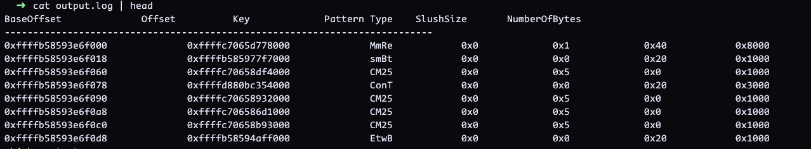

+++
title = "Windows Bigpools"
date = "2025-05-30T08:02:59+05:30"
author = ""
authorTwitter = "5h4rrk" 
cover = ""
tags = ["Windows Internals", "Memory Management", "Kernel Debugging", "BigPool"]
keywords = ["Windows BigPool", "Windows memory allocation", "paged pool", "non-paged pool", "kernel large allocations", "MmBigPoolInformation", "Poolmon", "Windows Kernel memory"]
description = "An overview of how the Windows Kernel handles large memory allocations using BigPools, including internal structures and debugging techniques." 
showFullContent = false
readingTime = true
hideComments = true
+++


PoolTag is a 4 bytes value (unsigned int value) present in the header (i.e. `POOL_HEADER`) .Microsoft creates pool tag mostly for debugging purposes. So, whenever Kernel creates any object in pool memory, it creates a `POOL_HEADER` which contains a `PoolTag` field which contains information regarding what kind of object is being created.


```bash
0: kd> dt nt!_POOL_HEADER 
   +0x000 PreviousSize     : Pos 0, 8 Bits
   +0x000 PoolIndex        : Pos 8, 8 Bits
   +0x002 BlockSize        : Pos 0, 8 Bits
   +0x002 PoolType         : Pos 8, 8 Bits
   +0x000 Ulong1           : Uint4B
   +0x004 PoolTag          : Uint4B
   +0x008 ProcessBilled    : Ptr64 _EPROCESS
   +0x008 AllocatorBackTraceIndex : Uint2B
   +0x00a PoolTagHash      : Uint2B
```

Let's look at one of the running process, how it actually looks like

```bash
0: kd> !process 0 0 cmd.exe
PROCESS ffffc509bf28b080
    SessionId: 1  Cid: 1164    Peb: 72ce659000  ParentCid: 1148
    DirBase: 5e2bc002  ObjectTable: ffff99011473e500  HandleCount: 245.
    Image: cmd.exe

0: kd> dt nt!_POOL_HEADER ffffc509bf28b000
   +0x000 PreviousSize     : 0y00000000 (0)
   +0x000 PoolIndex        : 0y00000000 (0)
   +0x002 BlockSize        : 0y11010000 (0xd0)
   +0x002 PoolType         : 0y00000010 (0x2)
   +0x000 Ulong1           : 0x2d00000
   +0x004 PoolTag          : 0x636f7250
   +0x008 ProcessBilled    : (null) 
   +0x008 AllocatorBackTraceIndex : 0
   +0x00a PoolTagHash      : 0
```

`0x636f7250`: It's a little endian value. On changing it to ascii, `corP` -> `Proc` which represents an process object. 

For more information  on different windows pool tags, please look at [pooltag.txt](https://raw.githubusercontent.com/jjzhang166/windbgtool/refs/heads/master/Dependecies/x64/triage/pooltag.txt)


Windows Kernel groups similar size memory allocations together. If the requested size exceeds one page (0x1000)  bytes, the memory would be allocated from special pool i.e. big pool which is for large allocations.

```bash
0: kd> dt nt!_POOL_TRACKER_BIG_PAGES
   +0x000 Va               : Uint8B
   +0x008 Key              : Uint4B
   +0x00c Pattern          : Pos 0, 8 Bits
   +0x00c PoolType         : Pos 8, 12 Bits
   +0x00c SlushSize        : Pos 20, 12 Bits
   +0x010 NumberOfBytes    : Uint8B

0: kd> ?? sizeof(nt!_POOL_TRACKER_BIG_PAGES)
unsigned int64 0x18
```


```bash
0: kd> x nt!PoolBigPageTable
fffff805`4ee16a68 nt!PoolBigPageTable = <no type information>

0: kd> x nt!PoolBigPageTableSize
fffff805`4ee19290 nt!PoolBigPageTableSize = <no type information>
```


```bash
0: kd> db fffff805`4ee16a68
fffff805`4ee16a68  00 f0 e6 93 85 b5 ff ff-00 00 00 00 00 00 00 00  ................
fffff805`4ee16a78  00 00 00 00 00 00 00 00-00 20 60 90 85 b5 ff ff  ......... `.....
fffff805`4ee16a88  00 80 18 bb 80 d8 ff ff-00 00 00 00 00 00 00 00  ................
fffff805`4ee16a98  00 00 00 00 00 00 00 00-00 00 00 00 00 00 00 00  ................
```

```bash
BigPoolTableAddress
0: kd> dps fffff805`4ee16a68 L1
fffff805`4ee16a68  ffffb585`93e6f000

BigPoolTableSize
0: kd> dps fffff805`4ee19290 L1
fffff805`4ee19290  00000000`00004000
```

Memory Dump

```bash
0: kd> db ffffb585`93e6f000
ffffb585`93e6f000  00 80 77 5d 06 c7 ff ff-4d 6d 52 65 00 01 04 00  ..w]....MmRe....
ffffb585`93e6f010  00 80 00 00 00 00 00 00-00 70 7f 97 85 b5 ff ff  .........p......
ffffb585`93e6f020  73 6d 42 74 00 00 02 00-00 10 00 00 00 00 00 00  smBt............
ffffb585`93e6f030  01 00 00 00 00 00 00 00-00 00 00 00 00 00 00 00  ................
ffffb585`93e6f040  00 00 00 00 00 00 00 00-01 00 00 00 00 00 00 00  ................
ffffb585`93e6f050  00 00 00 00 00 00 00 00-00 00 00 00 00 00 00 00  ................
ffffb585`93e6f060  00 40 df 58 06 c7 ff ff-43 4d 32 35 00 05 00 00  .@.X....CM25....
ffffb585`93e6f070  00 10 00 00 00 00 00 00-00 40 35 bc 80 d8 ff ff  .........@5.....
```


```bash
0: kd> dt nt!_POOL_TRACKER_BIG_PAGES ffffb585`93e6f000
   +0x000 Va               : 0xffffc706`5d778000
   +0x008 Key              : 0x65526d4d
   +0x00c Pattern          : 0y00000000 (0)
   +0x00c PoolType         : 0y010000000001 (0x401)
   +0x00c SlushSize        : 0y000000000000 (0)
   +0x010 NumberOfBytes    : 0x8000


0: kd> db 0xffffc706`5d778000
ffffc706`5d778000  70 80 77 5d 06 c7 ff ff-81 50 f8 95 85 b5 ff ff  p.w].....P......
ffffc706`5d778010  00 00 00 00 00 00 00 00-00 00 00 00 00 00 00 00  ................
ffffc706`5d778020  78 8f 77 5d 06 c7 ff ff-00 00 d5 5b 00 00 00 00  x.w].......[....
ffffc706`5d778030  00 00 00 00 00 00 00 00-e1 01 00 00 00 00 00 00  ................
ffffc706`5d778040  4d 01 00 00 03 00 00 00-0b 00 00 00 00 00 00 00  M...............
ffffc706`5d778050  4c 01 00 00 00 00 00 00-00 d0 75 5d 06 c7 ff ff  L.........u]....
ffffc706`5d778060  00 00 00 00 00 00 00 00-00 00 00 00 00 00 00 00  ................
ffffc706`5d778070  01 00 00 00 00 00 00 00-78 8f 77 5d 06 c7 ff ff  ........x.w]....
```

Let's write an WinDbg extension to parse the structures and display the information.

`bigPools.js`

```javascript
"use strict";

function CreateFileLog(f){
  return host.namespace.Debugger.Utility.FileSystem.CreateTextWriter(f);
}

function Print(dlog,output_string, args){
  dlog(output_string, args, "\n")
}

function PrintPoolEntries(dlog,baseOffset, offset, key, pattern, type, slushsize, numberOfBytes) {
  dlog(baseOffset, "\t\t", offset, "\t\t", key, "\t\t", pattern, "\t\t", type, "\t\t", slushsize, "\t\t", numberOfBytes, "\n");

}

const PoolType = {
  NonPagedPool: 0x0,
  NonPagedPoolExecute: 0x0,
  PagedPool: 0x1,
  NonPagedPoolMustSucceed: 0x2,
  DontUseThisType: 0x3,
  NonPagedPoolCacheAligned: 0x4,
  PagedPoolCacheAligned: 0x5,
  NonPagedPoolCacheAlignedMustS: 0x6,
  MaxPoolType: 0x7,
  NonPagedPoolBase: 0x0,
  NonPagedPoolBaseMustSucceed: 0x2,
  NonPagedPoolBaseCacheAligned: 0x4,
  NonPagedPoolBaseCacheAlignedMustS: 0x6,
  NonPagedPoolSession: 0x20,
  PagedPoolSession: 0x21,
  NonPagedPoolMustSucceedSession: 0x22,
  DontUseThisTypeSession: 0x23,
  NonPagedPoolCacheAlignedSession: 0x24,
  PagedPoolCacheAlignedSession: 0x25,
  NonPagedPoolCacheAlignedMustSSession: 0x26,
  NonPagedPoolNx: 0x200,
  NonPagedPoolNxCacheAligned: 0x204,
  NonPagedPoolSessionNx: 0x220
};

function DecodeBigPool(baseAddress) {
  let dlog = host.diagnostics.debugLog;

  let virtual_address = new host.parseInt64(host.memory.readMemoryValues(baseAddress, 1, 8));
  let key = new host.parseInt64(host.memory.readMemoryValues(baseAddress, 0x3, 4)[2]);

  if (key > 0) {
      let value = new host.parseInt64(host.memory.readMemoryValues(baseAddress, 0x4, 4)[3]);

      let pattern = value & 0xff; // Extract 8 bits
      let type = (value >> 8) & 0x0f; // Extract bits 8-12
      let slushsize = (value >> 12) & 0xff; // Extract bits 12-20

      let NumberOfBytes = new host.parseInt64(host.memory.readMemoryValues(baseAddress, 0x3, 8)[2]);

      PrintPoolEntries(dlog, baseAddress ,virtual_address, key, pattern, type, slushsize, NumberOfBytes);
  }
}

let logfileName = "E:\\output.log"
let flog = 0
let file = 0
let temp = 0
let offset = 0
let fileObject = 0 

function CreateIfFileNotExists(filePath){
  try{
      if (!host.namespace.Debugger.Utility.FileSystem.FileExists(filePath)) {
        throw new Error(`File Not Found ${filePath}`);
      }
  }
  catch{
      fileObject = host.namespace.Debugger.Utility.FileSystem.CreateFile(filePath);
      fileObject = host.namespace.Debugger.Utility.FileSystem.OpenFile(filePath);
    }
}

function initializeScript() {
    let dlog = host.diagnostics.debugLog;
    dlog("Initialized Script\n");

    return [
      new host.apiVersionSupport(1, 5),
      new host.functionAlias(PrintBigPoolTables, "PringBigPoolTables"),
    ];
}

function invokeScript() {
    CreateIfFileNotExists(logfileName)
    PrintBigPoolTables()
}

function PrintBigPoolTables() {
  let dlog = host.diagnostics.debugLog;

  let bigPoolTableAddress = host.getModuleSymbolAddress(
    "nt", 
    "PoolBigPageTable"
  );

  let bigPoolTableSizeAddress = host.getModuleSymbolAddress(
    "nt",
    "PoolBigPageTableSize", 
  );
  
  Print(dlog,"Pool Table Entries Address : ", bigPoolTableAddress);

  let bigPoolTable = host.memory.readMemoryValues(bigPoolTableAddress, 1, 8, false);
  let bigPoolTableSize = host.memory.readMemoryValues(bigPoolTableSizeAddress, 1, 8, false);

  Print(dlog, "Big Pool Table Base Address : ",bigPoolTable)
  Print(dlog, "Big Pool Table Base Size : ",bigPoolTableSize)

  var ctl = host.namespace.Debugger.Utility.Control;   

  let PoolTrackerBigPagesSize = 0x18
  Print(dlog, "Big Pool Table Size : ",PoolTrackerBigPagesSize)

  dlog("BaseOffset", "\t\t", "Offset", "\t\t", "Key", "\t\t", "Pattern", "\t\t", "Type", "\t\t", "SlushSize", "\t\t", "NumberOfBytes", "\n");
  dlog("-----------------------------------------------------------------------------------------\n");
  for (let idx = 0; idx < bigPoolTableSize; idx++) {
      offset = new host.parseInt64( BigInt(host.memory.readMemoryValues(bigPoolTableAddress, 1, 8, false)) + BigInt(PoolTrackerBigPagesSize) * BigInt(idx))
      DecodeBigPool(offset)
  }

}

```

Run the script


```js
0: kd> .scriptrun E:\bigPools.js
Initialized Script
JavaScript script successfully loaded from 'E:\bigPools.js'
Pool Table Entries Address : 0xfffff8054ee16a68
Big Pool Table Base Address : 0xffffb58593e6f000
Big Pool Table Base Size : 0x4000
Big Pool Table Size : 0x18
BaseOffset				Offset					Key			Pattern	  Type	SlushSize	NumberOfBytes
------------------------------------------------------------------------------------------------------
0xffffb58593e6f000		0xffffc7065d778000		MmRe		0		1		64		0x8000
0xffffb58593e6f018		0xffffb585977f7000		smBt		0		0		32		0x1000
0xffffb58593e6f060		0xffffc70658df4000		CM25		0		5		0		0x1000
0xffffb58593e6f078		0xffffd880bc354000		ConT		0		0		32		0x3000
0xffffb58593e6f090		0xffffc70658932000		CM25		0		5		0		0x1000
0xffffb58593e6f0a8		0xffffc706586d1000		CM25		0		5		0		0x1000
0xffffb58593e6f0c0		0xffffc70658b93000		CM25		0		5		0		0x1000
....
....
0xffffb58593eceee0		0xffffc7065e165000		Vi25		0		1		0		0x3000
0xffffb58593eceef8		0xffffb585979c3001		smWw		0		0		32		0x1000
0xffffb58593ecef70		0xffffc7065b6ce000		CM16		0		1		0		0x1000
0xffffb58593ecef88		0xffffd880bc16e000		ConT		0		0		32		0x3000
0xffffb58593ecefa0		0xffffc7065f6ce001		MmSt		0		1		0		0x2530
0xffffb58593ecefe8		0xffffb585945a8001		Mmxx		0		0		96		0x1e000
```

It saves the log file at the path. Check the log file for detailed analysis.




