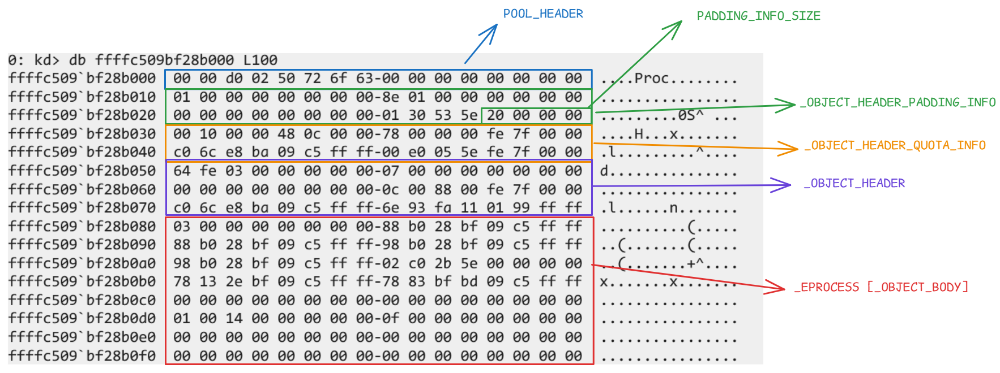

+++
title = 'Windows Objects: Structure, Headers, and Internal Mechanics'
date = 2025-03-12T08:23:06+05:30
draft = false
tags = ['Windows Internals', 'Kernel Objects', 'Debugging', 'Reverse Engineering']
summary = 'A deep dive into Windows objects, focusing on their structure, headers, and relationships. This blog covers key components like _OBJECT_HEADER, OBJECT_TYPE, and ObTypeIndexTable, providing insights into how Windows organizes and references objects.'
+++

#### Windows Pool

Windows Pool is memory allocated in kernel mode for core system components like drivers, can operate their activities. There are 

- **Paged Pool**: stays temporarily in memory. It would be paged out to disk when system memory runs out of memory. When it needs, it pulls it back to memory. 

- **Non Paged Pool**: stays permanent in memory. It would be reserved for critical kernel objects or drivers that system cannot afford to page out.


#### Objects

- Kernel Objects are fundamental components managed by Object Manager.
- Represents physical and logical resources like processes, threads, files, devices and so on.
- Every Object has general structure in a pool page. 
- It has 
   
   - Pool Header 
   - Optional Object Header  -> there can be mulitple Optional object headers 
   - Object header 
   - Object Body


```bash
+---------------------+                           +---------------+
|  PsActiveProcessHead | -----------------------> |    _EPROCESS   |
+---------------------+                           +---------------+
                                                          ^
                                                          |              
                                                          v   
                                                    +------------+
                                                    |  _EPROCESS  | 
                                                    +------------+      
                                                          ^
                                                          |              
                                                          v              
                                                    +------------+       
                                                    |  _EPROCESS  | 
                                                    +------------+
                                                          .
                                                          .
                                                          .    

Pool Object Representation

    +-------------------------+
    |       Pool Header        |  <---- Contains metadata for pool (e.g., size, type)
    +-------------------------+
    |  Optional Object Header  |  <---- Contains additional headers
    +-------------------------+
    |      Object Header       |  <---- Key fields: Object Type, Object Size, Reference Count
    +-------------------------+
    |      Object Body         |  <---- Actual data; varies depending on the object type
    |  (Process, Thread, etc) |         (e.g., "Proc" for processes, "Thre" for threads, "File" for files)
    +-------------------------+
    
```

#### Inspecting cmd.exe

```rs
0: kd> !process 0 0 cmd.exe
PROCESS 	
    SessionId: 1  Cid: 1164    Peb: 72ce659000  ParentCid: 1148
    DirBase: 5e2bc002  ObjectTable: ffff99011473e500  HandleCount: 245.
    Image: cmd.exe


0: kd> dt nt!_EPROCESS ffffc509bf28b080 -y Image
   +0x464 ImageNotifyDone : 0y1
   +0x5a0 ImageFilePointer : 0xffffc509`c095e2b0 _FILE_OBJECT
   +0x5a8 ImageFileName : [15]  "cmd.exe"
   +0x5f4 ImagePathHash : 0xbd30981
```


```bash
0: kd> !object ffffc509bf28b080
Object: ffffc509bf28b080  Type: (ffffc509b88ab900) Process
    ObjectHeader: ffffc509bf28b050 (new version)
    HandleCount: 7  PointerCount: 261732
```

- There are 7 active handles. PointerCount is a very large that represents the total number of objects referenced till time.


**Open Handles**

```bash
0: kd> !findhandle ffffc509bf28b080
                                                              
                   [ffffc509b8884040 System]
  18ac: Entry ffff99010d4662b0 Granted Access 102a (Protected) (Audit)
  2ab4: Entry ffff990112b41ad0 Granted Access 1fffff (Protected) (Audit)
  2c98: Entry ffff9901137fe260 Granted Access 102a (Protected) (Audit)
                                                              
                   [ffffc509bc16f080 csrss.exe]
   3a0: Entry ffff99010b5fce80 Granted Access 1fffff (Protected) (Audit)
                                                              
                   [ffffc509bd20d140 lsass.exe]
  1214: Entry ffff990112379850 Granted Access 1478 (Protected) (Audit)
                                                              
                   [ffffc509bd415300 svchost.exe]
  2768: Entry ffff9901139c2da0 Granted Access 1478 (Protected) (Audit)
                                                              
                   [ffffc509c0ed2080 conhost.exe]
   120: Entry ffff990112455480 Granted Access 1fffff (Protected) (Audit)
```


```bash
0: kd> !trueref ffffc509bf28b080
ffffc509bf28b080: HandleCount: 7 PointerCount: 261732 RealPointerCount: 153
```

- **HandleCount** represents objects are accessed using a **handle**, which is standard way of accessing resources in windows.

- **Real Pointer Count**, another way to access the kernel object is through **pointers**, done in kernel mode.

##### OBJECT_HEADER

```rs 
0: kd> dt nt!_OBJECT_HEADER
   +0x000 PointerCount     : Int8B
   +0x008 HandleCount      : Int8B
   +0x008 NextToFree       : Ptr64 Void
   +0x010 Lock             : _EX_PUSH_LOCK
   +0x018 TypeIndex        : UChar
   +0x019 TraceFlags       : UChar
   +0x019 DbgRefTrace      : Pos 0, 1 Bit
   +0x019 DbgTracePermanent : Pos 1, 1 Bit
   +0x01a InfoMask         : UChar
   +0x01b Flags            : UChar
   +0x01b NewObject        : Pos 0, 1 Bit
   +0x01b KernelObject     : Pos 1, 1 Bit
   +0x01b KernelOnlyAccess : Pos 2, 1 Bit
   +0x01b ExclusiveObject  : Pos 3, 1 Bit
   +0x01b PermanentObject  : Pos 4, 1 Bit
   +0x01b DefaultSecurityQuota : Pos 5, 1 Bit
   +0x01b SingleHandleEntry : Pos 6, 1 Bit
   +0x01b DeletedInline    : Pos 7, 1 Bit
   +0x01c Reserved         : Uint4B
   +0x020 ObjectCreateInfo : Ptr64 _OBJECT_CREATE_INFORMATION
   +0x020 QuotaBlockCharged : Ptr64 Void
   +0x028 SecurityDescriptor : Ptr64 Void
   +0x030 Body             : _QUAD  
```

```bash
0: kd> dt nt!_QUAD
   +0x000 UseThisFieldToCopy : Int8B
   +0x000 DoNotUseThisField : Float


0: kd> ?? sizeof(_OBJECT_HEADER)
unsigned int64 0x38
```

The Body field is of type QUAD,  which overlaps with the actual object’s data. So, subtract 0x8 from 0x38. 

In a 64-bit architecture,`_OBJECT_HEADER` structure size is 0x30 bytes. To obtain the starting address of `OBJECT_HEADER` from `OBJECT_BODY` address, simply subtract 0x30 bytes from `OBJECT_BODY` address.


```rs
0: kd> dt nt!_OBJECT_HEADER ffffc509bf28b080-30
   +0x000 PointerCount     : 0n261732
   +0x008 HandleCount      : 0n7
   +0x008 NextToFree       : 0x00000000`00000007 Void
   +0x010 Lock             : _EX_PUSH_LOCK
   +0x018 TypeIndex        : 0xc ''
   +0x019 TraceFlags       : 0 ''
   +0x019 DbgRefTrace      : 0y0
   +0x019 DbgTracePermanent : 0y0
   +0x01a InfoMask         : 0x88 ''
   +0x01b Flags            : 0 ''
   +0x01b NewObject        : 0y0
   +0x01b KernelObject     : 0y0
   +0x01b KernelOnlyAccess : 0y0
   +0x01b ExclusiveObject  : 0y0
   +0x01b PermanentObject  : 0y0
   +0x01b DefaultSecurityQuota : 0y0
   +0x01b SingleHandleEntry : 0y0
   +0x01b DeletedInline    : 0y0
   +0x01c Reserved         : 0x7ffe
   +0x020 ObjectCreateInfo : 0xffffc509`bae86cc0 _OBJECT_CREATE_INFORMATION
   +0x020 QuotaBlockCharged : 0xffffc509`bae86cc0 Void
   +0x028 SecurityDescriptor : 0xffff9901`11fa936e Void
   +0x030 Body             : _QUAD
```


- InfoMask is 0x88. 
- TraceFlags is an union of **DbgRefTrace** (0th bit) and **DbgTracePermanent**(1st bit). When the **DbgRefTrace** flag is set, it enables the tracking of reference count changes for the associated object. This allows developers and system administrators to monitor how many references exist to a particular object.

- PermanentObject = 0, which means the process would be deleted once PointerCount and HandleCount reaches to 0. If PermanentObject=1, the object won't be deleted the count drops to 0.

- ObjectCreateInfo is a strucutre of _OBJECT_CREATE_INFORMATION, which maintains information about Process Creation Attributes, Namespace where it is created, Charged Paged (amount of memory allocated from the paged pool that is currently in use by the system), Non-Paged Pool and so on

- In the older version of Windows, `_OBJECT_HEADER->Type` used to point to `OBJECT_TYPE`. 

- From Windows 7 onwards, it changed to 8 bit value and stored at `_OBJECT_HEADER->TypeIndex`. It points to index to a data structure `nt!ObTypeIndexTable`, which is an array of pointers of `_OBJECT_TYPE`. 


##### OBJECT_HEADER Flags

```c
#define OB_FLAG_NEW_OBJECT              0x01 // NewObject (New Object Created, not exists in Pool)
#define OB_FLAG_KERNEL_OBJECT           0x02 // KernelObject (Object can only have Kernel handles)
#define OB_FLAG_CREATOR_INFO            0x04 // KernelOnlyAccess (Kernel can only open & access handles)
#define OB_FLAG_EXCLUSIVE_OBJECT        0x08 // ExclusiveObject (Process who created can only open & access it)
#define OB_FLAG_PERMANENT_OBJECT        0x10 // PermanentObject (Persits even HandleCount & PointerCount drops to 0)
#define OB_FLAG_DEFAULT_SECURITY_QUOTA  0x20 // DefaultSecurityQuota (defines SecurityDescriptor)
#define OB_FLAG_SINGLE_HANDLE_ENTRY     0x40 // SingleHandleEntry (Only contains one entry OBJECT_HEADER_HANDLE_INFO )
#define OB_FLAG_DELETED_INLINE          0x80 // DeletedInline (Object in queue for deletion)
```


##### Optional ObjectHeader


| Optional Object Header           |   (ObpInfoMaskToOffset)       |
|----------------------------------|-------------------------------|
| _OBJECT_HEADER_CREATOR_INFO      | 0                    = 0x1    |
| _OBJECT_HEADER_NAME_INFO         | InfoMask & 0x3       = 0x2    |
| _OBJECT_HEADER_HANDLE_INFO       | InfoMask & 0x7       = 0x4    |
| _OBJECT_HEADER_QUOTA_INFO        | InfoMask & 0xF       = 0x8    |
| _OBJECT_HEADER_PROCESS_INFO      | InfoMask & 0x1F      = 0x10   |
| _OBJECT_HEADER_AUDIT_INFO        | InfoMask & 0x3F      = 0x20   |
| _OBJECT_HEADER_EXTENDED_INFO     | InfoMask & 0x7F      = 0x40   |
| _OBJECT_HEADER_PADDING_INFO      | InfoMask & 0xFF      = 0x80   |


InfoMask : `0x88` -> **_OBJECT_HEADER_QUOTA_INFO**


**Decoding InfoMask**

- Corresponding ResultBit for _OBJECT_HEADER_QUOTA_INFO is 0x08.
- Subtract ResultBit from InfoMask i.e. InfoMask - ResultBit = 0x88 - 0x8 = 0x80
- After subtraction, it points to the next Optional Header.
- Again, Update the InfoMask Value and Calculate it. It will give  _OBJECT_HEADER_PADDING_INFO


```py
InfoMask = 0x88

OptionalHeaders = ["_OBJECT_HEADER_CREATOR_INFO", "_OBJECT_HEADER_NAME_INFO", "_OBJECT_HEADER_HANDLE_INFO", "_OBJECT_HEADER_QUOTA_INFO", "_OBJECT_HEADER_PROCESS_INFO", "_OBJECT_HEADER_AUDIT_INFO", "_OBJECT_HEADER_EXTENDED_INFO", "_OBJECT_HEADER_PADDING_INFO"]

MaskBit = [0x0, 0x03, 0x07, 0x0F, 0x1F, 0x3F, 0x7F, 0xFF]

ResultBit = [0x01, 0x02, 0x04, 0x08, 0x10, 0x20, 0x40, 0x80]

while InfoMask != 0:
   for _ in range(len(OptionalHeaders)):
      if(ResultBit[_] == MaskBit[_] & InfoMask):
         print(OptionalHeaders[_]) 
         InfoMask -= ResultBit[_]


# Output: 
#_OBJECT_HEADER_QUOTA_INFO
#_OBJECT_HEADER_PADDING_INFO
```


```rs
0: kd> db ffffc509bf28b080-80
ffffc509`bf28b000  00 00 d0 02 50 72 6f 63-00 00 00 00 00 00 00 00  ....Proc........
ffffc509`bf28b010  01 00 00 00 00 00 00 00-8e 01 00 00 00 00 00 00  ................
ffffc509`bf28b020  00 00 00 00 00 00 00 00-01 30 53 5e 20 00 00 00  .........0S^ ...
ffffc509`bf28b030  00 10 00 00 48 0c 00 00-78 00 00 00 fe 7f 00 00  ....H...x.......
ffffc509`bf28b040  c0 6c e8 ba 09 c5 ff ff-00 e0 05 5e fe 7f 00 00  .l.........^....
ffffc509`bf28b050  64 fe 03 00 00 00 00 00-07 00 00 00 00 00 00 00  d...............
ffffc509`bf28b060  00 00 00 00 00 00 00 00-0c 00 88 00 fe 7f 00 00  ................
ffffc509`bf28b070  c0 6c e8 ba 09 c5 ff ff-6e 93 fa 11 01 99 ff ff  .l......n.......
```

```bash
0: kd> dt ntkrnlmp!_OBJECT_HEADER_*
          ntkrnlmp!_OBJECT_HEADER_QUOTA_INFO
          ntkrnlmp!_OBJECT_HEADER_PROCESS_INFO
          ntkrnlmp!_OBJECT_HEADER_HANDLE_INFO
          ntkrnlmp!_OBJECT_HEADER_NAME_INFO
          ntkrnlmp!_OBJECT_HEADER_CREATOR_INFO
          ntkrnlmp!_OBJECT_HEADER_AUDIT_INFO
          ntkrnlmp!_OBJECT_HEADER_EXTENDED_INFO
          ntkrnlmp!_OBJECT_HEADER_PADDING_INFO
```

```bash
// OBJECT_BODY - OBJECT_HEADER_SIZE - _OBJECT_HEADER_QUOTA_INFO_SIZE
0: kd> ? ffffc509bf28b080-30-20
Evaluate expression: -64829324218320 = ffffc509`bf28b030

0: kd>  dt nt!_OBJECT_HEADER_QUOTA_INFO ffffc509`bf28b050-20
   +0x000 PagedPoolCharge  : 0x1000
   +0x004 NonPagedPoolCharge : 0xc48
   +0x008 SecurityDescriptorCharge : 0x78
   +0x00c Reserved1        : 0x7ffe
   +0x010 SecurityDescriptorQuotaBlock : 0xffffc509`bae86cc0 Void
   +0x018 Reserved2        : 0x00007ffe`5e05e000
```

Objects are always created with headers attached to the object body. However, the number of headers depends entirely on how the object is created. In Kernel, Windows maintains an array of all possible combinations of headers and stores the value in ObpInfoMaskToOffset. Just say, I used `_OBJECT_HEADER_QUOTA_INFO`, then size would be 0x20. If I used two different headers, then InfoMask value would be sum of size of both headers result bit.


##### Locating OBJECT_HEADER

The Optional Headers would appear before main OBJECT_HEADER and corresponding OptionalHeader result bit value would be stored in InfoMask. 

```rs
// ObpInfoMaskToOffset + ResultBit Value of QUOTA_INFO
0: kd> db ObpInfoMaskToOffset + 0x8 L1
fffff807`1ec3de28  20   
```

- Subtract it from `_OBJECT_HEADER -  _OBJECT_HEADER_QUOTA_INFO`

```rs 
0: kd> dt nt!_OBJECT_HEADER_QUOTA_INFO ffffc509`bf28b050-20
   +0x000 PagedPoolCharge  : 0x1000
   +0x004 NonPagedPoolCharge : 0xc48
   +0x008 SecurityDescriptorCharge : 0x78
   +0x00c Reserved1        : 0x7ffe
   +0x010 SecurityDescriptorQuotaBlock : 0xffffc509`bae86cc0 Void
   +0x018 Reserved2        : 0x00007ffe`5e05e000
```

- When system opens any handles, it consumes system resources, and this keeps track of those for that given Object. 


##### Optional Object Header Structures

```bash
0: kd> dt ntkrnlmp!_OBJECT_HEADER_PROCESS_INFO
   +0x000 ExclusiveProcess : Ptr64 _EPROCESS
   +0x008 Reserved         : Uint8B
```

```rs
0: kd> dt ntkrnlmp!_OBJECT_HEADER_HANDLE_INFO
   +0x000 HandleCountDataBase : Ptr64 _OBJECT_HANDLE_COUNT_DATABASE
   +0x000 SingleEntry      : _OBJECT_HANDLE_COUNT_ENTRY
```

```bash
0: kd> dt nt!_OBJECT_HANDLE_COUNT_DATABASE
   +0x000 CountEntries     : Uint4B
   +0x008 HandleCountEntries : [1] _OBJECT_HANDLE_COUNT_ENTRY
```

```bash
0: kd> dt nt!_OBJECT_HANDLE_COUNT_ENTRY
   +0x000 Process          : Ptr64 _EPROCESS
   +0x008 HandleCount      : Pos 0, 24 Bits
   +0x008 LockCount        : Pos 24, 8 Bits
```
- Has entries of handles for per process

```bash
0: kd> dt ntkrnlmp!_OBJECT_HEADER_NAME_INFO
   +0x000 Directory        : Ptr64 _OBJECT_DIRECTORY
   +0x008 Name             : _UNICODE_STRING
   +0x018 ReferenceCount   : Int4B
   +0x01c Reserved         : Uint4B
```
-  Has Object name which makes it visible to other objects 

```bash
0: kd> dt ntkrnlmp!_OBJECT_HEADER_CREATOR_INFO   
   +0x000 TypeList         : _LIST_ENTRY
   +0x010 CreatorUniqueProcess : Ptr64 Void
   +0x018 CreatorBackTraceIndex : Uint2B
   +0x01a Reserved1        : Uint2B
   +0x01c Reserved2        : Uint4B
```
-  Links same-type objects, tracks creating process, and captures backtrace.

```bash
0: kd> dt ntkrnlmp!_OBJECT_HEADER_AUDIT_INFO
   +0x000 SecurityDescriptor : Ptr64 Void
   +0x008 Reserved         : Uint8B
```

- Has a pointer to Security Descriptor which was used while creating an Object. Used for File Objects to track audit.

```bash
0: kd> dt ntkrnlmp!_OBJECT_HEADER_EXTENDED_INFO
   +0x000 Footer           : Ptr64 _OBJECT_FOOTER   
   +0x008 Reserved         : Uint8B
```
- Has a pointer to _OBJECT_FOOTER

```bash
0: kd> dt ntkrnlmp!_OBJECT_HEADER_PADDING_INFO
   +0x000 PaddingAmount    : Uint4B                  -
```
- It's just for alignment of object body.



##### OBJECT_HEADER TypeIndex

In older versions of Windows,`Type` field used to point to `_OBJECT_TYPE` structure. Starting with Windows 7, `TypeIndex` field is introduced, which stores an encoded value. When decoded, it provides an index that is used to locate `_OBJECT_TYPE` structure within `ObTypeIndexTable` array.


Now, Let's look into **TypeIndex**

```rs 
0: kd> dt nt!_OBJECT_HEADER ffffc509bf28b080-30
   +0x000 PointerCount     : 0n261732
   +0x008 HandleCount      : 0n7
   +0x008 NextToFree       : 0x00000000`00000007 Void
   +0x010 Lock             : _EX_PUSH_LOCK
   +0x018 TypeIndex        : 0xc ''
   +0x019 TraceFlags       : 0 ''
   +0x019 DbgRefTrace      : 0y0
   +0x019 DbgTracePermanent : 0y0
   +0x01a InfoMask         : 0x88 ''
   +0x01b Flags            : 0 ''
   ....
   ....
```

TypeIndex : 0x0c

```bash 
0: kd> x nt!ObTypeIndexTable 
fffff807`1ed14e80 nt!ObTypeIndexTable = <no type information>
```

```bash
0: kd> x nt!ObGetObjectType
fffff807`1e6e7a50 nt!ObGetObjectType (ObGetObjectType)

0: kd> uf nt!ObGetObjectType
nt!ObGetObjectType:
fffff807`1e6e7a50 488d41d0        lea     rax,[rcx-30h]			 ; _OBJECT_HEADER 
fffff807`1e6e7a54 0fb649e8        movzx   ecx,byte ptr [rcx-18h] ; _OBJECT_HEADER->TypeIndex
fffff807`1e6e7a58 48c1e808        shr     rax,8					 ; _OBJECT_HEADER >> 8 
fffff807`1e6e7a5c 0fb6c0          movzx   eax,al				 ; (_OBJECT_HEADER >> 8) & 0xff
fffff807`1e6e7a5f 4833c1          xor     rax,rcx				 ;  ((_OBJECT_HEADER >> 8) & 0xff ) ^ (_OBJECT_HEADER->TypeIndex)
fffff807`1e6e7a62 0fb60dc3cc6200  movzx   ecx,byte ptr [nt!ObHeaderCookie (fffff807`1ed1472c)]
fffff807`1e6e7a69 4833c1          xor     rax,rcx				 ; ; (((_OBJECT_HEADER >> 8) & 0xff ) ^ (_OBJECT_HEADER->TypeIndex) ) ^ ((nt!ObHeaderCookie) & 0xff)
fffff807`1e6e7a6c 488d0d0dd46200  lea     rcx,[nt!ObTypeIndexTable (fffff807`1ed14e80)]
fffff807`1e6e7a73 488b04c1        mov     rax,qword ptr [rcx+rax*8]   ; Accessing the pointer to nt!ObTypeIndexTable
fffff807`1e6e7a77 c3              ret
```

- **ObHeaderCookie** is a security mitigation in Windows kernel to enhance kernel object integrity. This cookie value is randomly generated when system boots up. This makes kernel objects less predictable and prevents the attackers to exploit these structures. 

- **ObTypeIndexTable** is an array which keeps track of each entry of `_OBJECT_TYPE` structure represents which specific type of object i.e. Thread, Process, Files and so on.


```bash
0: kd> db nt!ObHeaderCookie L1
fffff807`1ed1472c  bb                                               .   
```

`(((_OBJECT_HEADER >> 0x8) & 0xff ) ^ (_OBJECT_HEADER->TypeIndex) ) ^ ((nt!ObHeaderCookie) & 0xff)`

##### ObGetObjectType

```py
nt!ObTypeIndexTable[
(   (((_OBJECT_HEADER >> 0x8) & 0xff ) ^ (_OBJECT_HEADER->TypeIndex) ) ^ ((nt!ObHeaderCookie) & 0xff)) * 0x08
   ]
```


(((0xffffc509bf28b080 >> 0x08) & 0xff) ^ (0xbb) ^ ((0x0c) & 0xff)) = 0x7


```bash
0: kd> ? 0xb0 ^ 0xbb ^ 0x0c
Evaluate expression: 7 = 00000000`00000007
```

```bash
0: kd> dq nt!ObTypeIndexTable L8
fffff807`1ed14e80  00000000`00000000 ffffb000`adbac000
fffff807`1ed14e90  ffffc509`b88ab640 ffffc509`b88ab220
fffff807`1ed14ea0  ffffc509`b88abbc0 ffffc509`b88abd20
fffff807`1ed14eb0  ffffc509`b88ab7a0 ffffc509`b88ab900

0: kd> dq nt!ObTypeIndexTable + (0x8 * 0x7) L1
fffff807`1ed14eb8  ffffc509`b88ab900
```


```rs 
0: kd> dt nt!_OBJECT_TYPE ffffc509`b88ab900
   +0x000 TypeList         : _LIST_ENTRY [ 0xffffc509`b88ab900 - 0xffffc509`b88ab900 ]
   +0x010 Name             : _UNICODE_STRING "Process"
   +0x020 DefaultObject    : (null) 
   +0x028 Index            : 0x7 ''
   +0x02c TotalNumberOfObjects : 0x68
   +0x030 TotalNumberOfHandles : 0x4e1
   +0x034 HighWaterNumberOfObjects : 0x6c
   +0x038 HighWaterNumberOfHandles : 0x55e
   +0x040 TypeInfo         : _OBJECT_TYPE_INITIALIZER
   +0x0b8 TypeLock         : _EX_PUSH_LOCK
   +0x0c0 Key              : 0x636f7250
   +0x0c8 CallbackList     : _LIST_ENTRY [ 0xffff9901`07feee00 - 0xffff9901`07feee00 ]
```

**Pool Header**

```bash
0: kd> dt nt!_POOL_HEADER ffffc509`bf28b000
   +0x000 PreviousSize     : 0y00000000 (0)
   +0x000 PoolIndex        : 0y00000000 (0)
   +0x002 BlockSize        : 0y11010000 (0xd0)
   +0x002 PoolType         : 0y00000010 (0x2) // NonPagedPoolMustSucceed
   +0x000 Ulong1           : 0x2d00000
   +0x004 PoolTag          : 0x636f7250
   +0x008 ProcessBilled    : (null) 
   +0x008 AllocatorBackTraceIndex : 0
   +0x00a PoolTagHash      : 0
```

- PreviousSize : Size of Previous Chunk / 16
- PoolIndex    : Index to an array of PoolDescriptor 
- BlockSize    : Size of Current Block / 16
- PoolType     : Information regarding the allocation tyoe
- ProcessBilled: Pointer to _EPROCESS, which made this allocation. Only exists if PoolType is PoolQuota.

```bash
0: kd> dt nt!_POOL_TYPE
   NonPagedPool = 0n0
   NonPagedPoolExecute = 0n0
   PagedPool = 0n1
   NonPagedPoolMustSucceed = 0n2
   DontUseThisType = 0n3
   NonPagedPoolCacheAligned = 0n4
   PagedPoolCacheAligned = 0n5
   NonPagedPoolCacheAlignedMustS = 0n6
   MaxPoolType = 0n7
   NonPagedPoolBase = 0n0
   NonPagedPoolBaseMustSucceed = 0n2
   NonPagedPoolBaseCacheAligned = 0n4
   NonPagedPoolBaseCacheAlignedMustS = 0n6
   NonPagedPoolSession = 0n32
   PagedPoolSession = 0n33
   NonPagedPoolMustSucceedSession = 0n34
   DontUseThisTypeSession = 0n35
   NonPagedPoolCacheAlignedSession = 0n36
   PagedPoolCacheAlignedSession = 0n37
   NonPagedPoolCacheAlignedMustSSession = 0n38
   NonPagedPoolNx = 0n512
   NonPagedPoolNxCacheAligned = 0n516
   NonPagedPoolSessionNx = 0n544
```

Lets check it for some other process 

#### Inspecting Notepad.exe

```bash
0: kd> !process 0 0 notepad.exe
PROCESS ffffc509c222c340
    SessionId: 1  Cid: 05a8    Peb: 74d112d000  ParentCid: 1148
    DirBase: 41f4c002  ObjectTable: ffff990111c26780  HandleCount: 482.
    Image: notepad.exe

0: kd> !object ffffc509c222c340
Object: ffffc509c222c340  Type: (ffffc509b88ab900) Process
    ObjectHeader: ffffc509c222c310 (new version)
    HandleCount: 6  PointerCount: 195153

0: kd> db ffffc509c222c340-90
ffffc509`c222c2b0  00 6f d0 02 50 72 6f 63-c8 14 c1 c1 09 c5 ff ff  .o..Proc........
ffffc509`c222c2c0  00 00 00 00 00 00 00 00-a8 0c 10 00 03 00 00 00  ................
ffffc509`c222c2d0  00 00 00 00 00 00 00 00-50 00 e3 c0 09 c5 ff ff  ........P.......
ffffc509`c222c2e0  00 00 46 09 01 99 ff ff-00 f0 18 00 30 00 00 00  ..F.........0...
ffffc509`c222c2f0  00 10 00 00 48 0c 00 00-78 00 00 00 00 00 00 00  ....H...x.......
ffffc509`c222c300  c0 6c e8 ba 09 c5 ff ff-95 61 07 00 00 00 00 00  .l.......a......
ffffc509`c222c310  51 fa 02 00 00 00 00 00-06 00 00 00 00 00 00 00  Q...............
ffffc509`c222c320  00 00 00 00 00 00 00 00-7f 00 88 00 00 00 00 00  ................

0: kd> dt nt!_OBJECT_HEADER ffffc509c222c340-30
   +0x000 PointerCount     : 0n195153
   +0x008 HandleCount      : 0n6
   +0x008 NextToFree       : 0x00000000`00000006 Void
   +0x010 Lock             : _EX_PUSH_LOCK
   +0x018 TypeIndex        : 0x7f ''
   +0x019 TraceFlags       : 0 ''
   +0x019 DbgRefTrace      : 0y0
   +0x019 DbgTracePermanent : 0y0
   +0x01a InfoMask         : 0x88 ''
   +0x01b Flags            : 0 ''
   +0x01b NewObject        : 0y0
   +0x01b KernelObject     : 0y0
   +0x01b KernelOnlyAccess : 0y0
   +0x01b ExclusiveObject  : 0y0
   +0x01b PermanentObject  : 0y0
   +0x01b DefaultSecurityQuota : 0y0
   +0x01b SingleHandleEntry : 0y0
   +0x01b DeletedInline    : 0y0
   +0x01c Reserved         : 0
   +0x020 ObjectCreateInfo : 0xffffc509`bae86cc0 _OBJECT_CREATE_INFORMATION
   +0x020 QuotaBlockCharged : 0xffffc509`bae86cc0 Void
   +0x028 SecurityDescriptor : 0xffff9901`11fa9365 Void
   +0x030 Body             : _QUAD


0: kd> db nt!ObHeaderCookie L1
fffff807`1ed1472c  bb                                               .

0: kd> ? (0xbb ^ 0x7f ^ c3)
Evaluate expression: 7 = 00000000`00000007

0: kd> ? nt!ObTypeIndexTable + ( 0x7 * @$ptrsize )
Evaluate expression: -8765511217480 = fffff807`1ed14eb8

0: kd> dq fffff807`1ed14eb8 L1
fffff807`1ed14eb8  ffffc509`b88ab900

0: kd> dt nt!_OBJECT_TYPE ffffc509`b88ab900
   +0x000 TypeList         : _LIST_ENTRY [ 0xffffc509`b88ab900 - 0xffffc509`b88ab900 ]
   +0x010 Name             : _UNICODE_STRING "Process"
   +0x020 DefaultObject    : (null) 
   +0x028 Index            : 0x7 ''
   +0x02c TotalNumberOfObjects : 0x68
   +0x030 TotalNumberOfHandles : 0x4e1
   +0x034 HighWaterNumberOfObjects : 0x6c
   +0x038 HighWaterNumberOfHandles : 0x55e
   +0x040 TypeInfo         : _OBJECT_TYPE_INITIALIZER
   +0x0b8 TypeLock         : _EX_PUSH_LOCK
   +0x0c0 Key              : 0x636f7250
   +0x0c8 CallbackList     : _LIST_ENTRY [ 0xffff9901`07feee00 - 0xffff9901`07feee00 ]

```

#### Inspecting csrss.exe


```bash

0: kd> !process csrss.exe
PROCESS ffff938cd7e86080
    SessionId: none  Cid: 0004    Peb: 00000000  ParentCid: 0000
    DirBase: 001aa000  ObjectTable: ffffc705c3015080  HandleCount: 2197.
    Image: System
    VadRoot ffff938cd7ea5560 Vads 6 Clone 0 Private 21. Modified 10228. Locked 0.
    DeviceMap ffffc705c304a540
....
....

0: kd> !pool ffff938cd7e86010
Pool page ffff938cd7e86010 region is Nonpaged pool
 ffff938cd7e86010 size:  e00 previous size:    0  (Allocated)  Proc
 ffff938cd7e86e10 size:  1f0 previous size:    0  (Free)       ..[U

0: kd> dt nt!_POOL_HEADER ffff938cd7e86080-70
   +0x000 PreviousSize     : 0y00000000 (0)
   +0x000 PoolIndex        : 0y11111111 (0xff)
   +0x002 BlockSize        : 0y11100000 (0xe0)
   +0x002 PoolType         : 0y00000010 (0x2)
   +0x000 Ulong1           : 0x2e0ff00
   +0x004 PoolTag          : 0x636f7250
   +0x008 ProcessBilled    : 0xffff938c`d7e4e9f8 _EPROCESS
   +0x008 AllocatorBackTraceIndex : 0xe9f8
   +0x00a PoolTagHash      : 0xd7e4
```

```rs
0: kd> !object ffff938cd7e86080
Object: ffff938cd7e86080  Type: (ffff938cd7eabbc0) Process
    ObjectHeader: ffff938cd7e86050 (new version)
    HandleCount: 4  PointerCount: 131200

0: kd> dt nt!_OBJECT_HEADER ffff938cd7e86080-30
   +0x000 PointerCount     : 0n131200
   +0x008 HandleCount      : 0n4
   +0x008 NextToFree       : 0x00000000`00000004 Void
   +0x010 Lock             : _EX_PUSH_LOCK
   +0x018 TypeIndex        : 0x7c '|'
   +0x019 TraceFlags       : 0 ''
   +0x019 DbgRefTrace      : 0y0
   +0x019 DbgTracePermanent : 0y0
   +0x01a InfoMask         : 0x80 ''
   +0x01b Flags            : 0x2 ''
   +0x01b NewObject        : 0y0
   +0x01b KernelObject     : 0y1
   +0x01b KernelOnlyAccess : 0y0
   +0x01b ExclusiveObject  : 0y0
   +0x01b PermanentObject  : 0y0
   +0x01b DefaultSecurityQuota : 0y0
   +0x01b SingleHandleEntry : 0y0
   +0x01b DeletedInline    : 0y0
   +0x01c Reserved         : 0xff938cd7
   +0x020 ObjectCreateInfo : 0xfffff806`7fe66a40 _OBJECT_CREATE_INFORMATION
   +0x020 QuotaBlockCharged : 0xfffff806`7fe66a40 Void
   +0x028 SecurityDescriptor : 0xffffc705`c30156a8 Void
   +0x030 Body             : _QUAD

```

InfoMask : 0x80 -> `_OBJECT_HEADER_PADDING_INFO`

```py
0: kd> dt nt!_OBJECT_HEADER_PADDING_INFO
   +0x000 PaddingAmount    : Uint4B
```

- There is one more way to find the offset

```bash 
0: kd> db ObpInfoMaskToOffset + 80 L1
fffff806`7fe39020  04
```

- Subtract `04` from the Header Offset 

```bash 
0: kd> dt nt!_OBJECT_HEADER_PADDING_INFO ffff938cd7e86080-30-4
   +0x000 PaddingAmount    : 0x30
```


**References**

- https://www.geoffchappell.com/studies/windows/km/ntoskrnl/inc/ntos/ob/object_header/index.htm

- https://ntamonsec.blogspot.com/2020/05/journey-into-object-manager-executive.html

- https://codemachine.com/article_objectheader.html

- [The-Art-of-Memory-Forensics](https://www.amazon.in/Art-Memory-Forensics-Detecting-Malware/dp/1118825098)
