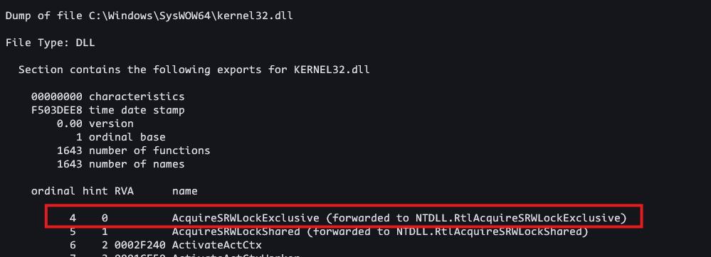
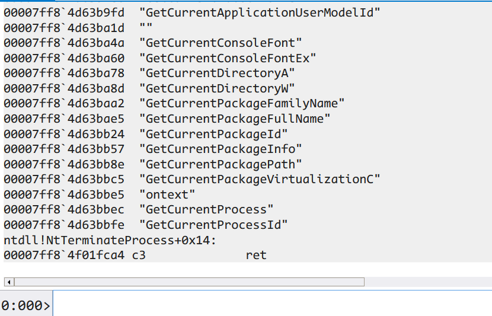

+++
title = 'Windows Shellcode Development & Debugging with WinDbg: A Hands-On Guide (Part 2)'
date = 2025-01-21T07:05:40+05:30
draft = false
tags = ['Windows Shellcode', 'Malware Analysis', 'Exploit Development', 'Assembly', 'WinDbg', 'Reverse Engineering', 'Debugging',  'Low-Level', 'Windows Internals']
summary = 'A comprehensive guide to understanding and creating Windows shellcode from scratch for exploit development. This article includes practical insights into using WinDbg for effective debugging and analysis.'
+++

## Prerequisites

Before diving into the content of this blog, it is recommended to familiarize yourself with the following topics.

1. **[PE Parsing with WinDbg](https://5h4rrk.github.io/posts/pe-parse-windbg/)**  
2. **[Windows Shellcode Development](https://5h4rrk.github.io/posts/windows-shellcode/)**  

## Parsing Executable with Assembly

In last [blog](https://5h4rrk.github.io/posts/windows-shellcode/), we wrote a program to iterate through the loaded modules and retrieve their names. 

Let's add a new layer to our process: we'll parse the target loaded module.

**What would our target module be?**

For now, we'll focus on `KERNEL32.dll` as our target module. 

**But how do we determine when to stop the iteration?**

If you've gone through the previous part of the blog, you'll notice that `KERNEL32.dll` is loaded in the **3rd position**. 

Here's the module layout for reference:  

```bash
00007ff7`bcf00000 00007ff7`bcf05000   execute  C (pdb symbols)          
00007ff8`d2310000 00007ff8`d26c2000   KERNELBASE   (deferred)             
00007ff8`d3930000 00007ff8`d39f8000   KERNEL32   (pdb symbols)          
00007ff8`d4f40000 00007ff8`d51a3000   ntdll      (pdb symbols) 
```

We will parse the `execute` module outside of the loop. As a result, we'll adjust the position value from **3** to **2**.  

### Plan

1. **Push a value (`0x02`) to the stack**: This value will act as a counter to track whether we've reached `KERNEL32.dll` or not.  
2. **Parse the PEB and its fields**: We'll follow the same parsing process as we did earlier.  
3. **Decrement the value after each iteration**: After parsing each module, we'll decrement the counter and update it on the stack; when the counter reaches **0**, we'll exit the loop.  
4. **Store the `DllBase` before exiting the loop**: Before exiting, we'll store the `DllBase` (the memory address where the DLL is loaded).  
5. **Parse the PE after exiting the loop**: Once out of the loop, we'll parse the Portable Executable (PE) structure of `KERNEL32.dll`.  

### Implementation (Assembly Code)

### Explanation of Each Label  

- **`start`**: Parses the TEB, PEB, and `_LDR_DATA_TABLE_ENTRY`.  
- **`find_names`**: Parses the `_LDR_DATA_TABLE_ENTRY`, finds the module name, and decrements the counter value.  
- **`is_finished`**: Checks if the target DLL is found; if not, it continues parsing the next entry in `_LIST_ENTRY`.  
- **`iterate_chars`**: Consumes the DLL names (optional checks can be added here, but they won’t be effective).  
- **`next_iteration`**: Adjusts the `_LIST_ENTRY` and moves from the current to the next entry.  
- **`load_address`**: Loads the DLL base address once the target DLL is found.  
- **`parse_pe`**: Responsible for parsing the Portable Executable (PE) structure.  
- **`exit`**:  Ensures smooth termination.  

`shellcode.asm`

```rust
bits 64 
section .text
    global start 
start:
    push rbp
    mov  rbp, rsp 
    sub  rsp, 0x1000                    ; 4096 bytes 

    push 0x02                           ; Stops at KERNEL32.dll, Counter Value
    mov rax, gs:[0x60]                  ; TEB
    mov rax, [rax + 0x18]               ; PEB.Ldr
    mov rax, [rax + 0x20]               ; PEB.Ldr->InMemoryOrderModuleList 
    mov rax, [rax]                      ; _LDR_DATA_TABLE_ENTRY
    sub rax, 0x10                       ; _LDR_DATA_TABLE_ENTRY.InMemoryOrderLinks

find_names:
    mov [rsp + 0x08], rax               ; _LDR_DATA_TABLE_ENTRY
    add rax, 0x58                       ;  _LDR_DATA_TABLE_ENTRY.BaseDllName
    xor rcx, rcx            
    mov rcx, [rax]                      ; _UNICODE_STRING.Length
    and rcx , 0x0fff                    ; Length of DllName  (WORD)
    mov rbx , [rax  + 0x08]             ; DLL name  _UNICODE_STRING.Buffer
    mov rdx , [rsp ]                    ; Moving Counter value 2 
    dec rdx                             ; Decrements the Counter Value
    mov [ rsp ] , rdx                   ; Updates the counter value in the stack

is_finished:
    cmp rdx, 0x00
    je load_address
    jmp iterate_chars                    ; Consumes the DLL Name

iterate_chars:
     add rcx, 0xfffffffffffffffe         ; Subtract 2 from DllName Length i.e. (0xffffffffffffffff - 0xfffffffffffffffe+0x1)
     cmp rcx, 0x00                       ; 
     je next_iteration
     jmp iterate_chars

next_iteration:
    sub rax, 0x58                        ; _LDR_DATA_TABLE_ENTRY 
    add rax, 0x10                        ; _LDR_DATA_TABLE_ENTRY.InMemoryOrderLinks (_LIST_ENTRY)
    mov rax, [rax ]                      ; _LIST_ENTRY.Flink
    sub rax, 0x10   
    jmp find_names
load_address:
    mov rax, [rsp + 0x08]                ; _LDR_DATA_TABLE_ENTRY
    mov rdx, [rax + 0x30]                ;  DllBase 
    jmp parse_pe        
parse_pe:
    mov  ebx, [rdx + 0x3c]               ; Offset to PE Header, rdx =  DllBase     (0x100)
    add  rdx, rbx                        ; _IMAGE_NT_HEADERS64           
    mov  edi, [rdx + 0x18 + 0x70]        ; _IMAGE_DATA_DIRECTORY[0].VirtualAddress (0xa3f90)
    xor  rcx, rcx                        ; 
    sub  rdx, rbx                        ; Backs to MZ (DllBase)                   (0x7ff84d590000)
    add  rdx, rdi                        ; DllBase + VirtualAddress
    mov  ecx, [rdx + 0x18]               ; _IMAGE_EXPORT_DIRECTORY.NumberOfNames    
    xor  rsi, rsi
    mov  esi, [rdx+ 0x1c]                ; _IMAGE_EXPORT_DIRECTORY.AddressofNames  (0x0a3fb8)
    sub  rdx, rdi                        ; Back to MZ (DllBase)                    (0x7ff84d590000)
    mov  ebx, [rdx + rsi]                ;  DllBase  + (AddressofNames)            (0x0a81a5)
    add  rbx, rdx                        ; (0x00007ff84d6381a5 ) -> NTDLL.RtlAcquireSRWLockExclusive
exit:
    pop r8
    mov rsp, rbp 
    pop rbp
    ret
```

Assemble and Link it.

```bash
nasm -f win64 -g -F cv8 -o shellcode.obj shellcode.asm
link /SUBSYSTEM:CONSOLE /ENTRY:start /OUT:execute.exe /DEBUG  shellcode.obj 
```

Open the executable in a debugger (WinDbg or x64dbg).  

I'm using **WinDbg** for this process:  

- Set a breakpoint at `execute!start+0xa1`.  

```bash
0:000> g
Breakpoint 1 hit
execute!start+0xa1:
00007ff6`15c210a1 4158            pop     r8

0:000> db @rbx
00007ff8`4d6381a5  4e 54 44 4c 4c 2e 52 74-6c 41 63 71 75 69 72 65  NTDLL.RtlAcquire
00007ff8`4d6381b5  53 52 57 4c 6f 63 6b 45-78 63 6c 75 73 69 76 65  SRWLockExclusive
00007ff8`4d6381c5  00 41 63 71 75 69 72 65-53 52 57 4c 6f 63 6b 53  .AcquireSRWLockS
00007ff8`4d6381d5  68 61 72 65 64 00 4e 54-44 4c 4c 2e 52 74 6c 41  hared.NTDLL.RtlA
00007ff8`4d6381e5  63 71 75 69 72 65 53 52-57 4c 6f 63 6b 53 68 61  cquireSRWLockSha
00007ff8`4d6381f5  72 65 64 00 41 63 74 69-76 61 74 65 41 63 74 43  red.ActivateActC
00007ff8`4d638205  74 78 00 41 63 74 69 76-61 74 65 41 63 74 43 74  tx.ActivateActCt
00007ff8`4d638215  78 57 6f 72 6b 65 72 00-41 63 74 69 76 61 74 65  xWorker.Activate

0:000> da @rbx
00007ff8`4d6381a5  "NTDLL.RtlAcquireSRWLockExclusive"
00007ff8`4d6381c5  ""

```

Here's a screenshot from `objdump` to verify that our implementation is correct:  




We can use this to confirm that the steps we've taken are accurate.


## Resolving API

### Techniques

In the above code, we used a hardcoded position value, which is not an effective or flexible approach. To make it independent, we can implement it in various ways:

#### 1. **Push the Target DLL Name to the Stack and Compare**  
   - **How it works**: Push the target DLL name (e.g., `KERNEL32.dll`) onto the stack and compare it during iteration.  
   - **Issue**: This method is easily detectable, as the DLL name is stored in plain text, making it vulnerable to static analysis.  

#### 2. **Calculate Hashes for the Target DLL and Export Function**  
   - **How it works**:  
     - Compute a hash for the target DLL name and its exported functions.  
     - Push the hash values onto the stack.  
     - During runtime, dynamically resolve the DLL and function by comparing hashes.  
   - **Advantage**: This approach is more stealthy and avoids storing plain-text strings, making it harder to detect.  
   - **Feasibility**: Since we've already achieved PE parsing, we can leverage it to resolve the DLL and its exports dynamically.  

By using hashes, we can make the code more robust, independent, and resistant to detection.  

For now, I'm going with the **second approach**: calculating hashes for the target DLL and its exported functions. This method ensures better stealth and independence, making the code more robust and harder to detect.  

## API Hashing

Hash Algorithm

```py
def get_hash(s):
    VAL = 13
    final_result = 0
    s = s.encode()
    for i in range(len(s)):
        final_result += (s[i] << VAL) & 0xffffffff
        final_result += s[i]
        final_result &= 0xffffffff
    return final_result

if __name__ == "__main__":
    print("KERNEL32.DLL : ",hex(get_hash("KERNEL32.DLL")))
    print("GetCurrentProcessId :",hex(get_hash("GetCurrentProcessId")))

```

**Output**

```bash
KERNEL32.DLL :  0x660330
GetCurrentProcessId : 0xf1e78f
```


```rust
bits 64 
section .text
    global start 
start:
    push rbp
    mov  rbp, rsp
    sub  rsp, 0x1000                           ; 4096 bytes 

    push 0x660330                              ; KERNEL32.DLL  
    sub rsp, 0x08                              ;
    mov rax, gs:[0x60]                         ; TEB 
    mov rax, [rax + 0x18]                      ; PEB.Ldr 
    mov rax, [rax + 0x20]                      ;  PEB.Ldr->InMemoryOrderModuleList.Flink
    mov rbx , [rax]                            ; _LDR_DATA_TABLE_ENTRY.InMemoryOrderLinks 
    push rbx                                   ; Will Restore it later
    add rbx, 0x48                              ; _LDR_DATA_TABLE_ENTRY.BaseDLlName 
    jmp find_base_name                         

init_regs:                                      ; Resets the registers
    xor rax, rax                                
    xor r8, r8
    ret 
calc_hash_core:
    mov dl, al                          
    shl eax, 13 
    and eax, 0x0fffffff                        ; Avoids overflows
    add al, dl  
    add r8d, eax 
    xor rax, rax 
    ret

find_base_name:
    call near init_regs
    mov rsi, [rbx + 0x08]                     ; _LDR_DATA_TABLE_ENTRY.BaseDLlName->_UNICODE_STRING.Buffer

calc_hash:
    lodsw                                     ; Loads two bytes       
    cmp ax, 0                                 
    je check_and_continue 
    call calc_hash_core                       ; Calcuates hash 
    jmp calc_hash

check_and_continue:
    cmp r8d, [rsp + 0x08]                       ; Compare the calculated hash of loaded module with pushed hash value
    je load_base_address
    
walk_through:
    mov rax, [rsp ]                             ; Restores _LDR_DATA_TABLE_ENTRY + 0x10 (_LDR_DATA_TABLE_ENTRY.InMemoryOrderLinks )
    sub rax, 10h                                ; _LDR_DATA_TABLE_ENTRY                 
    mov rbx, [rax + 0x10]                       ; _LDR_DATA_TABLE_ENTRY.Flink           
    add rbx, 0x48                               ; _LDR_DATA_TABLE_ENTRY->Flink.BaseDLLName
    pop rdx                                     ; Popping out pushed value from stack i.e. (_LDR_DATA_TABLE_ENTRY.InMemoryOrderLinks )
    pop rdx                                     ; Popping out pushed value from stack i.e. (KERNEL32.dll Hash Value)
    push rbx                                    ; _LDR_DATA_TABLE_ENTRY.BaseDllName (0x58)
    jmp find_base_name

load_base_address:
    mov rax, rbx                                ; _LDR_DATA_TABLE_ENTRY.BaseDllName  (_LDR_DATA_TABLE_ENTRY+0x58)
    sub rax, 0x28                               ; DLLBase (BaseAddress)              (_LDR_DATA_TABLE_ENTRY + 0x30)
    mov rax, [rax]                              ; DLlBase
    jmp pe_parse

again_calc_hash_wrapper:
    call init_regs
    jmp again_calc_hash 

again_calc_hash:
    lodsb                                       ; Loads single byte    
    cmp al, 0                      
    je func_ends                   
    call calc_hash_core                         ; Calculates the hash            
    jmp again_calc_hash                         

func_ends:
    mov r11d, r8d
    ret 

pe_parse:
    push rax 
    mov rdi, rax 
    mov rdx, rax                            ; DllBase
    mov ebx, [rdx + 0x3c]                   ; offset to PE header
    add rax, rbx                            ; PE Header 
    mov eax, [rax+18h+70h]                  ; IMAGE_DATA_DIRECTORY[0].EXPORT_TABLE.Address (RVA)
    add rax, rdx                            ; RVA + BaseAddress -> (VMA)
    xor rcx, rcx                            ; Resetting counter value
    mov ecx, [rax + 18h]                    ; NumberOfNames
    mov eax, [rax + 20h]                    ; AddressOfNames
    add rax, rdx                            
    jmp resolve_functions                   

restore_address:
    xor rbx, rbx
    mov rdx, rdi                            ; BaseAddress 
    mov rax, [rsp]                          ; 

resolve_functions:
    mov ebx, [rax]                          ; _IMAGE_EXPORT_DIRECTORY.AddressOfNames 
    cmp ecx, 0x0                            ; End of AddressOfNames
    je trap    

    dec rcx                                 ; Decrement Counter
    add rbx, rdx                            ; BaseAddress + AddressofNames
    mov rsi, rbx                            ; 
    add rax, 0x04                           ; Next Function Address
    mov [rsp], rax                          ; Loads the address 
    call again_calc_hash_wrapper             ; Calculate the hash of the function
    cmp r8d, 0xf1e78f                       ; Compares the calculated hash with hash of GetCurrentProcessId 
    je found_target_fn
    jmp restore_address                     

trap:   
    int 3

found_target_fn:
    mov rsp, rbp 
    pop rbp
    ret
```


Yeah, this looks *fantastic*-said no one ever. Don't worry, I'll write cleaner version of it.

`run.wds`

```js
.block {
    bp rip "da rsi; .if ($t0 < 0x66A) { r $t0 = $t0 + 1; gc } .else {  }"
    r $t0 = 0
    g
}
```

- Set breakpoint at `call again_calc_hash_wrapper`

Load the script

```bash
$><D:\run.wds
```



:) 