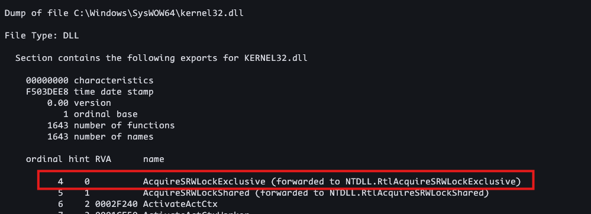

+++
title = 'Windows Shellcode2'
date = 2025-01-21T07:05:40+05:30
draft = true
+++


```bash
bits 64 
section .text
    global start 
start:
    push rbp 
    mov rbp, rsp 
    sub rsp, 0x40         
    
    push 0x02                ; Stops at KERNEL32.dll
    xor rdx, rdx             ;
    mov rax, gs:[0x60]       ; TEB
    mov rax, [rax + 0x18]    ; PEB.Ldr
    mov rax, [rax + 0x20]    ; PEB.Ldr->InMemoryOrderModuleList 
    mov rax, [rax]           ; loads the address, which points to _LDR_DATA_TABLE_ENTRY
    sub rax, 0x10            ; alignment
    jmp find_names

find_names:
    mov [rsp + 0x08], rax   ; _LDR_DATA_TABLE_ENTRY
    add rax, 0x58           ;  _LDR_DATA_TABLE_ENTRY.BaseDllName
    and rcx, 0x00           
    mov rcx, [rax]          ; _UNICODE_STRING.Length
    and rcx , 0x0fff        ; Length of DLL Name  (WORD)
    mov rbx , [rax  + 0x08] ; DLL name  _UNICODE_STRING.Buffer
    mov rdx , [rsp ]        ; Moving value to rdx (2)
    dec rdx                 
    mov [rsp ], rdx         ; Stopping Criteria 
    jmp is_finished
    jmp iterate_chars

is_finished:
    cmp rcx, 0x00
    je done 
    cmp rdx, 0x00
    je load_address

iterate_chars:
     sub rcx, 0x02 
     cmp rcx, 0x00
     je next_iteration
     jmp iterate_chars

next_iteration:
    sub rax, 0x58   ; Points to the start of _LDR_DATA_TABLE_ENTRY 
    add rax, 0x10   ; InMemoryOrderLinks
    mov rax, [rax ] ; _LIST_ENTRY.Flink
    sub rax, 0x10   ;alignment 
    jmp find_names

load_address:
    ; mov rdx, [rax + 0x30]   ; DLLBase Address 
    mov rax, [rsp + 0x08]     ; _LDR_DATA_TABLE_ENTRY
    mov rdx, [rax + 0x30]     ; DllBase 
    jmp parse_pe
    jmp done 

parse_pe:
    mov rax, rdx                      ; rdx = BaseAddress of kernel32.dll
    push rax
    mov rbx, [rax + 0x3c]             ; Offset to PE Header
    and rbx, 0xff
    add rax, rbx                      ; Points to PE
    add rax, 88h                      ; Export Directory Table RVA
    ; mov rdi, [rax + 0x18 + 0x70]    ; Export Directory Table RVA
    mov rdi, [rax]                    ; _IMAGE_NT_HEADERS64 OptionalHeader.DataDirectory[0].VirtualAddress
    and rdi, 0x0fffffff               ; RVA 
    
    mov rcx, [rdx + rdi + 0x18]       ; NumberofNames 
    and rcx, 0x0fffffff               ; DWORD

    mov rsi, [rdx + rdi + 0x1c]       ; AddressofNames 
    and rsi, 0x0fffffff               ; DWORD

    mov rbx, [rdx + rsi]              
    and rbx, 0x0fffffff                

    xor r11, r11                     
    add r11, rbx                     
    add r11, rdx                     
    ret 

done:
    mov rsp, rbp 
    pop rbp 
    ret 

```



